# Changelog

## Audience

This changelog is for developers, operators, security reviewers, and evaluators tracking public HELM AI Kernel interface changes across releases.

## Outcome

After this page you should know what this surface is for, which source files own the behavior, which public route or adjacent page to use next, and which validation command to run before changing the claim.

## Source Truth

- Public route: `helm-ai-kernel/changelog`
- Source document: `helm-ai-kernel/CHANGELOG.md`
- Public manifest: `helm-ai-kernel/docs/public-docs.manifest.json`
- Source inventory: `helm-ai-kernel/docs/source-inventory.manifest.json`
- Validation: `make docs-coverage`, `make docs-truth`, and `npm run coverage:inventory` from `docs-platform`

Do not expand this page with unsupported product, SDK, deployment, compliance, or integration claims unless the inventory manifest points to code, schemas, tests, examples, or an owner doc that proves the claim.

## Troubleshooting

| Symptom | First check |
| --- | --- |
| A link or route is missing from the docs website | Check `docs/public-docs.manifest.json`, `llms.txt`, search, and the per-page Markdown export before changing navigation. |
| A claim is not backed by code or tests | Remove the claim or add the missing code, example, schema, or validation command before publishing. |

## Diagram

This scheme maps the main sections of HELM AI Kernel Changelog in reading order.

```mermaid
flowchart LR
  Page["HELM AI Kernel Changelog"]
  A["[Unreleased]"]
  B["[0.5.4] - 2026-05-20"]
  C["[0.5.3] - 2026-05-19"]
  D["[0.5.2] - 2026-05-19"]
  E["[0.5.1] - 2026-05-18"]
  F["[0.5.0] - 2026-05-13"]
  G["[0.4.0] - 2026-04-25"]
  H["Validation"]
  Page --> A
  A --> B
  B --> C
  C --> D
  D --> E
  E --> F
  F --> G
  G --> H
```

All notable changes to the retained HELM AI Kernel surface are documented here. Public entries focus on developer-visible interfaces, compatibility, verification, SDKs, and security-relevant documentation.

## [Unreleased]

## [0.5.4] - 2026-05-20

Published at <https://github.com/Mindburn-Labs/helm-ai-kernel/releases/tag/v0.5.4>.

Chart page polish on ArtifactHub. No kernel binary or API changes;
the v0.5.3 work landed three of four chart-page badges -- this release
lights the fourth and makes the values reference panel useful.

- Moved ArtifactHub package metadata (changes, images, links, license,
  prerelease, containsSecurityUpdates, signKey, category) from
  `deploy/helm-chart/artifacthub-pkg.yml` into `Chart.yaml` annotations,
  which is the only file ArtifactHub reads for `kind=helm`. Lights the
  Changelog badge that stayed grey under v0.5.3.
- Annotated every field in `deploy/helm-chart/values.schema.json` with
  a description. The "Values schema reference" panel on the chart's
  ArtifactHub page now shows a one-line description per setting instead
  of an empty pane.
- Deleted the now-redundant `artifacthub-pkg.yml`.

## [0.5.3] - 2026-05-19

Published at <https://github.com/Mindburn-Labs/helm-ai-kernel/releases/tag/v0.5.3>.

Chart distribution polish. No kernel binary or API changes; this release
lights up the previously-grey ArtifactHub badges on the chart page.

- Added `deploy/helm-chart/values.schema.json` (JSON Schema draft 2020-12)
  covering every documented field in `values.yaml`. Enables IDE autocomplete
  for chart values, lets `helm install` reject malformed values before
  reaching the cluster, and lights the ArtifactHub Values Schema badge.
- Added `deploy/helm-chart/artifacthub-pkg.yml` with display name, license
  tag, structured changelog, container image inventory (main + slim,
  multi-arch), and six external project links. Lights the ArtifactHub
  Changelog badge and replaces the otherwise sparse Chart.yaml description.
- Added `artifacthub-repo` release job that pushes `artifacthub-repo.yml`
  as an OCI artifact (tag `:artifacthub.io`) into the chart namespace so
  ArtifactHub picks up the Verified Publisher UID for the OCI-backed
  Helm repository.
- Added `cosign-chart` release job that signs the chart OCI artifact by
  digest with sigstore keyless OIDC, lighting the ArtifactHub Signed badge.

## [0.5.2] - 2026-05-19

Published at <https://github.com/Mindburn-Labs/helm-ai-kernel/releases/tag/v0.5.2>
on 2026-05-19T16:13:38Z.

- Fixed default boundary policy initialization so the retained production
  surface starts fail-closed when default policy material is missing or invalid.
- Anchored KMS keystore state under the configured runtime data directory and
  added regression coverage for that path.
- Wired release build metadata into container builds and disabled the phantom
  chart metrics port by default.
- Refreshed Artifact Hub repository metadata and bumped the Helm chart release
  contract to `0.5.2` / `v0.5.2`.
- Kept release asset export and verification output visible during staging so
  failing commands are diagnosable from workflow logs.

## [0.5.1] - 2026-05-18

Published at <https://github.com/Mindburn-Labs/helm-ai-kernel/releases/tag/v0.5.1>.

- Fixed tag-driven release asset staging so release binaries, SBOM, OpenVEX,
  Homebrew formula metadata, and release attestations use the tag version
  instead of falling back to `VERSION` when a tag is cut before the file is
  bumped.
- Fixed audit EvidencePack export so every file listed in `00_INDEX.json`,
  including `01_SCORE.json.sha256`, is preserved in exported tar archives and
  verified during `make release-assets`.
- Added release staging diagnostics for exact failing commands and conformance
  gate failures, and require exact OpenVEX documents for tag release assets.
- Normalized pull-request Scorecard SARIF categories so GitHub code scanning
  sees the same `supply-chain/branch-protection` configuration on PR refs as it
  sees on `main`.
- Moved first-party GitHub setup actions to Node 24-capable pinned SHAs and
  configured Go workflow caching against `**/go.sum` for the monorepo layout.
- Downgraded the local release-smoke missing-cosign message from a GitHub
  warning annotation to a plain informational log unless cosign bundles are
  explicitly required.
- Bumped source, CLI fallback, SDK package manifests, Helm chart `appVersion`,
  OpenAPI version metadata, generated SDK version comments, Console visible
  version, and launch verification scripts to `0.5.1`.

## [0.5.0] - 2026-05-13

Published at <https://github.com/Mindburn-Labs/helm-ai-kernel/releases/tag/v0.5.0>
on 2026-05-13T09:15:00Z.

- Bumped source, CLI fallback, OpenAPI, SDK package manifests, generated SDK
  version comments, Helm chart metadata, and Console visible version to
  `0.5.0`.
- Added canonical release asset staging through `make release-assets`, including
  five CLI binaries, checksums, SBOM, OpenVEX, release attestation,
  `evidence-pack.tar`, `helm-ai-kernel.mcpb`, `helm-ai-kernel.rb`, and complete sample policy
  material.
- Fixed offline EvidencePack verification for canonical
  `02_PROOFGRAPH/receipts/` packs while preserving legacy root `receipts/`
  compatibility.
- Made audit export include `04_EXPORTS`.
- Added local launch-smoke coverage for MCP wrapping and the HTTP proxy using
  checked-in local fixtures with no external side effects.
- Retargeted Homebrew release workflow/docs to `mindburnlabs/homebrew-tap`.
- Corrected the release baseline: no public `v0.4.1` GitHub Release exists, so
  `v0.4.0` is the actual public baseline for the `v0.5.0` delta.

- Established `helm.docs.mindburn.org` as the canonical product docs surface while keeping HELM AI Kernel source docs in this repository.
- Reduced duplicate public docs routes so `/helm-ai-kernel` is the Kernel portal entry and older `/oss` links redirect.
- Expanded the OpenAI-compatible proxy, MCP, SDK, OWASP mapping, verification, publishing, and compatibility docs for agent-readable exports.
- Normalized the retained OSS surface around the kernel, contracts, SDKs, static viewer, examples, deployment material, and verification artifacts that remain in the repository.
- Removed stale workflows, hosted-demo collateral, internal planning material, tracked binaries, and generated repository junk from the public documentation path.

## [0.4.0] - 2026-04-25

- Published the public quickstart release at
  <https://github.com/Mindburn-Labs/helm-ai-kernel/releases/tag/v0.4.0>.
- Shipped `helm-ai-kernel serve --policy` TOML policy support and local receipt APIs.
- Shipped positional `helm-ai-kernel verify <pack>` with optional `--online`.
- Shipped `helm-ai-kernel receipts tail` for SSE receipt streaming.
- Published the `release.high_risk.v3.toml` sample policy and an
  offline-verifiable `evidence-pack.tar` fixture.
- Published platform binaries for Darwin, Linux, and Windows, plus
  `SHA256SUMS.txt`, `sbom.json`, `helm-ai-kernel.mcpb`, `helm-ai-kernel.rb`, and
  `release-attestation.json`.
- Documented that the included `evidence-pack.tar` verifies offline and reports
  `anchor offline`; public proof anchoring depends on the Titan proof deployment
  and public proof credentials.
