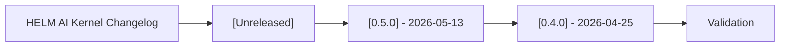

# Changelog

## Audience

This changelog is for developers, operators, security reviewers, and evaluators tracking public HELM AI Kernel interface changes across releases.

## Outcome

After this page you should know what this surface is for, which source files own the behavior, which public route or adjacent page to use next, and which validation command to run before changing the claim.

## Source Truth

- Public route: `helm-ai-kernel/changelog`
- Source document: `helm-ai-kernel/CHANGELOG.md`
- Public manifest: `helm-ai-kernel/docs/public-docs.manifest.json`
- Source inventory: `helm-ai-kernel/docs/source-inventory.manifest.json`
- Validation: `make docs-coverage`, `make docs-truth`, and `npm run coverage:inventory` from `docs-platform`

Do not expand this page with unsupported product, SDK, deployment, compliance, or integration claims unless the inventory manifest points to code, schemas, tests, examples, or an owner doc that proves the claim.

## Troubleshooting

| Symptom | First check |
| --- | --- |
| The public page and source behavior disagree | Treat the source path in `Source Truth` as canonical, then update the docs and source-inventory row in the same change. |
| A link or route is missing from the docs website | Check `docs/public-docs.manifest.json`, `llms.txt`, search, and the per-page Markdown export before changing navigation. |
| A claim is not backed by code or tests | Remove the claim or add the missing code, example, schema, or validation command before publishing. |

## Diagram

This scheme maps the main sections of HELM AI Kernel Changelog in reading order.

All notable changes to the retained HELM AI Kernel surface are documented here. Public entries focus on developer-visible interfaces, compatibility, verification, SDKs, and security-relevant documentation.

## [Unreleased]

## [0.5.0] - 2026-05-13

Published at <https://github.com/Mindburn-Labs/helm-ai-kernel/releases/tag/v0.5.0>
on 2026-05-13T09:15:00Z.

- Bumped source, CLI fallback, OpenAPI, SDK package manifests, generated SDK
  version comments, Helm chart metadata, and Console visible version to
  `0.5.0`.
- Added canonical release asset staging through `make release-assets`, including
  five CLI binaries, checksums, SBOM, OpenVEX, release attestation,
  `evidence-pack.tar`, `helm-ai-kernel.mcpb`, `helm-ai-kernel.rb`, and complete sample policy
  material.
- Fixed offline EvidencePack verification for canonical
  `02_PROOFGRAPH/receipts/` packs while preserving legacy root `receipts/`
  compatibility.
- Made audit export include `04_EXPORTS`.
- Added local launch-smoke coverage for MCP wrapping and the HTTP proxy using
  checked-in local fixtures with no external side effects.
- Retargeted Homebrew release workflow/docs to `mindburnlabs/homebrew-tap`.
- Corrected the release baseline: no public `v0.4.1` GitHub Release exists, so
  `v0.4.0` is the actual public baseline for the `v0.5.0` delta.

- Established `helm.docs.mindburn.org` as the canonical product docs surface while keeping HELM AI Kernel source docs in this repository.
- Reduced duplicate public docs routes so `/oss` is the OSS portal entry and older `/helm-ai-kernel` links redirect.
- Expanded the OpenAI-compatible proxy, MCP, SDK, OWASP mapping, verification, publishing, and compatibility docs for agent-readable exports.
- Normalized the retained OSS surface around the kernel, contracts, SDKs, static viewer, examples, deployment material, and verification artifacts that remain in the repository.
- Removed stale workflows, hosted-demo collateral, internal planning material, tracked binaries, and generated repository junk from the public documentation path.

## [0.4.0] - 2026-04-25

- Published the public quickstart release at
  <https://github.com/Mindburn-Labs/helm-ai-kernel/releases/tag/v0.4.0>.
- Shipped `helm-ai-kernel serve --policy` TOML policy support and local receipt APIs.
- Shipped positional `helm-ai-kernel verify <pack>` with optional `--online`.
- Shipped `helm-ai-kernel receipts tail` for SSE receipt streaming.
- Published the `release.high_risk.v3.toml` sample policy and an
  offline-verifiable `evidence-pack.tar` fixture.
- Published platform binaries for Darwin, Linux, and Windows, plus
  `SHA256SUMS.txt`, `sbom.json`, `helm-ai-kernel.mcpb`, `helm-ai-kernel.rb`, and
  `release-attestation.json`.
- Documented that the included `evidence-pack.tar` verifies offline and reports
  `anchor offline`; public proof anchoring depends on the Titan proof deployment
  and public proof credentials.
