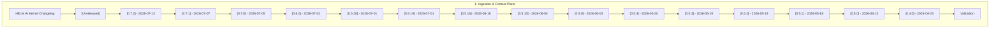

# Changelog

## Audience

This changelog is for developers, operators, security reviewers, and evaluators tracking public HELM AI Kernel interface changes across releases.

## Outcome

After this page you should know what this surface is for, which source files own the behavior, which public route or adjacent page to use next, and which validation command to run before changing the claim.

## Source Truth

- Public route: `helm-ai-kernel/changelog`
- Source document: `helm-ai-kernel/CHANGELOG.md`
- Public manifest: `helm-ai-kernel/docs/public-docs.manifest.json`
- Source inventory: `helm-ai-kernel/docs/source-inventory.manifest.json`
- Validation: `make docs-coverage`, `make docs-truth`, and `npm run coverage:inventory` from `docs-platform`

Do not expand this page with unsupported product, SDK, deployment, compliance, or integration claims unless the inventory manifest points to code, schemas, tests, examples, or an owner doc that proves the claim.

## Troubleshooting

| Symptom | First check |
| --- | --- |
| A link or route is missing from the docs website | Check `docs/public-docs.manifest.json`, `llms.txt`, search, and the per-page Markdown export before changing navigation. |
| A claim is not backed by code or tests | Remove the claim or add the missing code, example, schema, or validation command before publishing. |

## Diagram

This scheme maps the main sections of HELM AI Kernel Changelog in reading order.

```mermaid
flowchart TD
    subgraph Ingestion["1. Ingestion & Context Plane"]
        Page["HELM AI Kernel Changelog"]
        A["[Unreleased]"]
        A00["[0.7.2] - 2026-07-13"]
        A0["[0.7.1] - 2026-07-07"]
        A1["[0.7.0] - 2026-07-05"]
        A2["[0.6.0] - 2026-07-02"]
        B["[0.5.20] - 2026-07-01"]
        B0["[0.5.19] - 2026-07-01"]
        B1["[0.5.16] - 2026-06-18"]
        B2["[0.5.10] - 2026-06-04"]
        C["[0.5.9] - 2026-06-03"]
        D["[0.5.4] - 2026-05-20"]
        E["[0.5.3] - 2026-05-19"]
        F["[0.5.2] - 2026-05-19"]
        G["[0.5.1] - 2026-05-18"]
        H["[0.5.0] - 2026-05-13"]
        I["[0.4.0] - 2026-04-25"]
        J["Validation"]
    end

    %% Operational Flow Edges
    Page --> A
    A --> A00
    A00 --> A0
    A0 --> A1
    A1 --> A2
    A2 --> B
    B --> B0
    B0 --> B1
    B1 --> B2
    B2 --> C
    C --> D
    D --> E
    E --> F
    F --> G
    G --> H
    H --> I
    I --> J

    %% Premium Styling Rules
```

All notable changes to the retained HELM AI Kernel surface are documented here. Public entries focus on developer-visible interfaces, compatibility, verification, SDKs, and security-relevant documentation.

## [Unreleased]

Entries in this section describe merged source, not a tagged public release.
Keep research scaffolds and hardware-backed enforcement language out of the
public changelog until a tagged release ships source-owned tests, verifier
evidence, and release artifacts for that exact capability.

### Added — offline Kernel receipt.v5 file verify (Building)

Evaluate persist writes a copyable `receipt.v5` JSON file under
`<data-dir>/receipts/evaluate/<receipt_id>/` plus `expected-ed25519.pub`.
`helm-ai-kernel verify receipt --receipt <file> --trusted-public-key-file <key>`
verifies that file offline. Exit 0 requires integrity and signer trust
against the caller-supplied key. Hop fixtures are labeled DENY / no permit.
This is Foundation/offline verify, not AI OS live, not helm-ai-kernel#859,
and not self-attested EvidencePack verification.

### Added — chart-managed mounted-file runtime rules

The Helm chart can render explicit `helm.policy.runtimeActions` into its
reference pack for governed bootstrap and synthetic-stand policy proof. The
default remains an empty fail-closed rule list; production deployments should
prefer a signed control-plane or CRD policy source.

### Added — daemon semantic escalation threshold

The daemon and Helm chart can configure the Guardian's existing semantic
threat escalation threshold in basis points. Zero remains advisory-only;
positive thresholds return ESCALATE before dispatch when semantic assessment
is unavailable, truncated, or meets the configured score.

### Added — tenant-scoped receipt query predicates

`GET /api/v1/receipts` can filter the authenticated tenant's V5 receipts by
verdict, reason code, principal/executor, effect/resource, and an RFC3339Nano
half-open time window with at most nine fractional-second digits. Verdict,
reason code, and effect are receipt-signature fields; principal and timestamp
are causal-chain-bound projections, and the listing does not prove
completeness. Canonical rows fail closed if any filter projection differs from
the hash-verified receipt envelope.

### Fixed — daemon correlation propagation

The shared HTTP edge now adopts or mints `X-Helm-Correlation-ID`, echoes the
canonical value, carries it into governed MCP lifecycle events, and stamps it
on the active server span. This closes the deployed daemon path that bypasses
the embedded API server's equivalent correlation edge.

## [0.8.4] - pending tag

Release target for the receipt tenant-isolation fix, the corrected EU AI Act
applicability mapping, and a sweep of public claim corrections. v0.8.3 completed
its publication, so this is an ordinary successor rather than another attempt at
a stranded train.

Note for anyone reading the published v0.8.3 notes: its changelog states that
deployed MCP gateway receipts land "into the same store `GET /api/v1/receipts`
reads". That was not true when it shipped and is corrected below. The v0.8.3
artifacts are in immutable registries and cannot be reissued, so the correction
lands here rather than being rewritten there.

### Added

- The GitHub connector executes through the governed MCP bridge on a shipped
  path, so a connector dispatch is subject to the same permit and receipt
  contract as any other governed effect.
- The daemon serve path is traced: a span for the request, the matched route,
  and a flush on shutdown, so a deployed kernel's request path is observable
  without attaching a debugger.

### Fixed

- **Receipt reads are tenant-isolated (HELM-363).** Tenant-authenticated receipt
  HTTP APIs, Console receipt views, and onboarding state and export now exclude
  unscoped and foreign-tenant rows. Onboarding receipts are written into the
  authenticated tenant's scope rather than left unscoped.
- **Corrected claim, same issue:** receipts persisted by the deployed MCP
  gateway are durable and signed but are **not** retrievable through
  `GET /api/v1/receipts`. The gateway routes run under admin authentication,
  which establishes no tenant binding, so those rows are written unscoped by
  design while that route reads only tenant-scoped rows. Local operators with
  direct store access can still include them in offline report and rollup
  workflows. Making them tenant-retrievable requires moving the gateway to
  tenant-scoped auth, a breaking change for MCP clients, still open on HELM-363.
- Daemon output stays structured by default instead of degrading to
  unstructured lines, so log collection does not depend on a flag.
- The CLI no longer overstates what it can do: corrected contract and setup
  narrative, and discovery paths that no longer write state as a side effect.
- The Helm chart's authority initialization accepts a verified pre-existing root
  key instead of failing, so re-running an install against provisioned authority
  no longer requires deleting it first.
- `receipt_verify` CLI contract tests run in the default test gate rather than
  only in a profile nobody invokes locally.

### Changed — public documentation corrected against its own evidence

This release removes several documented capabilities that did not exist. Each was
found by checking a page against the code or evidence file it cited, and the
correction is a removal or a restatement, not a new claim:

- Reference-pack documentation described fixtures as runs, and its documented
  verify command did not work.
- `canonicalization.md` documented a Rust crate that has never existed; the cgo
  bridge to that crate is deleted.
- The conformance guide described an external-implementation runner that does not
  exist.
- `canonical-json-v1` §6.2 cited an unimplemented page as normative.
- `policy-bundle-v1` documented a bundle layout and CLI that do not exist.
- Six stale status claims elsewhere disagreed with the evidence files they
  pointed at.

### Changed — EU AI Act mapping and applicability dates corrected

Regulation (EU) 2026/1744 deferred Chapter III, Sections 1-3 of Regulation
(EU) 2024/1689 to 2027-12-02 for Annex III systems and 2028-08-02 for Annex I
systems, expressly excluding Article 6(5). This narrow amendment does not move
Article 50, Article 73 incident reporting, or CE-marking/registration provisions
outside Sections 1-3 to the same dates.

- Added `reference_packs/eu_ai_act_high_risk.v2.json` as an explicit
  `COMPLIANCE_MAPPING`. It contains candidate mappings and evidence names but no
  supported `runtime_actions` or `actions`; the sample policy therefore remains
  fail-closed with zero runtime rules.
- Preserved the previously released
  `reference_packs/eu_ai_act_high_risk.v1.json` byte-for-byte at SHA-256
  `8a33ad51441d6d939d74da2be388c1d11c12da1e055f1aeca72ca2763ebc05c4`.
  Supersession metadata lives in v2 and documentation, not a rewritten v1.
- Split general, Article 50, Annex III and Annex I applicability dates. The v2
  mapping records the Article 50(2) transition for specified pre-existing
  systems and the Article 6(5) exception.
- Corrected serious-incident reporting from Article 62/72 hours to Article 73:
  15 days generally, two days for the specified accelerated tier, and 10 days
  where a person dies. The compliance API now records the incident tier.
- Removed unsupported pack-driven QTSP, LOTL freshness and budget enforcement
  claims. QTSP is an optional evidence mapping; operator/library verification
  remains a separate explicitly configured path.

Primary sources: CELEX 32024R1689 and CELEX 32026R1744 on EUR-Lex.

## [0.8.3] - 2026-08-09

Completing release target for the v0.8 train. v0.8.0, v0.8.1 and v0.8.2 all
stopped before their GitHub Release and full asset set; none is a completed
public release and none may be described as one. Their partial public records
are permanent and are the reason this train advances the version rather than
reissuing one.

The local Console closure is bound to a distinct v0.8.3 Console workflow tag
while retaining the exact reviewed source pin that built green for the v0.8.1
train (`app-helm-console` commit `c0fd6b446`, sidecar `0.2.1`) — the same
practice recorded for v0.8.1. Console `main` has moved since; folding those
changes into a release whose scope is completing a stranded train would widen
it through a packaging path never exercised on that tree.

### Added

- `EffectPermit` is signed on issuance under the `effect_permit.v1` preimage
  and verified fail-closed before any connector executes: an unsigned permit,
  a permit whose scope or expiry was rewritten after signing, an expired or
  replayed permit, and a permit bound to another connector are all denied.
- `evidence_bindings` has a wire representation in the effects proto, so a
  signed permit keeps verifying after crossing a process boundary. Every
  language binding carries the field.
- A pre-tag `console-sidecar-pin` quality gate requires a Console source pin
  row for the checked-in `VERSION` in the pr, merge and release profiles. The
  release job reads the pin file from the tag commit, so a row missing at tag
  time strands the tag permanently; the gate catches it while it is still one
  line in a pull request.

### Fixed

- The release preflight requires the tagged commit to be reachable from
  `main` rather than identical to it. Requiring identity made a tagged release
  uncompletable as soon as anything merged, which is how v0.8.1 was stranded.
- The CLI refuses to exercise authority it was not given: `approvals
  approve`/`deny`/`assert` no longer default the actor, receipt or approval
  id (a bare `approvals approve` used to approve the bootstrap ceremony and
  attribute it to a principal that does not exist), an unrecognized flag no
  longer starts the server or mints a trust root in the working directory,
  and asking any boundary surface for `--help` no longer seeds or rewrites
  authority state on disk.

## [0.8.2] - stranded, superseded by 0.8.3

Tagged at `7d63fb8c1` and permanently bound to that commit by the Go checksum
transparency log and a Sigstore build-provenance attestation before the
release run failed: the tagged tree carried no Console source pin row for
v0.8.2, and the pin file is read from the tag commit. The tag cannot be moved
without falsifying those records, and no GitHub Release or asset set exists.
The permit-signing and wire-representation work first described under 0.8.2
ships in 0.8.3.

## [0.8.1] - stranded, superseded by 0.8.2

Corrective release target for the completed v0.8 feature train. The v0.8.0
aggregate publication was incomplete: it has no GitHub Release or complete
source-owned asset set, so it must not be described as a completed release.

### Changed

- Retargeted the lockstep CLI, chart, SDK, OpenAPI, and release documentation
  surfaces to v0.8.1 without rewriting any previously published version.
- Bound the local Console closure to a distinct v0.8.1 Console workflow tag
  while retaining its exact reviewed source pin.

## [0.8.0] - incomplete publication

Release preparation record only. The `v0.8.0` aggregate release did not finish
its required asset and provenance gates, and is not a completed public release.

<!-- quantum_posture: v0.8.0 continues classical Ed25519 (and optional ML-DSA-65 hybrid) signatures and SHA-256 content hashes; no new post-quantum cryptographic control is added. -->

### Added

- Guided first-run journey: `helm-ai-kernel setup` front door with read-only
  discovery modes, `--quickstart` local first-run proof path (Claude Code,
  Codex, MCP, and OpenAI-compatible profiles), and `setup install`, `status`,
  `repair`, and `remove` leaf commands with idempotent repair and removal.
- Release-gated local Policies and Receipts Console packaging: a
  Console-including artifact can serve the pinned, digest-verified sidecar
  against the loopback Kernel; source and headless packages fail closed.
- `decision_record.v4` signing preimage binding the evaluated authorization
  tuple (subject, action, resource) and the selected signature algorithm;
  execution authority is restricted to V4 decisions while V2/V3 records remain
  verifiable as evidence.
- Signed `receipt.v5` contract: session-scoped causal receipt chains with
  durable chain hashes, tenant-scoped reads, and semantic `decision_hash`
  persistence; older rows recover only from already-stored trusted metadata and
  otherwise fail closed.
- EventMeta v2 catalog and source-projection helpers for the eight lifecycle
  event types. Runtime emission and telemetry export are not claimed by this
  release entry.
- Deterministic semantic threat-advisory classifier for `threatscan`
  (advisory-only; no policy verdict depends on it).
- Governed capability registry enforcement in Guardian: undeclared
  capabilities cannot execute.
- Desktop authenticated transport v1 for local client integrations.
- Model-actionable deny feedback: ActionInbox deny receipts carry structured
  remediation, cascade-reject, and a doom-loop breaker for repeated denied
  retries.

### Changed

- Every command and subcommand serves side-effect-free `-h`/`--help`; help,
  preview, and dry-run paths cannot mutate state; destructive actions require
  explicit, unambiguous targets and never execute from typo or missing
  authority.
- Human terminal output uses the accessible HELM terminal design system;
  non-TTY, `NO_COLOR`, `TERM=dumb`, and `--json` outputs remain plain and
  stable for automation.
- First-party SDKs (Go, TypeScript, Python, Java, Rust) regenerate from the
  v0.8.0 contract; the served evaluate envelope preserves both the v0.7.5
  `action`/`resource` shape and the V5 `tool`/`effect_level` shape, so v0.7.5
  clients keep working unchanged.
- Kernel library packages no longer pull the OpenTelemetry SDK; correlation
  uses a narrow internal package (HELM-460).
- The canonical executable is `helm-ai-kernel`; release artifacts, the
  Homebrew formula, and documentation do not ship a `helm` executable, so the
  binary cannot collide with Kubernetes Helm on PATH.

### Fixed

- Workstation guard governs previously missed destructive paths, and SafeDep
  emergency activation is bound to the verified execution intent snapshot.
- Deployed MCP gateway enforces the reconciled policy snapshot, so mounted
  reference-pack `runtime_actions` compile into ALLOW rules on the served
  enforcement path instead of staying fail-closed `NO_POLICY_DEFINED`
  (HELM-362).
- Deployed MCP gateway persists a signed, durable receipt for every governed
  decision (ALLOW and DENY). These receipts are written unscoped and are **not**
  retrievable through `GET /api/v1/receipts`: the gateway routes run under
  admin authentication, which establishes no tenant binding, while that route
  reads only tenant-scoped rows. Tenant-authenticated receipt HTTP APIs,
  Console receipt views, and onboarding state/export exclude unscoped and
  foreign-tenant rows; onboarding receipts are written into the authenticated
  tenant scope, and state/export query the latest proof for each onboarding
  step without a fixed total-receipt window. Missing tenant-scoped store
  capabilities and proof-read failures fail closed instead of rendering
  successful-looking empty state. Local operators with direct access to the
  Kernel SQLite database can still include unscoped rows through the offline
  `report` and `rollup` commands, which intentionally operate on the local
  store rather than an HTTP tenant principal. Tenant retrievability for MCP
  gateway clients would require moving the gateway to tenant-scoped auth, a
  breaking change still open on HELM-363.
- MCP OAuth scope enforcement applies only when the gateway runs an OAuth
  channel; with `auth_mode: none` the scoped governance tools (`helm.verify`,
  `helm.evaluate`) are reachable and policy remains the fail-closed enforcement
  boundary (HELM-364).
- Contract-breaking CI gates fail closed instead of skipping on
  misconfiguration.

## [0.7.5] - 2026-07-23

Release target: <https://github.com/Mindburn-Labs/helm-ai-kernel/releases/tag/v0.7.5>.

<!-- quantum_posture: v0.7.5 records use classical Ed25519 signatures and SHA-256 content hashes; none add a post-quantum cryptographic control. -->

This section was backfilled during v0.8.0 release preparation; v0.7.5 shipped
without a changelog entry.

### Added

- `correlation_id` identity slice of the telemetry contract with otelhttp
  edges and a context-aware structured-log handler (HELM-325, HELM-333).

### Changed

- `golang.org/x/text` updated to v0.39.0 across the module graph (HELM-354).
- Receipt integrity documentation separates receipt integrity from signer
  trust (HELM-231).

### Fixed

- Workstation signer setup fails closed (previously could proceed unsigned).
- Release-permit workflow accepts a pinned workflow SHA.
- Proxy SSE correlation echo and observability follow-ups (HELM-325/333/345).

## [0.7.4] - 2026-07-21

Release target: <https://github.com/Mindburn-Labs/helm-ai-kernel/releases/tag/v0.7.4>.

<!-- quantum_posture: v0.7.4 records use classical Ed25519 signatures and SHA-256 content hashes; none add a post-quantum cryptographic control. -->

- Added the **Boundary Enforcement Profile**. `helm-ai-kernel boundary profile compile`
  emits systemd hardening drop-ins, a default-drop nftables ruleset,
  cgroup limits and device permits from a hash-bound `boundary_profile_input.v1`
  document, sealed by a signed `profile_compile_receipt.v1`. These are text
  artifacts an operator applies with `systemctl` and `nft`: the host's own
  systemd and nftables do the enforcing, and the kernel gains no enforcement
  mechanism of its own — no eBPF program, seccomp filter, TPM binding,
  hardware enclave, or in-process packet filter. HELM compiles and attests;
  the OS enforces.
- `boundary profile attest` reads live OS posture (systemd unit properties, the
  nftables ruleset, cgroup-v2 limits) and emits a hash-sealed
  `posture_attestation.v1` recording `MATCH` or `DRIFT` with per-check
  expected/observed diffs. `--enforce` exits non-zero on anything but a sealed
  `MATCH`, so a systemd dependency can refuse to start the gateway. Drift is
  attested at service (re)start and on demand, not monitored continuously.
- `boundary profile verify` verifies a compile receipt, artifact set and
  attestation entirely offline; `boundary profile bundle-verify` verifies a
  signed offline update bundle against an `update_bundle_manifest.v1`. The
  update-bundle surface is a format and verifier only — no build tooling and no
  OTA mechanism.
- Added sealed-appliance reference units under `deploy/appliance/` (a short-lived
  privileged attestation oneshot gating a fully unprivileged gateway) and the
  deployment guide `docs/deployment/boundary-enforcement-profile.md`.
- Added four `protocols/json-schemas/boundary/` schemas (profile input, compile
  receipt, posture attestation, update-bundle manifest) with schema-parity tests
  binding them to the Go validators, plus two cross-runtime golden vector packs
  (`boundary-profile-v1`, `update-bundle-v1`) verified by independent Python
  implementations and wired into `make verify-fixtures`.

## [0.7.3] - 2026-07-20

Release target: <https://github.com/Mindburn-Labs/helm-ai-kernel/releases/tag/v0.7.3>.

<!-- quantum_posture: v0.7.3 release notes cover Ed25519 workstation receipt signer trust hardening plus approval, connector-effect, launch-contract, and release-permit signing; all signatures remain classical Ed25519; none add a post-quantum cryptographic control. -->

- Removed the derivable observe-only workstation receipt signing fallback.
  Receipt minting now requires a persistent per-data-dir Ed25519 signing key
  (0600 file, O_EXCL-created); signing paths hard-error on an empty seed, and
  the MCP bridge maps a missing seed to a fail-closed `PDP_ERROR` deny.
- The retired derivable signer key is permanently rejected as a trust anchor,
  including when a caller explicitly pins its public key.
- Receipt verification separates integrity from trust: the JSON summary
  renames `signature_valid` to `integrity_valid` and adds `signer_trusted`
  and `trust_anchor`. `workstation view` and `verify-decision` now exit 1
  unless the signer is trusted; legacy-signed receipts still load and report
  `integrity: true, trusted: false` with no silent upgrade.
- Pre-tool hooks fail closed on signer or receipt-persistence failure: a
  structured deny is emitted (exit 0), and exit 2 blocks only when the deny
  JSON itself cannot be written. Safe commands never touch the signer, and
  HOME-less setups fail closed without creating CWD-relative keys. Setup
  migration deduplicates legacy hook entries and provisions the key on first
  classified call.
- Established a durable approval foundation: approvals bind source-owned
  grants to a signed assertion contract, verify a trusted-signer quorum, and
  carry durable ceremony authority with sealed store read authority.
  Consumption of an approval grant is fenced, and dispositions move over an
  authenticated transport with signed active-work disposition records.
- Hardened the connector effect lifecycle: effects are reserved before
  dispatch, dispatch admission is fenced, connector authority is bound to
  approvals, certified connector release authority is persisted, and effects
  close with signed evidence.
- Added universal workload and cloud route contracts and fail-closed launch
  effect preview contracts: prepared executions are sealed, credentials stay
  inside the runner boundary and are deferred until dispatch, unsupervised
  detached execution is rejected, authorization is bound to the signed effect
  digest, previews cannot dispatch effects or reuse credits, and routes are
  bounded by certification expiry.
- Added a persisted principal↔tenant binding registry (SQLite and Postgres)
  with an admin endpoint, so the kernel can authorize multiple tenants
  instead of a single environment-configured pair.
- Added the `helm connect` device-code cloud flow, including headless Codex
  project connection; Desktop Codex sidecar readiness is now certified before
  use, and launch tokens and config links are contained to the project
  workspace.
- Added a deterministic autonomous release permit: reviewer identity is
  canonicalized, case-folded self-review and merge self-pins are rejected,
  and authority generation lineage is bound.
- `scan` now fails closed on incomplete local coverage.
- CI and release tooling: PRs that backward-break a public contract now fail
  a breaking-change gate (`oasdiff`/`buf breaking` against the base branch,
  with an explicit major-version or labeled override), and the release
  workflow can publish a signed container image for an arbitrary commit sha.

No RiskEnvelope, website, checkout, connector certification, or Company AI OS
GA scope is included.

## [0.7.2] - 2026-07-13

Release target: <https://github.com/Mindburn-Labs/helm-ai-kernel/releases/tag/v0.7.2>.

<!-- quantum_posture: v0.7.2 release notes cover a Go toolchain rebuild, an OpenAPI contract alignment, enforcement and containment hardening, and dependency updates; none add a post-quantum cryptographic control. -->

- The tag-triggered release workflow will rebuild both container images on Go
  1.25.12 (up from 1.25.10), which includes the cumulative upstream
  standard-library security fixes for `crypto/x509`, `mime`, `net/textproto`,
  `crypto/tls`, and `os`. Post-release Trivy and Artifact Hub evidence is
  required before claiming any CVE clearance. Rebuild only; no code or runtime
  behavior change.
- Aligned the canonical `BoundaryStatus` OpenAPI schema and the generated Java,
  Python, Rust, and TypeScript models with the JSON already emitted by
  `GET /api/v1/boundary/status`. Replaced legacy generated properties such as
  `receipt_store_ready`, `signer_ready`, `last_checkpoint_id`, and `checked_at`
  with the existing runtime properties, and documented the consumer migration
  mapping. This correction does not change Kernel runtime JSON behavior.
- Replaced the deny-only MCP runtime adapter with an optional governed
  execution bridge that returns real `ALLOW`/`DENY`/`ESCALATE` verdicts: the
  `mcp.ExecutionFirewall` boundary gate (allowlist, server identity, permission
  scope, pinned schema, JCS argument hash) runs before policy; `workstation.Decide`
  issues a signed decision receipt; writes go through an approval-gated
  `ESCALATE` tier bound to the canonical request hash and a single-use,
  replay-protected `EffectPermit`; and each effect is linked to its intent in
  the ProofGraph. Fail-closed by default — with no bridge configured the adapter
  stays deny-only.
- Added a scoped emergency-stop fence with a recorded cryptography posture, and
  preserved JCS Unicode separators in its reference pack.
- Made the replay-determinism verifier gate fail closed.
- Made the sandbox fail closed on an ambiguous network posture.
- Updated the `golang.org/x/crypto`, Jackson Databind, and Python `cryptography`
  build dependencies to current patched releases.

No RiskEnvelope, scan, upload, cloud, checkout, website, connector
certification, or Company AI OS GA scope is included.

## [0.7.1] - 2026-07-07

Release target: <https://github.com/Mindburn-Labs/helm-ai-kernel/releases/tag/v0.7.1>.

<!-- quantum_posture: v0.7.1 release notes mention existing SLSA and cosign release verification only; this release adds no post-quantum cryptographic control. -->

- Added a published-release SLSA subject integrity gate that compares
  `multiple.intoto.jsonl` subjects against the published `SHA256SUMS.txt`
  manifest.
- Converted the standalone SLSA provenance workflow into a manual repair path
  for already-published release assets so normal tag releases use the lockstep
  `release.yml` provenance job.
- Repaired the `v0.7.0` provenance asset so its SLSA subjects match the
  published checksum manifest before starting `v0.8.0` RiskEnvelope work.

No RiskEnvelope, scan, upload, cloud, checkout, website, connector
certification, or Company AI OS GA scope is included.

## [0.7.0] - 2026-07-05

Release target: <https://github.com/Mindburn-Labs/helm-ai-kernel/releases/tag/v0.7.0>.

<!-- quantum_posture: v0.7.0 release notes mention existing cosign release verification only; this release adds no post-quantum cryptographic control. -->

- Cut the EvidencePack and ProofGraph beta release without adding product,
  cloud, GA, connector certification, or checkout scope.
- Made native EvidencePack verification fail closed when any regular pack file
  is neither listed in `00_INDEX.json` nor a separately verified control file
  such as `00_INDEX.json`, `07_ATTESTATIONS/evidence_pack.sig`, or
  `07_ATTESTATIONS/conformance_report.sig`.
- Bound declared `99_EXT/` extension files to pack verification so formal-proof
  and future extension material must be indexed before a seal verifies.
- Froze ProofGraph hash-reference validation for `node_hash` and `parents[]`
  as 64-character lowercase SHA-256 hex refs.
- Hardened the legacy tar EvidencePack verifier against duplicate,
  unsupported, or unmanifested archive entries.
- Added a release-asset gate that verifies the staged `evidence-pack.tar` and
  then proves an appended tampered copy is rejected by the same offline verifier.

## [0.6.0] - 2026-07-02

Release target: <https://github.com/Mindburn-Labs/helm-ai-kernel/releases/tag/v0.6.0>.

<!-- quantum_posture: v0.6.0 release notes mention existing cosign release verification only; this release adds no post-quantum cryptographic control. -->

- Cut a release-infrastructure hardening release after the `v0.5.20` tag
  exposed manual publish recovery gaps, without adding product, cloud, GA,
  connector certification, or checkout scope.
- Restored token-based PyPI publication as the fallback path when Trusted
  Publishing is unavailable, and added manual Python SDK publish dispatch from
  an immutable release tag so recovery can publish the tagged source version
  after `main` advances.
- Fixed published-version drift matching so rejected shorter versions such as
  `0.5.2` cannot satisfy a later valid version such as `0.5.20`.
- Routed docs truth through the public org reusable workflow and pinned that
  reusable workflow's docs-truth runner checkout so `MINDBURN_ORG_READ_TOKEN`
  is not paired with floating runner code.
- Clarified HELM Kernel and HELM Enterprise quantum-security wording so public
  release material does not imply an added post-quantum cryptographic control.

## [0.5.20] - 2026-07-01

Release target: <https://github.com/Mindburn-Labs/helm-ai-kernel/releases/tag/v0.5.20>.

<!-- quantum_posture: v0.5.20 release notes mention existing cosign release verification only; this release adds no post-quantum cryptographic control. -->

- Cut a corrective lockstep release after the `v0.5.19` tag exposed release
  evidence and SDK contract drift, without adding product, cloud, GA, connector
  certification, or checkout scope.
- Completed the account session and entitlement SDK contract alignment on
  `plan_id`, with public plan enums limited to `free`, `developer`, `team`,
  `scale`, and `enterprise` across OpenAPI and generated Go, Java, Python,
  Rust, and TypeScript SDK types.
- Added exact `v0.5.19` and `v0.5.20` OpenVEX source files and made OpenVEX
  generation reproducible under `SOURCE_DATE_EPOCH`.
- Moved Go SDK subdirectory tag publication into the tag-driven release
  workflow with immutable-tag checks and published-channel drift coverage.
- Replaced stale release-document command lists with the maintained gates:
  `quality-merge`, `quality-release`, `release-readiness`, `release-assets`,
  and `version-drift-published`.

## [0.5.19] - 2026-07-01

Release target: <https://github.com/Mindburn-Labs/helm-ai-kernel/releases/tag/v0.5.19>.

<!-- quantum_posture: v0.5.19 release notes mention existing cosign release verification only; this release adds no post-quantum cryptographic control. -->

- Hardened hosted sandbox execution guardrails by centralizing timeout caps,
  output caps, secret-bearing environment variable denial, and cleanup
  degradation reporting across sandbox adapters and broker receipts.
- Aligned account session and entitlement SDK contract fields on `plan_id`,
  expanded public plan enums to `free`, `developer`, `team`, `scale`, and
  `enterprise`, and regenerated Go, Java, Python, Rust, and TypeScript SDK
  types from OpenAPI.
- Updated the Java SDK Jackson dependency to `2.22.0`.
- Shipped developer-first integration docs for Codex, Claude Code, MCP,
  OpenAI-compatible proxy use, EvidencePack verification, signed receipts, and
  policy bundles without expanding cloud, GA, connector certification, or
  checkout claims.
- Updated release version-surface automation for the rewritten Developer
  Journey and Quickstart docs so future patch bumps remain tool-driven.

## [0.5.16] - 2026-06-18

Release target: <https://github.com/Mindburn-Labs/helm-ai-kernel/releases/tag/v0.5.16>.

- Added Formal Verification Worker v0 contracts, deterministic proof-result
  hashing, CPI status mapping, EvidencePack extension validation, and
  conformance vectors for the no-side-effect-before-approval invariant.
- Added docs-only LEAP research notes under `research/leap/` to record the
  verifier-guided proof-search pattern without adding a LEAP, Lean, or SMT
  runtime dependency.
- Included optional OpenEnv safety fixtures and the sharpened README front-door
  copy shipped after `v0.5.15`.

## [0.5.15] - 2026-06-14

Release target: <https://github.com/Mindburn-Labs/helm-ai-kernel/releases/tag/v0.5.15>.

- Anchored receipt issuance into the append-only transparency log and persisted
  the receipt transparency anchor fields (`log_id`, `leaf_index`, transparency
  payload) across the Postgres and SQLite receipt stores (MIN-720).
- Added the certification evidence gate, verifier telemetry, demo MCP surface,
  and receipt comparison tooling (MIN-719/568/609/570).
- Fixed the self-serve proof loop so `demo` emits a canonical sealed
  EvidencePack that offline `verify` accepts out of the box (MIN-738).
- Scoped the `scripts/proof-path.sh` conformance steps as a gate-engine smoke
  test against the seeded local baseline (fail-closed by design) rather than a
  hard release gate, so a clean run exits 0 (MIN-740).
- Hardened the release pipeline to block stale Go SDK publication.

## [0.5.13] - 2026-06-13

Release target: <https://github.com/Mindburn-Labs/helm-ai-kernel/releases/tag/v0.5.13>.

- Added `helm-ai-kernel quickstart` as the OSS local-first path with loopback
  Kernel startup, same-origin `/console`, starter fail-closed policy material,
  one-time local session exchange, backend-owned onboarding proof APIs, signed
  ALLOW/DENY/ESCALATE receipts, tamper verification, and onboarding
  EvidencePack export.
- Added release workflow wiring that builds the production `app-helm-console`
  web bundle, runs the Console fixture-leak gate, stages bundle
  checksum/SBOM/provenance/lock/manifest sidecars into the kernel release
  assets, and installs the Console bundle through the Homebrew formula.
- Hardened local quickstart auth so the generated session token expires in the
  shared admin/tenant auth path, not only on onboarding routes.

## [0.5.12] - 2026-06-13

Release target: <https://github.com/Mindburn-Labs/helm-ai-kernel/releases/tag/v0.5.12>.

- Published the lockstep `0.5.12` release surfaces across the CLI, Helm chart,
  OpenAPI metadata, SDK package manifests, generated SDK headers, verification
  docs, Launchpad clean-install defaults, and release security references.
- Promoted signed Launchpad image references after the multi-arch artifact
  pipeline produced current OpenClaw, Hermes, OpenCode, Kilo Code, and egress
  proxy artifacts.
- Fixed the live OpenRouter/OpenClaw smoke path by proving token reachability
  before the positive Kubernetes smoke and by preserving Helm test logs long
  enough for CI diagnostics.
- Bound `SignDecision` to the canonical effect digest and authenticated release
  setup-protoc lookups to keep the release validation lane deterministic.

## [0.5.10] - 2026-06-04

Release target: <https://github.com/Mindburn-Labs/helm-ai-kernel/releases/tag/v0.5.10>.

- Added native EvidencePack customer proof verification: `07_ATTESTATIONS/evidence_pack.sig` is now the seal authority for customer-grade verification, with customer/high-assurance profiles requiring external signer trust, verified Rekor/RFC3161 anchor receipts, and S3 Object Lock storage receipts.
- Added receipt-aware verification commands: `helm-ai-kernel verify` accepts `--profile`, `--config`, and `--storage-receipt` for native EvidencePack trust profiles; top-level `helm-ai-kernel trust init --config helm/helm.yaml` routes to native EvidencePack trust initialization.
- Extended Launchpad verification to carry profile-aware native seal options through evidence pack receipts and verifier execution.

## [0.5.9] - 2026-06-03

Release target: <https://github.com/Mindburn-Labs/helm-ai-kernel/releases/tag/v0.5.9>.

- Prepared the lockstep `0.5.9` release surfaces across the CLI, Helm chart,
  OpenAPI metadata, SDK package manifests, generated SDK headers, verification
  docs, and Launchpad clean-install defaults.
- Refreshed the Launchpad model-provider catalog so direct OpenRouter,
  Anthropic, DeepSeek, and xAI provider routes are represented in retained
  provider metadata.
- Expanded regression coverage across governance policy streams, executor
  evidence, trust roots, kernel edge cases, guardian checks, MCP quarantine,
  conformance gates, Launchpad session runtime, and pack behavior.

## [0.5.4] - 2026-05-20

Published at <https://github.com/Mindburn-Labs/helm-ai-kernel/releases/tag/v0.5.4>.

Chart page polish on ArtifactHub. No kernel binary or API changes;
the v0.5.3 work landed three of four chart-page badges -- this release
lights the fourth and makes the values reference panel useful.

- Moved ArtifactHub package metadata (changes, images, links, license,
  prerelease, containsSecurityUpdates, signKey, category) from
  `deploy/helm-chart/artifacthub-pkg.yml` into `Chart.yaml` annotations,
  which is the only file ArtifactHub reads for `kind=helm`. Lights the
  Changelog badge that stayed grey under v0.5.3.
- Annotated every field in `deploy/helm-chart/values.schema.json` with
  a description. The "Values schema reference" panel on the chart's
  ArtifactHub page now shows a one-line description per setting instead
  of an empty pane.
- Deleted the now-redundant `artifacthub-pkg.yml`.

## [0.5.3] - 2026-05-19

Published at <https://github.com/Mindburn-Labs/helm-ai-kernel/releases/tag/v0.5.3>.

Chart distribution polish. No kernel binary or API changes; this release
lights up the previously-grey ArtifactHub badges on the chart page.

- Added `deploy/helm-chart/values.schema.json` (JSON Schema draft 2020-12)
  covering every documented field in `values.yaml`. Enables IDE autocomplete
  for chart values, lets `helm install` reject malformed values before
  reaching the cluster, and lights the ArtifactHub Values Schema badge.
- Added `deploy/helm-chart/artifacthub-pkg.yml` with display name, license
  tag, structured changelog, container image inventory (main + slim,
  multi-arch), and six external project links. Lights the ArtifactHub
  Changelog badge and replaces the otherwise sparse Chart.yaml description.
- Added `artifacthub-repo` release job that pushes `artifacthub-repo.yml`
  as an OCI artifact (tag `:artifacthub.io`) into the chart namespace so
  ArtifactHub picks up the Verified Publisher UID for the OCI-backed
  Helm repository.
- Added `cosign-chart` release job that signs the chart OCI artifact by
  digest with sigstore keyless OIDC, lighting the ArtifactHub Signed badge.

## [0.5.2] - 2026-05-19

Published at <https://github.com/Mindburn-Labs/helm-ai-kernel/releases/tag/v0.5.2>
on 2026-05-19T16:13:38Z.

- Fixed default boundary policy initialization so the retained production
  surface starts fail-closed when default policy material is missing or invalid.
- Anchored KMS keystore state under the configured runtime data directory and
  added regression coverage for that path.
- Wired release build metadata into container builds and disabled the phantom
  chart metrics port by default.
- Refreshed Artifact Hub repository metadata and bumped the Helm chart release
  contract to `0.5.2` / `v0.5.2`.
- Kept release asset export and verification output visible during staging so
  failing commands are diagnosable from workflow logs.

## [0.5.1] - 2026-05-18

Published at <https://github.com/Mindburn-Labs/helm-ai-kernel/releases/tag/v0.5.1>.

- Fixed tag-driven release asset staging so release binaries, SBOM, OpenVEX,
  Homebrew formula metadata, and release attestations use the tag version
  instead of falling back to `VERSION` when a tag is cut before the file is
  bumped.
- Fixed audit EvidencePack export so every file listed in `00_INDEX.json`,
  including `01_SCORE.json.sha256`, is preserved in exported tar archives and
  verified during `make release-assets`.
- Added release staging diagnostics for exact failing commands and conformance
  gate failures, and require exact OpenVEX documents for tag release assets.
- Normalized pull-request Scorecard SARIF categories so GitHub code scanning
  sees the same `supply-chain/branch-protection` configuration on PR refs as it
  sees on `main`.
- Moved first-party GitHub setup actions to Node 24-capable pinned SHAs and
  configured Go workflow caching against `**/go.sum` for the monorepo layout.
- Downgraded the local release-smoke missing-cosign message from a GitHub
  warning annotation to a plain informational log unless cosign bundles are
  explicitly required.
- Bumped source, CLI fallback, SDK package manifests, Helm chart `appVersion`,
  OpenAPI version metadata, generated SDK version comments, Console visible
  version, and launch verification scripts to `0.5.1`.

## [0.5.0] - 2026-05-13

Published at <https://github.com/Mindburn-Labs/helm-ai-kernel/releases/tag/v0.5.0>
on 2026-05-13T09:15:00Z.

- Bumped source, CLI fallback, OpenAPI, SDK package manifests, generated SDK
  version comments, Helm chart metadata, and Console visible version to
  `0.5.0`.
- Added canonical release asset staging through `make release-assets`, including
  five CLI binaries, checksums, SBOM, OpenVEX, release attestation,
  `evidence-pack.tar`, `helm-ai-kernel.mcpb`, `helm-ai-kernel.rb`, and complete sample policy
  material.
- Fixed offline EvidencePack verification for canonical
  `02_PROOFGRAPH/receipts/` packs while preserving legacy root `receipts/`
  compatibility.
- Made audit export include `04_EXPORTS`.
- Added local launch-smoke coverage for MCP wrapping and the HTTP proxy using
  checked-in local fixtures with no external side effects.
- Retargeted Homebrew release workflow/docs to `mindburnlabs/homebrew-tap`.
- Corrected the release baseline: no public `v0.4.1` GitHub Release exists, so
  `v0.4.0` is the actual public baseline for the `v0.5.0` delta.

- Established `helm.docs.mindburn.org` as the canonical product docs surface while keeping HELM AI Kernel source docs in this repository.
- Reduced duplicate public docs routes so `/helm-ai-kernel` is the Kernel portal entry and older `/oss` links redirect.
- Expanded the OpenAI-compatible proxy, MCP, SDK, OWASP mapping, verification, publishing, and compatibility docs for agent-readable exports.
- Normalized the retained OSS surface around the kernel, contracts, SDKs, static viewer, examples, deployment material, and verification artifacts that remain in the repository.
- Removed stale workflows, hosted-demo collateral, internal planning material, tracked binaries, and generated repository junk from the public documentation path.

## [0.4.0] - 2026-04-25

- Published the public quickstart release at
  <https://github.com/Mindburn-Labs/helm-ai-kernel/releases/tag/v0.4.0>.
- Shipped `helm-ai-kernel serve --policy` TOML policy support and local receipt APIs.
- Shipped positional `helm-ai-kernel verify <pack>` with optional `--online`.
- Shipped `helm-ai-kernel receipts tail` for SSE receipt streaming.
- Published the `release.high_risk.v3.toml` sample policy and an
  offline-verifiable `evidence-pack.tar` fixture.
- Published platform binaries for Darwin, Linux, and Windows, plus
  `SHA256SUMS.txt`, `sbom.json`, `helm-ai-kernel.mcpb`, `helm-ai-kernel.rb`, and
  `release-attestation.json`.
- Documented that the included `evidence-pack.tar` verifies offline and reports
  `anchor offline`; public proof anchoring depends on the public proof deployment
  and public proof credentials.
