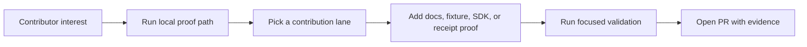

# Community

HELM AI Kernel is open for developers who care about AI agent security, MCP tool-call governance, signed receipts, and offline-verifiable evidence.

Star the repo to follow the MCP execution-firewall roadmap: <https://github.com/Mindburn-Labs/helm-ai-kernel/stargazers>

## Contribution Flow

## Start Here

- Run the local proof path: [Quickstart](docs/QUICKSTART.md).
- Ask setup and contribution questions: [Q&A](https://github.com/Mindburn-Labs/helm-ai-kernel/discussions/categories/q-a).
- Propose MCP, gateway, or agent-framework integrations: [Ideas](https://github.com/Mindburn-Labs/helm-ai-kernel/discussions/categories/ideas).
- Follow build-in-public updates: [Announcements](https://github.com/Mindburn-Labs/helm-ai-kernel/discussions/categories/announcements).
- Pick a scoped first issue: [good first issue](https://github.com/Mindburn-Labs/helm-ai-kernel/issues?q=is%3Aissue%20is%3Aopen%20label%3A%22good%20first%20issue%22).

## Contribution Lanes

| Lane | Good first contribution | Validation |
| --- | --- | --- |
| Docs | Clarify quickstart, proxy, MCP, or receipt verification steps. | `make docs-coverage docs-truth` |
| Examples | Add a localhost fixture for ALLOW, DENY, or ESCALATE behavior. | `make launch-smoke` or a focused example command |
| MCP | Improve quarantine, schema-pin, or authz documentation. | `bash scripts/launch/demo-mcp.sh` |
| Proxy | Improve OpenAI-compatible base URL examples. | `bash scripts/launch/demo-openai-proxy.sh` |
| Receipts | Add verification or tamper-failure fixtures. | `bash scripts/launch/demo-proof.sh` |
| SDKs | Polish first-run examples and README snippets. | `make sdk-examples-smoke` or the focused SDK target |

## Issue Labels

- `good first issue` is scoped and newcomer-safe.
- `help wanted` is contributor-ready, but may need more context or maintainer review.
- `maintainer-task` requires maintainer, operator, or release access and is not externally claimable.

Large changes should start in Discussions before a PR. Do not post provider keys, customer data, private prompts, unredacted production receipts, or live tenant metadata.
