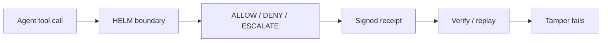
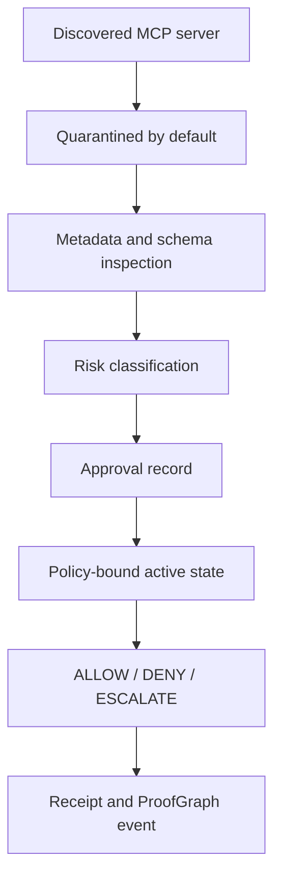

# HELM OSS

[](LICENSE)
[](https://scorecard.dev/viewer/?uri=github.com/mindburn-labs/helm-oss)
[](BEST_PRACTICES.md)
[](docs/VERIFICATION.md)
[](docs/PUBLISHING.md)
[](docs/PUBLISHING.md)

HELM OSS is the fail-closed execution firewall for AI agents.

AI models propose. Deterministic systems govern. HELM sits between stochastic
agent tool calls and infrastructure side effects. It intercepts MCP tools and
OpenAI-compatible requests, evaluates authority before dispatch, and emits
signed receipts that can be verified offline.

This is Mindburn Labs' HELM execution kernel for AI, not the Kubernetes package
manager.

```text
Agent proposal -> HELM boundary -> ALLOW / DENY / ESCALATE -> signed receipt
```

## Status

- Repository: `Mindburn-Labs/helm-oss`
- Root package identity: `helm-oss-root`
- Current public release: `v0.5.0`
- License: Apache-2.0
- Supported security line: `0.5.x`; `0.4.x` is best effort
- Canonical docs: <https://helm.docs.mindburn.org/oss>

The current `v0.5.0` GitHub release was published on 2026-05-13 at
<https://github.com/Mindburn-Labs/helm-oss/releases/tag/v0.5.0>. It includes
CLI binaries, checksums, SBOM JSON, OpenVEX, release-attestation metadata,
Cosign bundles, `evidence-pack.tar`, `helm.mcpb`, `helm.rb`, and sample policy
material.

## What HELM OSS Does

- Enforces default-deny execution for agent tool calls.
- Wraps MCP servers so unknown tools can be quarantined before side effects.
- Runs the kernel, guardian, proxy, receipt store, evidence export, and
  verification paths.
- Produces signed receipts and EvidencePacks for replay, audit, and tamper
  checks.
- Ships public SDK sources for Go, Python, TypeScript, Rust, and Java.

HELM OSS does not include hosted Mindburn operations, private operational
tooling, or non-OSS downstream extensions.

## Quick Start

Install the published macOS CLI:

```bash
brew install mindburnlabs/tap/helm
helm --version
```

Start a local boundary. Add `--console` when you want the self-hostable Console:

```bash
helm serve --policy ./release.high_risk.v3.toml
helm serve --policy ./release.high_risk.v3.toml --console
helm boundary status
```

Run the local proof demo after `helm serve` starts on `127.0.0.1:7714`:

```bash
curl http://127.0.0.1:7714/api/demo/run \
  -H 'content-type: application/json' \
  -d '{"action_id":"export_customer_list","policy_id":"agent_tool_call_boundary"}'
```

Verify the returned receipt and confirm that tampering fails:

```bash
curl http://127.0.0.1:7714/api/demo/verify \
  -H 'content-type: application/json' \
  -d '{"receipt":{...},"expected_receipt_hash":"<receipt_hash from proof_refs>"}'

curl http://127.0.0.1:7714/api/demo/tamper \
  -H 'content-type: application/json' \
  -d '{"receipt":{...},"expected_receipt_hash":"<receipt_hash from proof_refs>","mutation":"flip_verdict"}'
```

Govern MCP tools or an OpenAI-compatible client:

```bash
python3 scripts/launch/mock-openai-upstream.py --port 19090
helm mcp wrap --server-id local-tools --upstream-command "python3 scripts/launch/mcp-fixture-server.py"
helm proxy --upstream http://127.0.0.1:19090/v1
```

Inspect and verify evidence:

```bash
helm sandbox preflight --runtime wazero
helm receipts tail --agent agent.demo.exec
helm verify evidence-pack.tar
```

`helm serve --policy` stores receipts in SQLite by default unless
`DATABASE_URL` is set. `helm verify evidence-pack.tar` runs offline by default;
use `--online` only when public proof endpoint credentials are available for
that release.

## Build From Source

```bash
git clone https://github.com/Mindburn-Labs/helm-oss.git
cd helm-oss
make build
./bin/helm serve --policy ./release.high_risk.v3.toml
```

Run the retained validation targets before publishing changes:

```bash
make test
make test-console
make test-platform
make test-all
make crucible
```

## Architecture

HELM separates orchestration from execution authority. Agent frameworks decide
what to attempt; HELM decides what is allowed to execute.



Unknown MCP servers and tools enter quarantine before dispatch:



Key terms:

- `ALLOW`: HELM lets the action run.
- `DENY`: HELM blocks the action.
- `ESCALATE`: HELM stops and asks for more facts, policy, or human approval.
- `Receipt`: signed record of the decision.
- `ProofGraph`: replayable record chain for what happened.
- `EvidencePack`: portable bundle of records for a review path.

The complete diagram doctrine lives in
[docs/architecture/canonical-diagrams.md](docs/architecture/canonical-diagrams.md).

## Public Interfaces

| Surface | Path | Status |
| --- | --- | --- |
| CLI and kernel | `core/` | Go implementation of boundary, CLI, HTTP API, proxy, receipts, evidence export, and verification |
| Console | `apps/console/` | Self-hostable HELM OSS Console |
| Design system core | `packages/design-system-core/` | Workspace package source used by the Console |
| Wire contracts | `api/openapi/`, `protocols/`, `schemas/` | OpenAPI, Protobuf, policy schemas, and JSON schemas |
| SDKs | `sdk/` | Go, Python, TypeScript, Rust, and Java sources |
| Examples | `examples/` | Runnable integrations and launch smoke material |
| Conformance | `tests/conformance/`, `reference_packs/` | Profile, checklist, fixtures, and reference packs |
| Deployment | `deploy/helm-chart/` | Helm chart for running the kernel in Kubernetes |

## SDKs And Packages

| Surface | Current install or status |
| --- | --- |
| CLI | `brew install mindburnlabs/tap/helm`; release binaries are attached to GitHub Releases |
| Go SDK | `go get github.com/Mindburn-Labs/helm-oss/sdk/go@main`; tagged module versions are tracked as an OSS-readiness follow-up |
| Python SDK | `pip install helm-sdk` |
| TypeScript SDK | `npm install @mindburn/helm` |
| Rust SDK | `cargo add helm-sdk` |
| Java SDK | Source-available local Maven build under `sdk/java`; public package coordinate is not verified in this repo |
| Design system core | Workspace source; public npm registry publication is not verified in this repo |

HTTP clients are generated from
[`api/openapi/helm.openapi.yaml`](api/openapi/helm.openapi.yaml). Protobuf
message bindings come from [`protocols/proto/`](protocols/proto/) where a
language SDK ships them.

## Documentation

Public OSS docs are sourced from this repo and published through
`helm.docs.mindburn.org`. The owned docs set for sync is declared in
`docs/public-docs.manifest.json`.

- [Quickstart](docs/QUICKSTART.md)
- [Console](docs/CONSOLE.md)
- [Architecture](docs/ARCHITECTURE.md)
- [Conformance](docs/CONFORMANCE.md)
- [Verification](docs/VERIFICATION.md)
- [Publishing](docs/PUBLISHING.md)
- [Compatibility](docs/COMPATIBILITY.md)
- [SDK Index](docs/sdks/00_INDEX.md)
- [Security Model](docs/EXECUTION_SECURITY_MODEL.md)
- [OWASP Mapping](docs/OWASP_MCP_THREAT_MAPPING.md)
- [NIST AI Agent Critical Infrastructure Alignment](docs/compliance/nist-ai-agent-critical-infrastructure.md)
- [NIST AI RMF to ISO 42001 Crosswalk](docs/compliance/nist-ai-rmf-iso-42001-crosswalk.md)

## Release Verification

For `v0.5.0`, verify downloads with `SHA256SUMS.txt`, `sbom.json`,
`v0.5.0.openvex.json`, `release-attestation.json`, the platform binary assets,
matching `*.cosign.bundle` files, and offline `evidence-pack.tar` verification.

See [docs/VERIFICATION.md](docs/VERIFICATION.md) and
[docs/PUBLISHING.md](docs/PUBLISHING.md) for the full release verification path.

## Security, Contributing, And Governance

- Report vulnerabilities through [SECURITY.md](SECURITY.md). Do not open public
  issues for security-sensitive reports.
- Contribution setup and validation expectations are in
  [CONTRIBUTING.md](CONTRIBUTING.md).
- Project governance and maintainer responsibilities are in
  [GOVERNANCE.md](GOVERNANCE.md) and [MAINTAINERS.md](MAINTAINERS.md).
- Community behavior expectations are in [CODE_OF_CONDUCT.md](CODE_OF_CONDUCT.md).
- Support channels are listed in [SUPPORT.md](SUPPORT.md).
- Near-term OSS work is summarized in [ROADMAP.md](ROADMAP.md).

## License

Apache-2.0. See [LICENSE](LICENSE).
