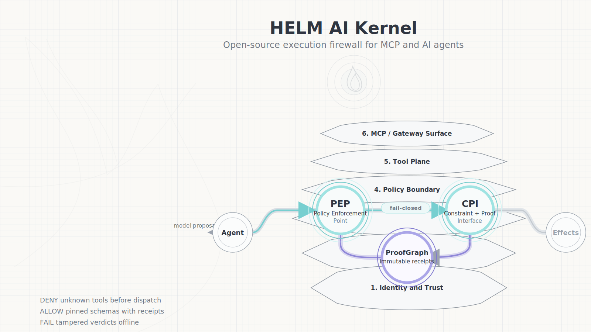
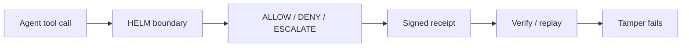
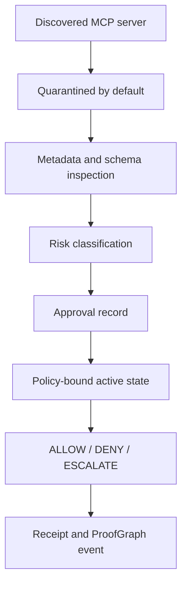

HELM AI Kernel is the fail-closed execution firewall for AI agents.

# HELM AI Kernel

[](LICENSE)
[](https://github.com/Mindburn-Labs/helm-ai-kernel/actions/workflows/ci.yml)
[](https://github.com/Mindburn-Labs/helm-ai-kernel/actions/workflows/docs.yml)
[](https://github.com/Mindburn-Labs/helm-ai-kernel/actions/workflows/codeql.yml)
[](https://scorecard.dev/viewer/?uri=github.com/Mindburn-Labs/helm-ai-kernel)
[](https://bestpractices.dev/projects/9876)
[](https://github.com/Mindburn-Labs/helm-ai-kernel/releases/latest)
[](https://goreportcard.com/report/github.com/Mindburn-Labs/helm-ai-kernel)
[](https://central.sonatype.com/artifact/io.github.mindburnlabs/helm-sdk)
[](https://www.npmjs.com/package/@mindburn/helm-ai-kernel)
[](https://pypi.org/project/helm-sdk/)
[](https://crates.io/crates/helm-sdk)
[](https://pkg.go.dev/github.com/Mindburn-Labs/helm-ai-kernel/sdk/go)
[](https://github.com/mindburnlabs/homebrew-tap/blob/main/Formula/helm-ai-kernel.rb)
[](https://github.com/Mindburn-Labs/helm-ai-kernel/actions/workflows/launchpad-artifacts.yml)
[](https://github.com/Mindburn-Labs/helm-ai-kernel/releases/latest/download/SHA256SUMS.txt)
[](https://github.com/Mindburn-Labs/helm-ai-kernel/releases/latest/download/release-attestation.json)
[](https://github.com/Mindburn-Labs/helm-ai-kernel/releases/latest/download/sbom.json)
[](docs/RELEASE_SECURITY.md)
[](docs/VERIFICATION.md)
[](https://github.com/Mindburn-Labs/helm-ai-kernel/pkgs/container/helm-ai-kernel)
[](https://github.com/Mindburn-Labs/helm-ai-kernel/pkgs/container/charts%2Fhelm-ai-kernel)
[](https://artifacthub.io/packages/search?repo=mindburn-labs)

This is Mindburn Labs’ HELM execution kernel for AI, not the Kubernetes package manager.

HELM evaluates agent execution requests and records every ALLOW / DENY /
ESCALATE decision as verifiable evidence.

HELM AI Kernel is a fail-closed execution firewall for AI agents. It sits
between stochastic agent proposals, such as MCP tools and OpenAI-compatible
requests, and infrastructure side effects. The kernel enforces default-deny
policies, quarantines unknown MCP tools, and emits signed receipts plus
EvidencePacks that can be verified offline.

HELM AI Kernel is not an agent orchestration framework, a SaaS AI governance
dashboard, or a vague trust layer with no enforcement mechanism. The public
kernel is the local boundary, policy, receipt, and verification path.

## Try HELM AI Kernel Locally

No account, hosted service, or production credential is required for the local
proof path:

```bash
git clone https://github.com/Mindburn-Labs/helm-ai-kernel.git
cd helm-ai-kernel
make build
bash scripts/launch/demo-mcp.sh
bash scripts/launch/demo-proof.sh
```

The local proof path shows the public value proposition in one frame:

- unknown MCP servers and tools are denied before fixture dispatch
- a schema-pinned fixture call is allowed
- a signed DENY receipt verifies offline
- a flipped-verdict receipt fails verification

Star HELM AI Kernel if you want to follow fail-closed AI agent execution, MCP
quarantine, signed receipts, and offline-verifiable EvidencePacks:
<https://github.com/Mindburn-Labs/helm-ai-kernel/stargazers>



Sanitized transcripts are checked in under
[`examples/launch/assets`](examples/launch/assets).

## From Zero To Verified

**Autonomous setup. Explicit authority.** HELM sets itself up autonomously,
but cannot grant itself authority. Setup is near-zero-touch by design —
adoption friction is a security property:

```bash
helm-ai-kernel quickstart # one command: local Kernel + same-origin Console,
                          # backend-owned proof flow, no cloud account needed
helm-ai-kernel onboard    # terminal-only local store + trust root + config,
                          # plus auto-detection of agent SDKs and MCP configs
helm-ai-kernel scan       # boundary grade: what runs ungoverned here?
helm-ai-kernel proxy --upstream <openai-compatible-url>   # wrap an agent
helm-ai-kernel mcp serve  # quarantine MCP tools until approved
helm-ai-kernel verify --bundle <pack>                     # verify evidence offline
```

Onboarding requires no external dependencies. Discovered MCP servers are
quarantined automatically until approved — HELM prepares approval records, it
never approves them itself. Observe mode (the shadow on-ramp:
full verdicts and receipts, no blocking) is an explicit, receipt-labeled,
time-boxed grant — never a silent default; expiry restores fail-closed
enforcement automatically.

## Start Here

| Visitor | First path | What to verify |
| --- | --- | --- |
| Agent builders | [Quickstart](docs/QUICKSTART.md) and [OpenAI-compatible proxy](docs/INTEGRATIONS/openai_baseurl.md) | Existing OpenAI-style clients can route through HELM and receive receipt metadata. |
| Security engineers | [Execution Security Model](docs/EXECUTION_SECURITY_MODEL.md) and [OWASP MCP Threat Mapping](docs/OWASP_MCP_THREAT_MAPPING.md) | ALLOW, DENY, and ESCALATE decisions are recorded with verifiable evidence. |
| Gateway and MCP maintainers | [MCP integration](docs/INTEGRATIONS/mcp.md) and [Ecosystem map](docs/ECOSYSTEM.md) | Unknown tools stay quarantined until schema, identity, and policy state are approved. |

## Community And Product Links

- Try HELM AI Kernel locally: [Quickstart](https://helm.docs.mindburn.org/helm-ai-kernel/quickstart?utm_source=github&utm_medium=readme&utm_campaign=oss-traction)
- Star on GitHub: [Mindburn-Labs/helm-ai-kernel](https://github.com/Mindburn-Labs/helm-ai-kernel?utm_source=github&utm_medium=readme&utm_campaign=oss-traction)
- Join Discussions: [GitHub Discussions](https://github.com/Mindburn-Labs/helm-ai-kernel/discussions?utm_source=github&utm_medium=readme&utm_campaign=oss-traction)
- Find first issues: [good first issue](https://github.com/Mindburn-Labs/helm-ai-kernel/issues?q=is%3Aissue%20is%3Aopen%20label%3A%22good%20first%20issue%22)
- Talk to Mindburn Labs about production execution authority: [Console](https://console.helm.mindburn.org?utm_source=github&utm_medium=readme&utm_campaign=oss-traction)

## Launchpad And Console

Run the local OSS proof first:

```bash
helm-ai-kernel quickstart
```

After that proof succeeds, use hosted Console pairing when you want account,
Launchpad, or commercial workflows:

```bash
brew install mindburnlabs/tap/helm-ai-kernel
helm-ai-kernel login
helm-ai-kernel console pair

export OPENROUTER_API_KEY=...
helm-ai-kernel launch secrets set model_gateway \
  --provider openrouter \
  --value-env OPENROUTER_API_KEY

helm up openclaw
helm up hermes --target local

helm-ai-kernel launch evidence <launch_id> --export --json
helm-ai-kernel verify --bundle <pack>
```

Native EvidencePack verification is sealed by
`07_ATTESTATIONS/evidence_pack.sig`. Dev-local packs verify offline with the
default profile. Customer-grade packs use the same seal plus explicit trust
configuration, external signing, an external Rekor or RFC3161 anchor receipt,
and an S3 Object Lock storage receipt:

```bash
helm-ai-kernel trust init --config helm/helm.yaml --profile customer --signer kms --anchor rekor --store s3 --object-lock
helm-ai-kernel verify --bundle <pack.tar> --profile customer --storage-receipt <pack.tar.storage.json>
```

What you get:
* Console dashboard with receipts, evidence, and run history
* deterministic ALLOW / DENY / ESCALATE verdicts
* MCP quarantine for unknown servers and tools
* signed receipts
* offline-verifiable EvidencePacks
* teardown proof

## Core Overview

AI models propose. Deterministic systems govern. HELM sits between stochastic
agent tool calls and infrastructure side effects. It intercepts MCP tools and
OpenAI-compatible requests, evaluates authority before dispatch, and emits
signed receipts that can be verified offline.

This is Mindburn Labs’ HELM execution kernel for AI, not the Kubernetes package manager.

```text
Agent proposal -> HELM boundary -> ALLOW / DENY / ESCALATE -> signed receipt
```

The wire formats behind that pipeline — verdicts, receipts, EvidencePacks,
policy bundles, reason codes — are open, versioned specifications under
[`protocols/`](protocols/spec/PROTOCOL.md), implementable without HELM
software or branding and verifiable against the conformance golden vectors in
[`tests/conformance`](tests/conformance). HELM is the reference
implementation. Proof is only proof when the verifier does not have to trust
the prover.

If your agent can execute tools without receipts, it is not production-grade.
**No receipt, no production.**

## Status

- Repository: `Mindburn-Labs/helm-ai-kernel`
- Root package identity: `helm-ai-kernel-root`
- Source release target: `v0.5.15`
- License: Apache-2.0
- Supported security line: `0.5.x`; `0.4.x` is best effort
- Canonical docs: <https://helm.docs.mindburn.org/helm-ai-kernel>

The `v0.5.15` release is complete only when the GitHub Release includes
CLI binaries, checksums, SBOM JSON, OpenVEX, release-attestation metadata,
Cosign bundles, `evidence-pack.tar`, `helm-ai-kernel.mcpb`,
`helm-ai-kernel.rb`, sample policy material, the signed Console web bundle
with checksum/SBOM/provenance/lock/manifest sidecars, and a passing
`version-status.json` for all lockstep package channels:
<https://github.com/Mindburn-Labs/helm-ai-kernel/releases/tag/v0.5.15>.

## What HELM AI Kernel Does

- Enforces default-deny execution for agent tool calls.
- Wraps MCP servers so unknown tools can be quarantined before side effects.
- Runs the kernel, guardian, proxy, receipt store, evidence export, and
  verification paths.
- Produces signed receipts and EvidencePacks for replay, audit, and tamper
  checks.
- Ships public SDK sources for Go, Python, TypeScript, Rust, and Java.

HELM AI Kernel does not include hosted Mindburn operations, private operational
tooling, or non-OSS downstream extensions.

## Security Model And Limitations

HELM AI Kernel provides a deterministic execution boundary: fail-closed policy
evaluation, MCP interception, OpenAI-compatible proxying, signed receipts, and
offline-verifiable EvidencePacks. It records ALLOW, DENY, and ESCALATE outcomes
so reviewers can inspect the decision path after the run.

It does not claim operating-system sandboxing beyond the sandbox and runtime
surfaces present in this repository, and it does not claim seccomp or eBPF
enforcement unless a specific source-backed integration says so. It is not a
robot fleet controller, an AGI operating system, or a generic compliance
guarantee.

## Quick Start

Install the published macOS CLI from the current GitHub release, or use the
source build path below when editing this repository. No Console account is
required for the local proof path. The public Homebrew tap is current only when
the release includes a passing `version-status.json`.

```bash
curl -L -o helm-ai-kernel https://github.com/Mindburn-Labs/helm-ai-kernel/releases/latest/download/helm-ai-kernel-darwin-arm64
chmod +x helm-ai-kernel
./helm-ai-kernel --version
```

Start a local headless boundary:

```bash
helm-ai-kernel serve --policy ./release.high_risk.v3.toml
helm-ai-kernel boundary status
```

Run the local proof demo after `helm-ai-kernel serve` starts on `127.0.0.1:7714`:

```bash
curl http://127.0.0.1:7714/api/demo/run \
  -H 'content-type: application/json' \
  -d '{"action_id":"export_customer_list","policy_id":"agent_tool_call_boundary"}'
```

Verify the returned receipt and confirm that tampering fails:

```bash
curl http://127.0.0.1:7714/api/demo/verify \
  -H 'content-type: application/json' \
  -d '{"receipt":{...},"expected_receipt_hash":"<receipt_hash from proof_refs>"}'

curl http://127.0.0.1:7714/api/demo/tamper \
  -H 'content-type: application/json' \
  -d '{"receipt":{...},"expected_receipt_hash":"<receipt_hash from proof_refs>","mutation":"flip_verdict"}'
```

Govern MCP tools or an OpenAI-compatible client:

```bash
python3 scripts/launch/mock-openai-upstream.py --port 19090
helm-ai-kernel mcp wrap --server-id local-tools --upstream-command "python3 scripts/launch/mcp-fixture-server.py"
helm-ai-kernel proxy --upstream http://127.0.0.1:19090/v1
```

Inspect and verify evidence:

```bash
helm-ai-kernel sandbox preflight --runtime wazero
helm-ai-kernel receipts tail --agent agent.demo.exec
helm-ai-kernel verify evidence-pack.tar
```

`helm-ai-kernel serve --policy` stores receipts in SQLite by default unless
`DATABASE_URL` is set. `helm-ai-kernel verify evidence-pack.tar` runs offline by default;
use `--online` only when public proof endpoint credentials are available for
that release.

## Build From Source

```bash
git clone https://github.com/Mindburn-Labs/helm-ai-kernel.git
cd helm-ai-kernel
make build
./bin/helm-ai-kernel serve --policy ./release.high_risk.v3.toml
```

Run the retained validation targets before publishing changes:

```bash
make test
make test-platform
make test-all
make crucible
```

## Architecture

HELM separates orchestration from execution authority. Agent frameworks decide
what to attempt; HELM decides what is allowed to execute.



Unknown MCP servers and tools enter quarantine before dispatch:



Key terms:

- `ALLOW`: HELM lets the action run.
- `DENY`: HELM blocks the action.
- `ESCALATE`: HELM stops and asks for more facts, policy, or human approval.
- `Receipt`: signed record of the decision.
- `ProofGraph`: replayable record chain for what happened.
- `EvidencePack`: portable bundle of records for a review path.

The complete diagram doctrine lives in
[docs/architecture/canonical-diagrams.md](docs/architecture/canonical-diagrams.md).

## Public Interfaces

| Surface | Path | Status |
| --- | --- | --- |
| CLI and kernel | `core/` | Go implementation of boundary, CLI, HTTP API, proxy, receipts, evidence export, and verification |
| Headless API contract | `api/openapi/`, `protocols/`, `schemas/` | HTTP, WebSocket-adjacent, OpenAPI, Protobuf, policy schema, and JSON schema contracts for external clients |
| Wire contracts | `api/openapi/`, `protocols/`, `schemas/` | OpenAPI, Protobuf, policy schemas, and JSON schemas |
| SDKs | `sdk/` | Go, Python, TypeScript, Rust, and Java sources |
| Examples | `examples/` | Runnable integrations and launch smoke material |
| Conformance | `tests/conformance/`, `reference_packs/` | Profile, checklist, fixtures, and reference packs |
| Deployment | `deploy/helm-chart/` | Helm chart for running the kernel in Kubernetes |

## SDKs And Packages

| Surface | Current install or status |
| --- | --- |
| CLI | GitHub Release binaries; the latest release attaches a `helm-ai-kernel.rb` formula asset. Verify the public tap before relying on `brew install mindburnlabs/tap/helm-ai-kernel` for the latest version |
| Go SDK | `go get github.com/Mindburn-Labs/helm-ai-kernel/sdk/go@v0.5.15` |
| Python SDK | `pip install helm-sdk` |
| TypeScript SDK | `npm install @mindburn/helm-ai-kernel` |
| Rust SDK | `cargo add helm-sdk` |
| Java SDK | Maven Central coordinate `io.github.mindburnlabs:helm-sdk:0.5.15` |

HTTP clients are generated from
[`api/openapi/helm.openapi.yaml`](api/openapi/helm.openapi.yaml). Protobuf
message bindings come from [`protocols/proto/`](protocols/proto/) where a
language SDK ships them.

## Documentation

Public OSS docs are sourced from this repo and published through
`helm.docs.mindburn.org`. The owned docs set for sync is declared in
`docs/public-docs.manifest.json`.

- [Quickstart](docs/QUICKSTART.md)
- [Community](COMMUNITY.md)
- [Ecosystem](docs/ECOSYSTEM.md)
- [HELM AI Kernel OSS Traction Plan](docs/TRACTION.md)
- [Architecture](docs/ARCHITECTURE.md)
- [Conformance](docs/CONFORMANCE.md)
- [Verification](docs/VERIFICATION.md)
- [Publishing](docs/PUBLISHING.md)
- [Compatibility](docs/COMPATIBILITY.md)
- [SDK Index](docs/sdks/00_INDEX.md)
- [Security Model](docs/EXECUTION_SECURITY_MODEL.md)
- [OWASP Mapping](docs/OWASP_MCP_THREAT_MAPPING.md)
- [NIST AI Agent Critical Infrastructure Alignment](docs/compliance/nist-ai-agent-critical-infrastructure.md)
- [NIST AI RMF to ISO 42001 Crosswalk](docs/compliance/nist-ai-rmf-iso-42001-crosswalk.md)
- Search-intent pages: [MCP tool quarantine](docs/use-cases/mcp-execution-firewall.md), [AI agent execution firewall](docs/use-cases/ai-agent-security.md), [OpenAI-compatible execution boundary](docs/use-cases/openai-compatible-ai-gateway-policy.md), [signed receipts for AI agent actions](docs/use-cases/llm-audit-receipts.md), and [AI agent side-effect governance](docs/use-cases/agent-tool-call-governance.md)

## Release Verification

For `v0.5.15`, verify downloads with `SHA256SUMS.txt`, `sbom.json`,
`v0.5.15.openvex.json`, `release-attestation.json`, the platform binary assets,
the Console web bundle lock/SBOM/provenance sidecars, matching
`*.cosign.bundle` files, and offline `evidence-pack.tar` verification.

Current release tooling requires tag refs to match the checked-in `VERSION`,
requires an exact `v<version>.openvex.json` for tag releases, and verifies the
staged `evidence-pack.tar` before checksums are finalized.

See [docs/VERIFICATION.md](docs/VERIFICATION.md) and
[docs/PUBLISHING.md](docs/PUBLISHING.md) for the full release verification path.

## Security, Contributing, And Governance

- Report vulnerabilities through [SECURITY.md](SECURITY.md). Do not open public
  issues for security-sensitive reports.
- Contribution setup and validation expectations are in
  [CONTRIBUTING.md](CONTRIBUTING.md).
- Project governance and maintainer responsibilities are in
  [GOVERNANCE.md](GOVERNANCE.md) and [MAINTAINERS.md](MAINTAINERS.md).
- Community behavior expectations are in [CODE_OF_CONDUCT.md](CODE_OF_CONDUCT.md).
- Support channels are listed in [SUPPORT.md](SUPPORT.md).
- Near-term OSS work is summarized in [ROADMAP.md](ROADMAP.md).

## License

Apache-2.0. See [LICENSE](LICENSE).
