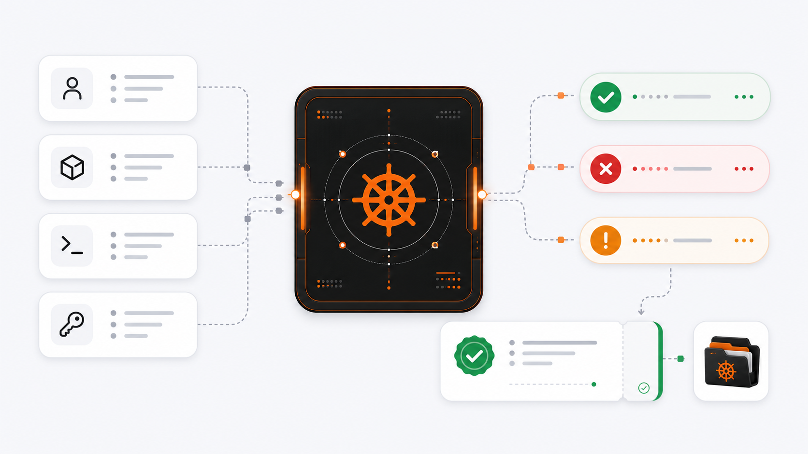

# HELM AI Kernel

**A local firewall for AI-agent actions.**

HELM sits between Claude Code, Codex, MCP tools, shell commands, and other agent
actions. It decides `ALLOW`, `DENY`, or `ESCALATE`, then writes a signed receipt
you can verify later.



## Try It

```bash
brew install mindburnlabs/tap/helm-ai-kernel
helm-ai-kernel setup claude-code --yes
# Codex: helm-ai-kernel setup codex --yes
```

Ask your agent to do something risky. HELM blocks or escalates the action before
it runs, then records the decision.

```bash
helm-ai-kernel workstation verify-decision \
  --receipt ~/.helm-ai-kernel/receipts/hooks/<decision>.json
```

No cloud account. No model key. No Docker. No production credentials.

## What It Does

| Agent tries to... | HELM does this | Proof |
| --- | --- | --- |
| Run a destructive shell command | `DENY` | signed receipt |
| Use an unknown MCP tool | `ESCALATE` | quarantine record |
| Read protected secrets | `DENY` | fail-closed receipt |
| Run approved work | `ALLOW` | receipt + evidence |
| Export a review bundle | verify offline | EvidencePack |

## One Example

```text
Agent asks: delete the production database
HELM sees: protected data + irreversible action
HELM says: DENY
You get:  a signed receipt you can verify offline
```

## Where To Go Next

| Need | Link |
| --- | --- |
| 5-minute local proof | [Quickstart](docs/QUICKSTART.md) |
| CLI commands | [CLI reference](docs/reference/cli.md) |
| Security model | [Execution security model](docs/EXECUTION_SECURITY_MODEL.md) |
| MCP tool quarantine | [MCP integration](docs/INTEGRATIONS/mcp.md) |
| Evidence verification | [Verification](docs/VERIFICATION.md) |

## What It Is Not

- Not Kubernetes Helm.
- Not the hosted HELM Enterprise product.
- Not a vague AI-safety claim.

It is the open-source execution boundary: policy in, action checked, receipt out.

## Source Build

```bash
git clone https://github.com/Mindburn-Labs/helm-ai-kernel.git
cd helm-ai-kernel
make build
bin/helm-ai-kernel setup claude-code --yes
```

## Project

Apache-2.0. See [LICENSE](LICENSE), [SECURITY.md](SECURITY.md), and
[CONTRIBUTING.md](CONTRIBUTING.md).
