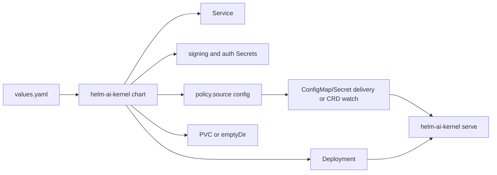

# Deployment

The retained deployment material in this repository is the Kubernetes Helm
chart under `deploy/helm-chart/`. Docker Compose remains the local development
path and is documented in `docker-compose.yml` and `docs/DEVELOPER_JOURNEY.md`.

## Deployment Shape



## Helm Chart

```bash
make helm-chart-smoke
helm lint deploy/helm-chart
helm template helm-ai-kernel deploy/helm-chart
helm install helm-ai-kernel deploy/helm-chart
```

Review `deploy/helm-chart/values.yaml` before use in a real environment.

## systemd (single host)

For a single host without Kubernetes — for example a sealed or air-gapped
appliance — a hardened reference unit ships at
`deploy/systemd/helm-gateway.service`. It runs the gateway under a
system-managed unprivileged account with a read-only root filesystem, no new
privileges, a narrowed system-call and address-family set, and closed device
access. The host enforces the isolation; HELM writes the receipts. Review every
path and directive, then check it on the host with
`systemd-analyze verify helm-gateway.service`. See the
[sealed / air-gapped host guide](https://helm.docs.mindburn.org/guides/air-gap-appliance).

## Scope

Included:

- `Deployment` running `helm-ai-kernel serve`
- reference `systemd` unit for a single-host deployment at `deploy/systemd/helm-gateway.service`
- `Service` for HTTP, health, and optional metrics ports
- optional `Ingress`
- generated or existing signing-key `Secret`
- generated or existing runtime-auth `Secret`
- policy source configuration with default mounted-file delivery
- optional mounted-file policy `ConfigMap` or `Secret`
- optional `HelmPolicyBundle` CRD/RBAC template for `policy.source.kind=crd`
- optional `PersistentVolumeClaim`
- optional Prometheus Operator `ServiceMonitor`

Not included:

- hosted demo deployment material
- Grafana dashboards or broader monitoring bundles
- managed control-plane deployment material
- Agent Scope Audit chart behavior; `helm-ai-kernel audit scope` is a local CLI and evidence export over receipt files

Those excluded surfaces are not part of the retained OSS deployment contract.
