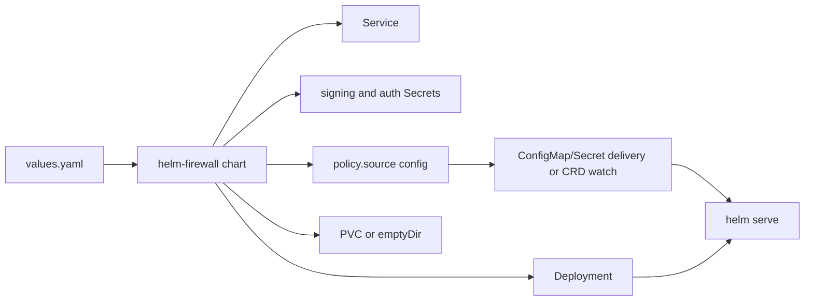

# Deployment

The retained deployment material in this repository is the Kubernetes Helm
chart under `deploy/helm-chart/`. Docker Compose remains the local development
path and is documented in `docker-compose.yml` and `docs/DEVELOPER_JOURNEY.md`.

## Deployment Shape



## Helm Chart

```bash
make helm-chart-smoke
helm lint deploy/helm-chart
helm template helm-oss deploy/helm-chart
helm install helm-oss deploy/helm-chart
```

Review `deploy/helm-chart/values.yaml` before use in a real environment.

## Scope

Included:

- `Deployment` running `helm serve`
- `Service` for HTTP, health, and optional metrics ports
- optional `Ingress`
- generated or existing signing-key `Secret`
- generated or existing runtime-auth `Secret`
- policy source configuration with default mounted-file delivery
- optional mounted-file policy `ConfigMap` or `Secret`
- optional `HelmPolicyBundle` CRD/RBAC template for `policy.source.kind=crd`
- optional `PersistentVolumeClaim`
- optional Prometheus Operator `ServiceMonitor`

Not included:

- hosted demo deployment material
- Grafana dashboards or broader monitoring bundles
- managed control-plane deployment material

Those excluded surfaces are not part of the retained OSS deployment contract.
