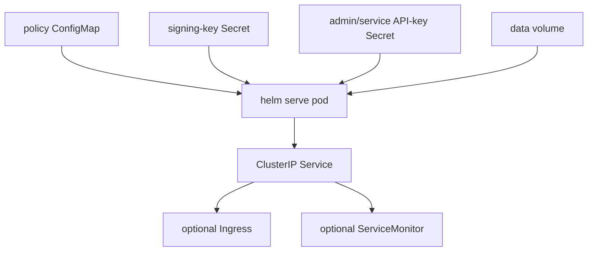

# HELM Chart

This chart deploys the retained OSS kernel from source in this repository.
The chart name is `helm-firewall` to avoid confusion with the Kubernetes Helm
package manager.

## Validate

```bash
make helm-chart-smoke
helm lint deploy/helm-chart
helm template helm-oss deploy/helm-chart
```

`make helm-chart-smoke` uses `scripts/ci/helm_chart_smoke.sh`. Set
`KUBE_HELM_CMD` to an explicit Kubernetes Helm binary, or let the script use
the pinned containerized Helm runner.

## Install

```bash
helm install helm-oss deploy/helm-chart \
  --set helm.production=true \
  --set helm.signing.key=<64-char-ed25519-seed-hex> \
  --set helm.auth.adminAPIKey=<admin-api-key> \
  --set helm.auth.serviceAPIKey=<service-api-key>
```

Review `values.yaml` before use in a real environment.

## Runtime Contract



## Values That Matter

| Value | Default | Effect |
| --- | --- | --- |
| `image.repository` | `ghcr.io/mindburn-labs/helm-oss` | Container image repository. |
| `image.tag` | chart `appVersion` | Container image tag. |
| `helm.bindAddr` | `0.0.0.0` | Required inside Kubernetes pods. |
| `helm.production` | `false` | Refuses generated signing/auth material when set to `true`. |
| `helm.signing.key` | empty | 64-char hex Ed25519 seed when not using an existing secret. |
| `helm.signing.existingSecret` | empty | Existing secret containing `signing-key`. |
| `helm.auth.adminAPIKey` | empty | Admin API key written to the generated auth secret. |
| `helm.auth.serviceAPIKey` | empty | Service API key written to the generated auth secret. |
| `helm.auth.existingSecret` | empty | Existing secret containing auth key entries. |
| `helm.storage.type` | `sqlite` | `sqlite` or `postgres`. |
| `helm.storage.postgres.existingSecret` | empty | Existing secret containing `DATABASE_URL`. |
| `persistence.enabled` | `true` | Creates or uses a PVC for `/data`. |
| `ingress.enabled` | `false` | Enables Kubernetes ingress. |
| `helm.metrics.serviceMonitor.enabled` | `false` | Emits a Prometheus Operator `ServiceMonitor`. |

## Production Notes

- Set `helm.production=true` and provide `helm.signing.key` or
  `helm.signing.existingSecret`.
- Provide `helm.auth.adminAPIKey` and `helm.auth.serviceAPIKey`, or
  `helm.auth.existingSecret`; production rendering fails closed without auth
  material.
- Use a persistent volume or external PostgreSQL for durable receipts and
  evidence.
- Keep `serviceAccount.automountServiceAccountToken=false` unless an
  integration explicitly requires Kubernetes API access.
- Use `make kind-smoke` to prove install, health, receipt persistence,
  evidence export, replay verification, and signing-key stability across pod
  restart.
