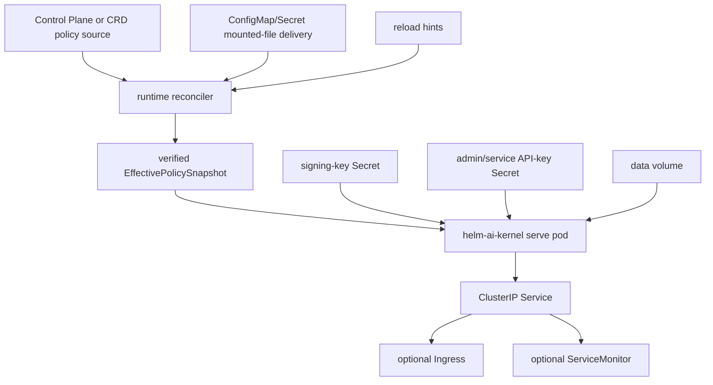

# HELM Chart

This chart deploys the retained OSS kernel from source in this repository.
The chart name is `helm-ai-kernel`. Values remain under the `.Values.helm`
root for one compatibility window.

## Validate

```bash
make helm-chart-smoke
helm lint deploy/helm-chart
helm template helm-ai-kernel deploy/helm-chart
```

`make helm-chart-smoke` uses `scripts/ci/helm_chart_smoke.sh`. Set
`KUBE_HELM_CMD` to an explicit Kubernetes Helm binary, or let the script use
the pinned containerized Helm runner.

## Install

```bash
helm install helm-ai-kernel deploy/helm-chart \
  --set helm.production=true \
  --set helm.signing.key=<64-char-ed25519-seed-hex> \
  --set helm.auth.adminAPIKey=<admin-api-key> \
  --set helm.auth.serviceAPIKey=<service-api-key> \
  --set helm.auth.tenantID=<runtime-tenant-id> \
  --set helm.auth.principalID=<runtime-principal-id>
```

Review `values.yaml` before use in a real environment.

## Runtime Contract



## Values That Matter

| Value | Default | Effect |
| --- | --- | --- |
| `image.repository` | `ghcr.io/mindburn-labs/helm-ai-kernel` | Container image repository. |
| `image.tag` | chart `appVersion` | Container image tag. |
| `imagePullSecrets` | `[]` | Pull secrets applied to the kernel and optional launchpad app Pods/Jobs/test Pod. |
| `launchpadApps.hermes.mode` | `job` | `job` renders the promoted single-query smoke Job; `deployment` renders a long-lived Hermes gateway Deployment without claiming live F2 promotion. |
| `launchpadApps.hermes.provider` | `openrouter` | Provider passed to the default Hermes Job command. |
| `launchpadApps.hermes.model` | `openai/gpt-4o-mini` | Model passed to the default Hermes Job command. |
| `launchpadApps.hermes.query` | `ping` | Single query passed to the default Hermes Job command. |
| `launchpadApps.hermes.commandOverride` | `[]` | Full command array replacement for operator-specific Hermes runtime evidence. |
| `helm.*` | retained | Legacy values root retained for one compatibility window. |
| `helm.bindAddr` | `0.0.0.0` | Required inside Kubernetes pods. |
| `helm.production` | `false` | Refuses generated signing/auth material when set to `true`. |
| `helm.signing.key` | empty | 64-char hex Ed25519 seed when not using an existing secret. |
| `helm.signing.existingSecret` | empty | Existing secret containing `signing-key`. |
| `helm.auth.adminAPIKey` | empty | Admin API key written to the generated auth secret. |
| `helm.auth.serviceAPIKey` | empty | Service API key written to the generated auth secret. |
| `helm.auth.existingSecret` | empty | Existing secret containing auth key entries. |
| `helm.auth.tenantID` | `default` | Server-bound tenant for tenant-scoped runtime routes; request tenant headers must match. |
| `helm.auth.principalID` | `system-admin` | Server-bound principal for tenant-scoped runtime routes; request principal headers must match. |
| `helm.storage.type` | `sqlite` | `sqlite` or `postgres`. |
| `helm.storage.postgres.existingSecret` | empty | Existing secret containing `DATABASE_URL`; required for production Postgres. |
| `helm.storage.postgres.sslMode` | `require` | PostgreSQL TLS mode. Production requires `require`, `verify-ca`, or `verify-full`. |
| `helm.storage.postgres.maxOpenConns` | `25` | PostgreSQL pool open-connection ceiling. |
| `helm.storage.postgres.maxIdleConns` | `10` | PostgreSQL pool idle-connection ceiling. |
| `helm.storage.postgres.connMaxLifetime` | `30m` | PostgreSQL pooled connection lifetime. |
| `helm.limits.global.rps` | `60` | Process-wide per-client request rate. |
| `helm.limits.global.burst` | `120` | Process-wide per-client burst. |
| `helm.limits.actor.rps` | `60` | Actor/resource request rate. |
| `helm.limits.actor.burst` | `120` | Actor/resource burst. |
| `helm.limits.concurrency.max` | `0` | Process in-flight request cap; `0` disables. |
| `helm.limits.loadShed.enabled` | `false` | Enable low-priority load shedding. |
| `helm.policy.source.kind` | `mountedFile` | `controlplane`, `crd`, or `mountedFile`; Kubernetes delivery is not policy truth. |
| `helm.policy.source.pollInterval` | `10s` | Runtime reconciler polling interval. Lost hints are recovered by polling. |
| `helm.policy.failClosed.onInvalidUpdate` | `keepLastKnownGood` | Retain only a fresh verified snapshot after a source fault, or `deny` to invalidate immediately. |
| `helm.policy.failClosed.lastKnownGoodMaxAge` | `10m` | Positive maximum retention age for a last-known-good snapshot after a source fault. |
| `helm.policy.signature.required` | `false` | Rejects unsigned policy heads during reconciliation when enabled. |
| `helm.policy.signature.publicKey` | empty | 64-char hex Ed25519 public key for canonical policy bundle signatures. |
| `helm.policy.signature.existingSecret` | empty | Existing secret containing `HELM_POLICY_TRUST_PUBLIC_KEY`. |
| `helm.policy.reloadHints.httpWakeEndpoint` | `/internal/policy/reconcile` | Wake-only internal endpoint for sidecars/operators. |
| `helm.policy.reloadHints.configReloaderSidecar.enabled` | `false` | Optional mounted-file wake hint; disabled by default. |
| `persistence.enabled` | `true` | Creates or uses a PVC for `/data`. |
| `ingress.enabled` | `false` | Enables Kubernetes ingress. |
| `helm.metrics.enabled` | `false` | Enables `/metrics` on `service.metricsPort`. |
| `helm.metrics.serviceMonitor.enabled` | `false` | Emits a Prometheus Operator `ServiceMonitor`. |

## Production Notes

- Set `helm.production=true` and provide `helm.signing.key` or
  `helm.signing.existingSecret`.
- Provide `helm.auth.adminAPIKey` and `helm.auth.serviceAPIKey`, or
  `helm.auth.existingSecret`; production rendering fails closed without auth
  material.
- Set `helm.auth.tenantID` and `helm.auth.principalID` to the runtime identity
  expected by tenant-scoped API clients. Caller-supplied tenant and principal
  headers are accepted only when they match these server-bound values.
- Prefer `helm.policy.source.kind=controlplane` for production deployments.
  The chart configures where policy truth is published; the runtime still
  polls, verifies hash/signature/provenance, compiles, and atomically swaps
  immutable snapshots. Production control-plane renders require
  `helm.policy.signature.required=true` plus `helm.policy.signature.publicKey`
  or `helm.policy.signature.existingSecret`.
- Use `helm.policy.source.kind=crd` for Kubernetes-native self-hosted control
  in runtime builds that include a CRD `PolicySource`. The OSS chart renders
  the optional `HelmPolicyBundle` CRD and RBAC only in CRD mode.
- `mountedFile` mode is retained for OSS/local/bootstrap/demo use. ConfigMap
  or Secret bytes are delivery backends only and the sidecar, when enabled,
  only calls `/internal/policy/reconcile`. Signed mounted-file bundles can
  provide a companion `serve-policy.toml.sig` file in the same volume.
- Keep connector credentials in Kubernetes Secrets or an external secret
  manager. Policy bundles should reference credentials, not embed raw secrets.
- Use a persistent volume or external PostgreSQL for durable receipts and
  evidence.
- Keep `serviceAccount.automountServiceAccountToken=false` unless CRD mode is
  enabled or another integration explicitly requires Kubernetes API access.
- Use `make kind-smoke` to prove install, health, receipt persistence,
  evidence export, replay verification, and signing-key stability across pod
  restart.
