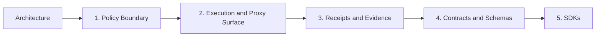

# Architecture

## Audience

Use this page when you need the public `helm-oss/architecture` guidance without opening repo internals first. It is written for developers, operators, security reviewers, and evaluators who need to connect the docs website back to the owning HELM source files.

## Outcome

After this page you should know what this surface is for, which source files own the behavior, which public route or adjacent page to use next, and which validation command to run before changing the claim.

## Source Truth

- Public route: `helm-oss/architecture`
- Source document: `helm-oss/docs/ARCHITECTURE.md`
- Public manifest: `helm-oss/docs/public-docs.manifest.json`
- Source inventory: `helm-oss/docs/source-inventory.manifest.json`
- Validation: `make docs-coverage`, `make docs-truth`, and `npm run coverage:inventory` from `docs-platform`

Do not expand this page with unsupported product, SDK, deployment, compliance, or integration claims unless the inventory manifest points to code, schemas, tests, examples, or an owner doc that proves the claim.

## Troubleshooting

| Symptom | First check |
| --- | --- |
| The public page and source behavior disagree | Treat the source path in `Source Truth` as canonical, then update the docs and source-inventory row in the same change. |
| A link or route is missing from the docs website | Check `docs/public-docs.manifest.json`, `llms.txt`, search, and the per-page Markdown export before changing navigation. |
| A claim is not backed by code or tests | Remove the claim or add the missing code, example, schema, or validation command before publishing. |

## Diagram

This scheme maps the main sections of Architecture in reading order.

HELM is organized around an execution boundary rather than around model prompting. The retained OSS implementation has five main pieces.

## 1. Policy Boundary

The policy boundary evaluates requests before tool dispatch. In the OSS kernel this includes:

- request parsing and normalization
- manifest and schema validation
- policy evaluation
- deterministic allow or deny decisions
- receipt generation for the decision outcome

The core implementation lives under `core/pkg/guardian/`, `core/pkg/manifest/`, `core/pkg/policy/`, and related contract packages.

## 2. Execution and Proxy Surface

The kernel exposes:

- a Go CLI in `core/cmd/helm`
- an HTTP API and OpenAI-compatible proxy surface
- an MCP server surface for governed tool access

The proxy path is the easiest way to insert HELM into an existing client without changing application control flow.

## 3. Receipts and Evidence

Every retained proof surface is built around durable, verifiable records:

- signed receipts
- proof graph data structures
- exported evidence bundles
- offline verification

The export and verify paths are implemented in `core/pkg/evidence*`, `core/pkg/proofgraph/`, `core/pkg/replay/`, and supporting crypto packages.

## 4. Contracts and Schemas

Public contracts are kept in:

- `api/openapi/helm.openapi.yaml`
- `protocols/`
- `schemas/`

The SDK HTTP client/types layer is generated from the OpenAPI contract. Protobuf message bindings are generated from `protocols/proto/` where a language SDK ships them. The protocol and schema directories document the retained on-disk and over-the-wire shapes the kernel uses.

## 5. SDKs

The public client surface is:

- Go SDK in `sdk/go`
- Python SDK in `sdk/python`
- TypeScript SDK in `sdk/ts`
- Rust SDK in `sdk/rust`
- Java SDK in `sdk/java`

No bundled interactive client, embedded presentation layer, static viewer, or generated browser-rendered report is shipped from this repository. Future product clients should integrate through the CLI JSON output, OpenAPI contract, SDKs, evidence bundles, and conformance reports.

## Directory Layout

| Path | Role |
| --- | --- |
| `core/` | Kernel implementation, CLI, API, proxy, verification |
| `sdk/` | Public generated SDKs and their tests |
| `protocols/` | Protocol sources and specifications |
| `schemas/` | JSON schemas for receipts, work, connectors, and related contracts |
| `tests/conformance/` | Conformance profile and verification suite |
| `deploy/helm-chart/` | Kubernetes deployment chart |

## Non-Goals of the OSS Repo

This repository does not present a hosted SaaS control plane, a product UI surface, a bundled viewer, or private operational material. The OSS shape is a kernel, its CLI, its contracts, and its SDKs.
