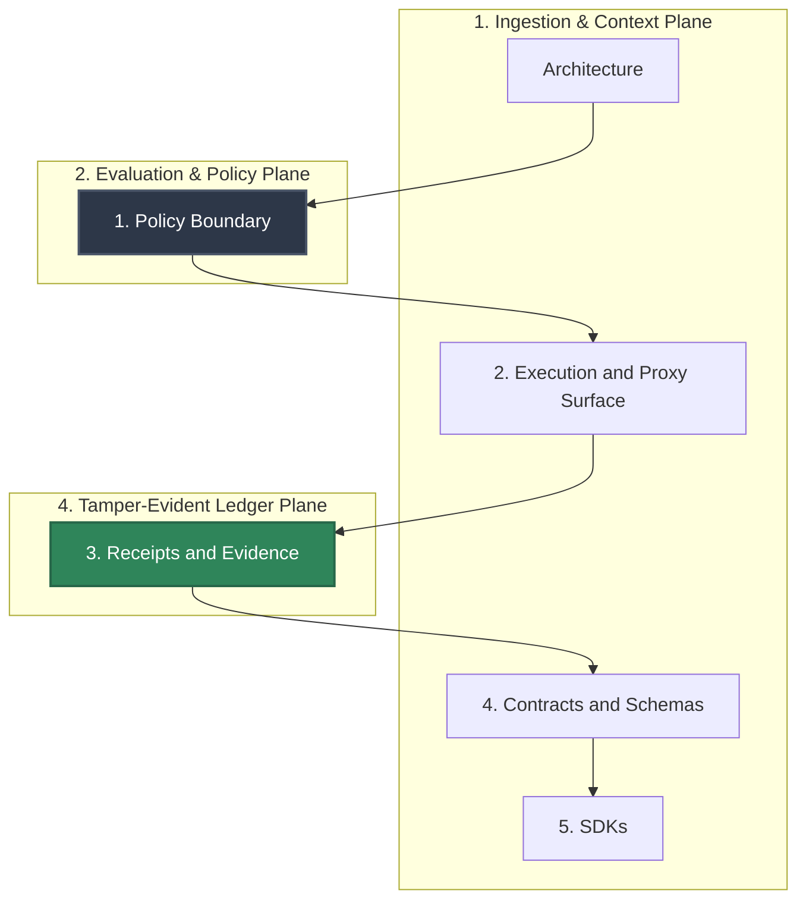

# Architecture

## Audience

Maintainers and operators who need the current HELM AI Kernel execution-boundary model before changing kernel, API, or integration docs.

## Outcome

After this page you should know what this surface is for, which source files own the behavior, which public route or adjacent page to use next, and which validation command to run before changing the claim.

## Source Truth

- Public route: `helm-ai-kernel/architecture`
- Source document: `helm-ai-kernel/docs/ARCHITECTURE.md`
- Public manifest: `helm-ai-kernel/docs/public-docs.manifest.json`
- Source inventory: `helm-ai-kernel/docs/source-inventory.manifest.json`
- Validation: `make docs-coverage`, `make docs-truth`, and `npm run coverage:inventory` from `docs-platform`

Do not expand this page with unsupported product, SDK, deployment, compliance, or integration claims unless the inventory manifest points to code, schemas, tests, examples, or an owner doc that proves the claim.

## Troubleshooting

| Symptom | First check |
| --- | --- |
| Published output is stale or incomplete | Run `npm run helm-public:accuracy` in `docs-platform`, then check the source path and public manifest row for this page. |
| A claim needs implementation backing | Check the Source Truth files above and update the implementation, manifest, source inventory, or page in the same change. |

## Diagram

This scheme maps the main sections of Architecture in reading order.
Use [Canonical diagrams](architecture/canonical-diagrams.md) for public
execution-boundary, MCP quarantine, evidence, drift, and long-horizon visuals.

HELM is organized around an execution boundary rather than around model prompting. The retained OSS implementation has five main pieces.

## 1. Policy Boundary

The policy boundary evaluates requests before tool dispatch. In the OSS kernel this includes:

- request parsing and normalization
- manifest and schema validation
- policy evaluation
- deterministic allow or deny decisions
- receipt generation for the decision outcome
- boundary records, checkpoints, approval ceremonies, MCP quarantine state, authz snapshots, sandbox grants, and evidence envelope manifests

The core implementation lives under `core/pkg/guardian/`, `core/pkg/manifest/`, `core/pkg/policy/`, `core/pkg/boundary/`, and related contract packages. `helm-ai-kernel serve` stores the boundary surface snapshot in the runtime database; local CLI-only workflows use the same contracts through the file-backed boundary registry.

## 2. Execution and Proxy Surface

The kernel exposes:

- a Go CLI in `core/cmd/helm-ai-kernel`
- an HTTP API and OpenAI-compatible proxy surface
- an MCP server surface for governed tool access
- route-backed API workspaces for boundary records, MCP registry/auth profiles, sandbox grants, approvals, budgets, conformance, evidence envelopes, telemetry exports, and coexistence manifests

The proxy path is the easiest way to insert HELM into an existing client without changing application control flow. Framework adapters and coexistence manifests must call HELM before dispatch; passive tracing is non-authoritative.

## 3. Receipts and Evidence

Every retained proof surface is built around durable, verifiable records:

- signed receipts
- proof graph data structures
- exported evidence bundles
- offline verification
- tamper-evident boundary checkpoints and optional DSSE, JWS, in-toto, SLSA, and Sigstore envelope wrappers over HELM-native roots

The export and verify paths are implemented in `core/pkg/evidence*`, `core/pkg/proofgraph/`, `core/pkg/replay/`, and supporting crypto packages.

## 4. Contracts and Schemas

Public contracts are kept in:

- `api/openapi/helm.openapi.yaml`
- `protocols/`
- `schemas/`

The SDK HTTP client/types layer is generated from the OpenAPI contract. Protobuf message bindings are generated from `protocols/proto/` where a language SDK ships them. The protocol and schema directories document the retained on-disk and over-the-wire shapes the kernel uses.

## 5. SDKs

The public client surface is:

- Go SDK in `sdk/go`
- Python SDK in `sdk/python`
- TypeScript SDK in `sdk/ts`
- Rust SDK in `sdk/rust`
- Java SDK in `sdk/java`

The repository does not include browser UI source or bundled UI assets. It
remains a headless kernel and API engine over the kernel contracts, CLI/API JSON
output, SDKs, evidence bundles, and conformance reports. External frontends must
integrate through the retained HTTP routes, OpenAPI schema, SDKs, CORS controls,
receipts, and conformance fixtures.

## Directory Layout

| Path | Role |
| --- | --- |
| `core/` | Kernel implementation, CLI, API, proxy, verification |
| `sdk/` | Public generated SDKs and their tests |
| `protocols/` | Protocol sources and specifications |
| `schemas/` | JSON schemas for receipts, work, connectors, and related contracts |
| `tests/conformance/` | Conformance profile and verification suite |
| `deploy/helm-chart/` | Kubernetes deployment chart |

## Non-Goals of the OSS Repo

This repository does not present a hosted SaaS control plane, product UI
surface, bundled viewer, or private operational material. The OSS shape is a
kernel, its CLI, its API contracts, its SDKs, and release/conformance evidence
for external clients.
