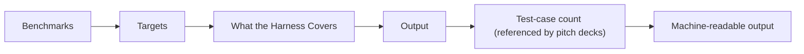

# Benchmarks

## Audience

Maintainers comparing local benchmark harnesses and reported performance measurements against source-backed results.

## Outcome

After this page you should know what this surface is for, which source files own the behavior, which public route or adjacent page to use next, and which validation command to run before changing the claim.

## Source Truth

- Public route: `helm-ai-kernel/benchmarks`
- Source document: `helm-ai-kernel/docs/BENCHMARKS.md`
- Public manifest: `helm-ai-kernel/docs/public-docs.manifest.json`
- Source inventory: `helm-ai-kernel/docs/source-inventory.manifest.json`
- Validation: `make docs-coverage`, `make docs-truth`, and `npm run coverage:inventory` from `docs-platform`

Do not expand this page with unsupported product, SDK, deployment, compliance, or integration claims unless the inventory manifest points to code, schemas, tests, examples, or an owner doc that proves the claim.

## Troubleshooting

| Symptom | First check |
| --- | --- |
| The public page and source behavior disagree | Treat the source path in `Source Truth` as canonical, then update the docs and source-inventory row in the same change. |
| A link or route is missing from the docs website | Check `docs/public-docs.manifest.json`, `llms.txt`, search, and the per-page Markdown export before changing navigation. |
| A claim is not backed by code or tests | Remove the claim or add the missing code, example, schema, or validation command before publishing. |

## Diagram

This scheme maps the main sections of Benchmarks in reading order.



The benchmark harness measures retained kernel paths locally. This page documents how to run the harness, not a frozen set of numbers.

## Targets

```bash
make bench
make bench-report
```

## What the Harness Covers

The benchmark code in `core/benchmarks/` focuses on the hot paths used by the OSS kernel, including decision evaluation, signing, and persistence-related work.

## Output

`make bench-report` writes a local JSON report under `benchmarks/results/`. That path is treated as a generated artifact, not as committed repository truth.

## Test-case count (referenced by pitch decks)

As of 2026-04-18, `helm-ai-kernel/core` ships **8,930 Go test cases**, counted via:

```bash
cd core && go test -list '.*' ./... 2>&1 | grep -c '^Test'
```

This is the number the Mindburn Labs pitch decks cite under "tests" (see `docs/ai/deck-facts.md` row `h3` in the monorepo). Rerun the command above to refresh. Any deck edit claiming a different number must update this doc and the ledger in the same pass.

## Machine-readable output

## Reproducing Results

For component-level work:

```bash
cd core
go test -bench=. -benchmem ./pkg/crypto/ ./pkg/store/ ./pkg/guardian/ ./benchmarks/
```

<!-- docs-depth-final-pass -->

## Benchmark Evidence Checklist

Every benchmark claim must name the runner, fixture, hardware or container profile, sample size, and validation command. Treat benchmark numbers as release-scoped facts: keep the command output with the release evidence pack and update this page only after the same command passes against the current tree. For developer trust, include both the success metric and the failure interpretation. A slow verification run should point to verifier profiling and receipt bundle size; an unexpected pass/fail split should point to the conformance fixture and ProofGraph row that produced it. Avoid competitive claims unless the compared artifact, version, and command are reproducible from public sources.

<!-- docs-depth-final-pass-extra -->
 Keep benchmark tables paired with raw artifacts and exact commit SHA. If the result cannot be reproduced from a clean checkout, move it to a lab note instead of the public benchmark page.
