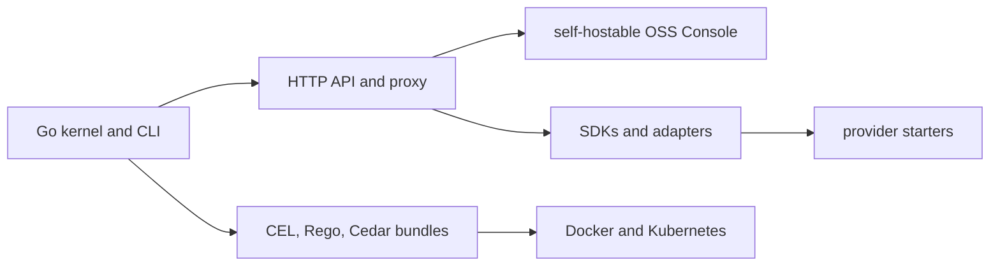

# Compatibility

HELM OSS compatibility is the retained public surface that maps to code, examples, tests, or canonical docs. Historical experiments are not supported unless they appear in the source-backed tables below.

## Audience

This page is for developers and operators deciding whether HELM OSS supports their operating system, SDK language, framework helper, policy language, deployment target, or verification path today.

## Outcome

After this page you should know which surfaces are supported, example-only, or outside HELM OSS; which source paths prove each claim; and which validation commands must pass before a compatibility claim changes.

## Surface Map



## Source Truth

This page is backed by:

- `docs/developer-coverage.manifest.json`
- `sdk/ts/src/adapters/agent-frameworks.ts`
- `sdk/ts/src/adapters/agent-frameworks.test.ts`
- `sdk/ts/README.md`
- `examples/starters/anthropic/`
- `examples/starters/google/`
- `examples/policies/`
- `docs/architecture/policy-languages.md`
- `deploy/helm-chart/`
- `apps/console/`
- `docs/CONSOLE.md`

## Supported Public Surfaces

| Surface | Status | Proof |
| --- | --- | --- |
| Go kernel and CLI | Supported | `make build`, `make test` |
| OpenAI-compatible proxy | Supported | `core/cmd/helm/proxy_cmd.go`, proxy examples |
| MCP server, OAuth scope enforcement, and bundle generation | Supported | `core/cmd/helm/mcp_*`, MCP tests |
| Boundary records, MCP quarantine, sandbox grants, authz snapshots, approvals, budgets, telemetry, and coexistence APIs | Supported | `api/openapi/helm.openapi.yaml`, `core/cmd/helm/route_registry.go`, `core/cmd/helm/contract_routes.go` |
| Evidence export and offline verification | Supported | `core/cmd/helm/export_cmd.go`, `core/cmd/helm/verify_cmd.go` |
| Self-hostable OSS Console | Supported | `apps/console/`, `make test-console` |
| Python SDK | Supported | `make test-sdk-py` |
| TypeScript SDK and JavaScript OpenAI-compatible path | Supported | `make test-sdk-ts` |
| Go SDK | Supported | `cd sdk/go && go test ./...` |
| Rust SDK | Supported | `make test-sdk-rust` |
| Java SDK | Supported | `make test-sdk-java` |
| Docker and Docker Compose | Supported | `Dockerfile`, `docker-compose.yml` |
| Kubernetes Helm chart | Supported | `deploy/helm-chart/` |

## Framework Adapter Helpers

The TypeScript SDK ships compatibility helpers for normalizing tool-call events from common agent frameworks into HELM governance requests. These helpers are source-backed adapter helpers, not full framework runtimes and not vendor certification.

| Framework | Status | Test Surface |
| --- | --- | --- |
| LangGraph | Compatible helper | `sdk/ts/src/adapters/agent-frameworks.test.ts` |
| CrewAI | Compatible helper | `sdk/ts/src/adapters/agent-frameworks.test.ts` |
| OpenAI Agents SDK | Compatible helper | `sdk/ts/src/adapters/agent-frameworks.test.ts` |
| PydanticAI | Compatible helper | `sdk/ts/src/adapters/agent-frameworks.test.ts` |
| LlamaIndex | Compatible helper | `sdk/ts/src/adapters/agent-frameworks.test.ts` |

Validation:

```bash
make test-sdk-ts
```

## Provider Starters

| Starter | Status | Source | Validation |
| --- | --- | --- | --- |
| Anthropic starter | Example-only | `examples/starters/anthropic/` | `bash examples/starters/anthropic/ci-smoke.sh` |
| Google ADK / A2A starter | Example-only | `examples/starters/google/` | `bash examples/starters/google/ci-smoke.sh` |
| Codex starter | Example-only | `examples/starters/codex/` | `bash examples/starters/codex/ci-smoke.sh` |
| OpenAI starter | Example-only | `examples/starters/openai/` | `bash examples/starters/openai/ci-smoke.sh` |

Example-only means the repository contains a starter layout and smoke script. It does not mean HELM OSS owns the provider SDK or certifies every feature of that ecosystem.

## Policy Languages

HELM OSS supports CEL, Rego, and Cedar policy bundle examples.

| Language | Source example | Notes |
| --- | --- | --- |
| CEL | `examples/policies/cel/example.cel` | Small footprint and direct attribute rules. |
| Rego | `examples/policies/rego/example.rego` | Useful when teams already operate OPA/Rego workflows. |
| Cedar | `examples/policies/cedar/example.cedar`, `examples/policies/cedar/entities.json` | Requires entity context for authorization evaluation. |

Use `docs/architecture/policy-languages.md` for the longer comparison and command examples.

## Deployment Surface

The repository keeps Docker, Docker Compose, a Kubernetes Helm chart, and the self-hostable OSS Console. It does not ship hosted operations, a static report viewer, or tenant-admin services in HELM OSS.

| Deployment | Status | Source |
| --- | --- | --- |
| Local source build | Supported | `Makefile` |
| Docker image | Supported | `Dockerfile` |
| Docker Compose | Supported | `docker-compose.yml` |
| Kubernetes Helm chart | Supported | `deploy/helm-chart/` |
| Self-hostable OSS Console | Supported | `apps/console/` |

## Verdict Compatibility

Current HELM OSS runtime docs use `ALLOW`, `DENY`, and `ESCALATE`.
Historical docs and generated compatibility code may still contain older
verdict labels. Treat them only as migration aliases:

| Legacy label | Current meaning |
| --- | --- |
| `DEFER` | `ESCALATE` |
| `REQUIRE_APPROVAL` | `ESCALATE` |
| `APPROVAL_REQUIRED` | `ESCALATE` |

Do not use legacy verdict labels in new runtime docs, policy examples, or
quickstart paths.

## Source Build Expectations

The retained CI verifies:

- Go build and test for the kernel;
- Python SDK tests;
- TypeScript SDK tests and adapter helper tests;
- Rust SDK build and test;
- Java SDK build and test;
- fixture root verification through the Go verifier;
- docs coverage and docs truth resolution.

```bash
make test-all
make docs-coverage
make docs-truth
```

## Unsupported Claim Policy

Do not claim a language, framework, deployment target, or provider integration as supported unless one of these is true:

- `docs/developer-coverage.manifest.json` has a `supported`, `example-only`, or `experimental` row for it;
- the row points at live source paths and example paths;
- the row names the validation command that proves the claim;
- the public docs page exposes the same claim in Markdown, LLM, and MCP surfaces.

## Troubleshooting

| Symptom | First check |
| --- | --- |
| A docs page claims support that is missing here | Add or fix the row in `docs/developer-coverage.manifest.json`, then link the source, example, and validation command. |
| A framework helper is mistaken for full framework ownership | Keep the status as compatible helper unless HELM owns runnable framework integration code and tests. |
| A deployment target lacks a smoke command | Mark it example-only or not-supported until a source-backed validation command exists. |

## MCP 2026 Radar Notes

The original Linear radar item pointed at `https://modelcontextprotocol.io/roadmap`; as of April 30, 2026 that URL returns a 404 and the current source is [MCP Roadmap](https://modelcontextprotocol.io/development/roadmap). The current roadmap frames enterprise-managed auth, gateway/proxy authorization propagation, and finer-grained least-privilege scopes as active enterprise/security directions, while RFC 8707 remains the normative OAuth source for resource indicators. HELM OSS implements this as an additive auth and metadata layer; protocol versions and existing tool schemas remain backward compatible.
