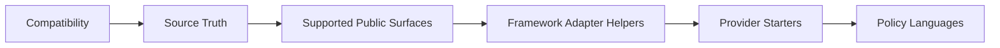

# Compatibility

## Audience

Use this page when you need the public `helm-oss/compatibility` guidance without opening repo internals first. It is written for developers, operators, security reviewers, and evaluators who need to connect the docs website back to the owning HELM source files.

## Outcome

After this page you should know what this surface is for, which source files own the behavior, which public route or adjacent page to use next, and which validation command to run before changing the claim.

## Troubleshooting

| Symptom | First check |
| --- | --- |
| The public page and source behavior disagree | Treat the source path in `Source Truth` as canonical, then update the docs and source-inventory row in the same change. |
| A link or route is missing from the docs website | Check `docs/public-docs.manifest.json`, `llms.txt`, search, and the per-page Markdown export before changing navigation. |
| A claim is not backed by code or tests | Remove the claim or add the missing code, example, schema, or validation command before publishing. |

## Diagram

This scheme maps the main sections of Compatibility in reading order.



This page defines the retained HELM OSS compatibility surface. It is intentionally narrower than every historical experiment in the repository: public claims must map to code, examples, tests, or canonical docs.

## Source Truth

This page is backed by:

- `docs/developer-coverage.manifest.json`
- `sdk/ts/src/adapters/agent-frameworks.ts`
- `sdk/ts/src/adapters/agent-frameworks.test.ts`
- `sdk/ts/README.md`
- `examples/starters/anthropic/`
- `examples/starters/google/`
- `examples/policies/`
- `docs/architecture/policy-languages.md`
- `deploy/helm-chart/`

## Supported Public Surfaces

| Surface | Status | Proof |
| --- | --- | --- |
| Go kernel and CLI | Supported | `make build`, `make test` |
| OpenAI-compatible proxy | Supported | `core/cmd/helm/proxy_cmd.go`, proxy examples |
| MCP server, OAuth scope enforcement, and bundle generation | Supported | `core/cmd/helm/mcp_*`, MCP tests |
| Evidence export and offline verification | Supported | `core/cmd/helm/export_cmd.go`, `core/cmd/helm/verify_cmd.go` |
| Python SDK | Supported | `make test-sdk-py` |
| TypeScript SDK and JavaScript OpenAI-compatible path | Supported | `make test-sdk-ts` |
| Go SDK | Supported | `cd sdk/go && go test ./...` |
| Rust SDK | Supported | `make test-sdk-rust` |
| Java SDK | Supported | `make test-sdk-java` |
| Docker and Docker Compose | Supported | `Dockerfile`, `docker-compose.yml` |
| Kubernetes Helm chart | Supported | `deploy/helm-chart/` |

## Framework Adapter Helpers

The TypeScript SDK ships compatibility helpers for normalizing tool-call events from common agent frameworks into HELM governance requests. These helpers are source-backed adapter helpers, not full framework runtimes and not vendor certification.

| Framework | Status | Test Surface |
| --- | --- | --- |
| LangGraph | Compatible helper | `sdk/ts/src/adapters/agent-frameworks.test.ts` |
| CrewAI | Compatible helper | `sdk/ts/src/adapters/agent-frameworks.test.ts` |
| OpenAI Agents SDK | Compatible helper | `sdk/ts/src/adapters/agent-frameworks.test.ts` |
| PydanticAI | Compatible helper | `sdk/ts/src/adapters/agent-frameworks.test.ts` |
| LlamaIndex | Compatible helper | `sdk/ts/src/adapters/agent-frameworks.test.ts` |

Validation:

```bash
make test-sdk-ts
```

## Provider Starters

| Starter | Status | Source | Validation |
| --- | --- | --- | --- |
| Anthropic starter | Example-only | `examples/starters/anthropic/` | `bash examples/starters/anthropic/ci-smoke.sh` |
| Google ADK / A2A starter | Example-only | `examples/starters/google/` | `bash examples/starters/google/ci-smoke.sh` |
| Codex starter | Example-only | `examples/starters/codex/` | `bash examples/starters/codex/ci-smoke.sh` |
| OpenAI starter | Example-only | `examples/starters/openai/` | `bash examples/starters/openai/ci-smoke.sh` |

Example-only means the repository contains a starter layout and smoke script. It does not mean HELM OSS owns the provider SDK or certifies every feature of that ecosystem.

## Policy Languages

HELM OSS supports CEL, Rego, and Cedar policy bundle examples.

| Language | Source example | Notes |
| --- | --- | --- |
| CEL | `examples/policies/cel/example.cel` | Small footprint and direct attribute rules. |
| Rego | `examples/policies/rego/example.rego` | Useful when teams already operate OPA/Rego workflows. |
| Cedar | `examples/policies/cedar/example.cedar`, `examples/policies/cedar/entities.json` | Requires entity context for authorization evaluation. |

Use `docs/architecture/policy-languages.md` for the longer comparison and command examples.

## Deployment Surface

The repository keeps Docker, Docker Compose, and a Kubernetes Helm chart. It does not ship a browser product UI, static report viewer, or hosted control plane in HELM OSS.

| Deployment | Status | Source |
| --- | --- | --- |
| Local source build | Supported | `Makefile` |
| Docker image | Supported | `Dockerfile` |
| Docker Compose | Supported | `docker-compose.yml` |
| Kubernetes Helm chart | Supported | `deploy/helm-chart/` |
| Hosted control plane | Not in HELM OSS | commercial HELM |
| Browser product UI | Not in HELM OSS | commercial HELM |

## Source Build Expectations

The retained CI verifies:

- Go build and test for the kernel;
- Python SDK tests;
- TypeScript SDK tests and adapter helper tests;
- Rust SDK build and test;
- Java SDK build and test;
- fixture root verification through the Go verifier;
- docs coverage and docs truth resolution.

```bash
make test-all
make docs-coverage
make docs-truth
```

## Unsupported Claim Policy

Do not claim a language, framework, deployment target, or provider integration as supported unless one of these is true:

- `docs/developer-coverage.manifest.json` has a `supported`, `example-only`, or `experimental` row for it;
- the row points at live source paths and example paths;
- the row names the validation command that proves the claim;
- the public docs page exposes the same claim in Markdown, LLM, and MCP surfaces.

## MCP 2026 Radar Notes

The original Linear radar item pointed at `https://modelcontextprotocol.io/roadmap`; as of April 30, 2026 that URL returns a 404 and the current source is [MCP Roadmap](https://modelcontextprotocol.io/development/roadmap). The current roadmap frames enterprise-managed auth, gateway/proxy authorization propagation, and finer-grained least-privilege scopes as active enterprise/security directions, while RFC 8707 remains the normative OAuth source for resource indicators. HELM OSS implements this as an additive auth and metadata layer; protocol versions and existing tool schemas remain backward compatible.
