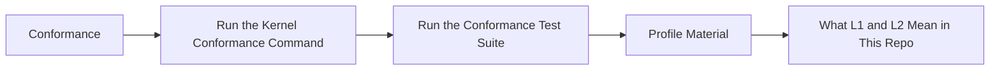

# Conformance

## Audience

Use this page when you need the public `helm-oss/conformance` guidance without opening repo internals first. It is written for developers, operators, security reviewers, and evaluators who need to connect the docs website back to the owning HELM source files.

## Outcome

After this page you should know what this surface is for, which source files own the behavior, which public route or adjacent page to use next, and which validation command to run before changing the claim.

## Source Truth

- Public route: `helm-oss/conformance`
- Source document: `helm-oss/docs/CONFORMANCE.md`
- Public manifest: `helm-oss/docs/public-docs.manifest.json`
- Source inventory: `helm-oss/docs/source-inventory.manifest.json`
- Validation: `make docs-coverage`, `make docs-truth`, and `npm run coverage:inventory` from `docs-platform`

Do not expand this page with unsupported product, SDK, deployment, compliance, or integration claims unless the inventory manifest points to code, schemas, tests, examples, or an owner doc that proves the claim.

## Troubleshooting

| Symptom | First check |
| --- | --- |
| The public page and source behavior disagree | Treat the source path in `Source Truth` as canonical, then update the docs and source-inventory row in the same change. |
| A link or route is missing from the docs website | Check `docs/public-docs.manifest.json`, `llms.txt`, search, and the per-page Markdown export before changing navigation. |
| A claim is not backed by code or tests | Remove the claim or add the missing code, example, schema, or validation command before publishing. |

## Diagram

This scheme maps the main sections of Conformance in reading order.



HELM keeps a retained conformance profile under `tests/conformance/profile-v1/`. The profile describes the minimum checks an implementation must pass to match the public OSS kernel behavior documented in this repository.

## Run the Kernel Conformance Command

```bash
./bin/helm conform --level L1 --json
./bin/helm conform --level L2 --json
```

## Run the Conformance Test Suite

```bash
cd tests/conformance
go test ./...
```

## Profile Material

The profile directory contains:

- `checklist.yaml` for the machine-readable checklist
- `profile_test.go` for profile assertions
- `README.md` for the human-readable profile summary

## What L1 and L2 Mean in This Repo

- `L1` covers core structural correctness such as canonicalization, schema handling, and receipt shape.
- `L2` adds broader runtime verification around exported evidence, replay, and retained kernel invariants.

The exact checks are defined by the code and checklist in `tests/conformance/`, not by this page.
