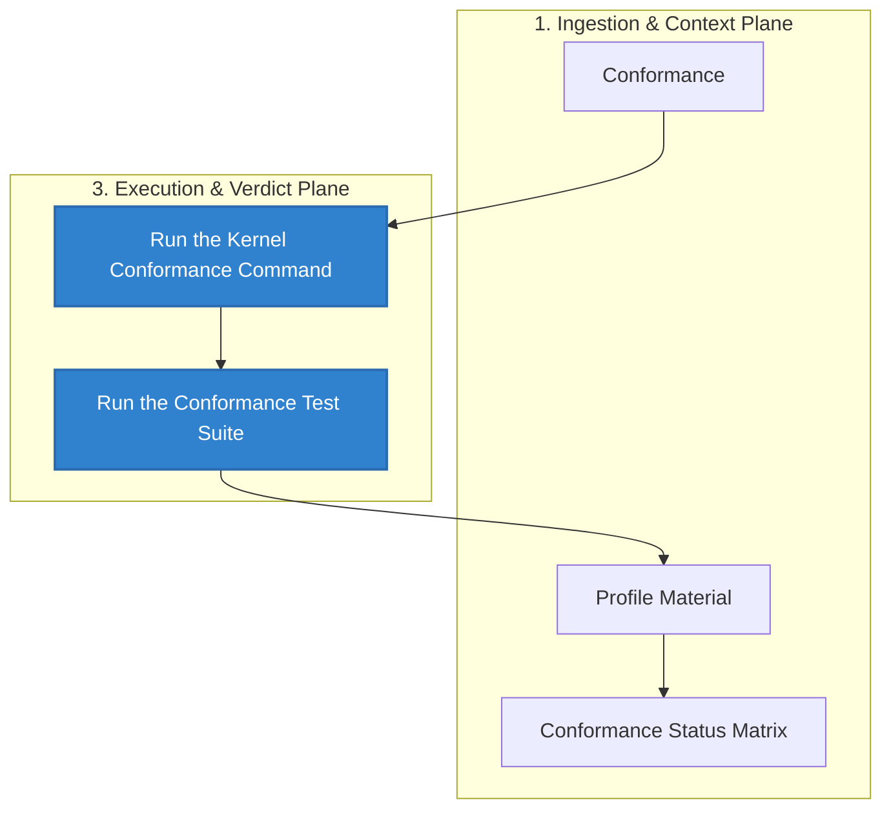

# Conformance

## Audience

Policy/runtime implementers and maintainers validating behavior with conformance packs and fixture replay.

## Outcome

After this page you should know what this surface is for, which source files own the behavior, which public route or adjacent page to use next, and which validation command to run before changing the claim.

## Source Truth

- Public route: `conformance`
- Source document: `helm-ai-kernel/docs/CONFORMANCE.md`
- Public manifest: `helm-ai-kernel/docs/public-docs.manifest.json`
- Source inventory: `helm-ai-kernel/docs/source-inventory.manifest.json`
- Validation: `make docs-coverage`, `make docs-truth`, and `npm run coverage:inventory` from `docs-platform`

Do not expand this page with unsupported product, SDK, deployment, compliance, or integration claims unless the inventory manifest points to code, schemas, tests, examples, or an owner doc that proves the claim.

## Troubleshooting

| Symptom | First check |
| --- | --- |
| Published output is stale or incomplete | Run `npm run helm-public:accuracy` in `docs-platform`, then check the source path and public manifest row for this page. |
| A claim needs implementation backing | Check the Source Truth files above and update the implementation, manifest, source inventory, or page in the same change. |

## Diagram

This scheme maps the main sections of Conformance in reading order.




HELM keeps a retained conformance profile under `tests/conformance/profile-v1/`. The profile describes the minimum checks an implementation must pass to match the public OSS kernel behavior documented in this repository.

## Run the Kernel Conformance Command

```bash
./bin/helm-ai-kernel conform --level L1 --json
./bin/helm-ai-kernel conform --level L2 --json
./bin/helm-ai-kernel conform negative --json
./bin/helm-ai-kernel conform vectors --json
```

Use the CLI commands above as the public proof path. `L1` and `L2` are the
only public level shortcuts accepted by `helm-ai-kernel conform --level`.

The public API exposes negative vectors at
`GET /api/v1/conformance/negative`. Runtime conformance report routes are
admin/runtime status surfaces, not public conformance proof, until they are
backed by the same engine and tests as the CLI.

## Run the Maintained Conformance Tests

```bash
go test ./core/cmd/helm-ai-kernel -run TestConformLevelAliasesSeedBaselineEvidence -count=1
go test ./core/pkg/conformance -run 'TestCoreSuiteRegistrationAndRun|TestOWASP_LLM_Top10' -count=1
```

## Profile Material

The profile directory contains:

- `checklist.yaml` for the machine-readable checklist
- `profile_test.go` for profile assertions
- `README.md` for the human-readable profile summary

## Conformance Status Matrix

- `L1` is implemented as a public CLI shortcut. It covers the baseline OSS
  proof path: canonical inputs, schema handling, receipt shape, offline
  verification, and checkpoint roots.
- `L2` is implemented as a public CLI shortcut. It adds the MCP
  execution-firewall gates: quarantine, tool-list/call consistency, OAuth
  resource and scope checks, schema pinning, direct-bypass denial, and deny-path
  receipt emission.
- `L3` exists as source/test conformance coverage, not as a public
  `--level L3` shortcut. Treat it as maintainer-facing until the CLI and public
  docs publish an engine-backed proof path.
- Higher levels are not a public claim in this repo. Do not publish them as
  supported conformance until the level constants, CLI wiring, fixtures, and
  tests all exist.

The exact checks are defined by the code and checklist in `tests/conformance/`, not by this page.

<!-- docs-depth-final-pass -->

## Conformance Completion Path

A conformance page is complete only when it tells a maintainer how to run the profile, how to interpret a failure, and which fixture owns the expected behavior. Keep profiles explicit: runtime decision, receipt canonicalization, verifier replay, policy denial, MCP boundary, and OpenAI-compatible proxy behavior are different surfaces. When adding a profile, add a fixture, a golden expected output, a negative case, and a short compatibility note. Public users should be able to run the command from a clean checkout, compare output to the documented profile, and decide whether a failure is a local environment issue, a schema drift, or an implementation regression.
