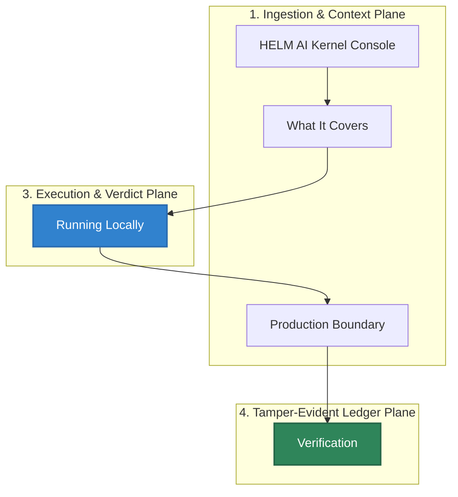

# HELM AI Kernel Console

## Audience

Operators and frontend maintainers running the self-hostable Console against a local HELM API.

## Outcome

After this page you should know what this surface is for, which source files own the behavior, which public route or adjacent page to use next, and which validation command to run before changing the claim.

## Source Truth

- Public route: `helm-ai-kernel/console`
- Source document: `helm-ai-kernel/docs/CONSOLE.md`
- Public manifest: `helm-ai-kernel/docs/public-docs.manifest.json`
- Source inventory: `helm-ai-kernel/docs/source-inventory.manifest.json`
- Validation: `make docs-coverage`, `make docs-truth`, and `npm run coverage:inventory` from `docs-platform`

Do not expand this page with unsupported product, SDK, deployment, compliance, or integration claims unless the inventory manifest points to code, schemas, tests, examples, or an owner doc that proves the claim.

## Troubleshooting

| Symptom | First check |
| --- | --- |
| Published output is stale or incomplete | Run `npm run helm-public:accuracy` in `docs-platform`, then check the source path and public manifest row for this page. |
| A claim needs implementation backing | Check the Source Truth files above and update the implementation, manifest, source inventory, or page in the same change. |

## Diagram

This scheme maps the main sections of HELM AI Kernel Console in reading order.




HELM AI Kernel ships one browser frontend: `apps/console`.

The Console is a self-hostable operator surface for the OSS kernel. It is built
with React, Vite, TypeScript, and `@mindburn/ui-core`; it does not carry a
second component system, Tailwind layer, private package, or generated marketing
surface.

## What It Covers

- Command-first governance over the local kernel.
- Live receipts from `/api/v1/receipts` and `/api/v1/receipts/tail`.
- Intent evaluation through `/api/v1/evaluate`.
- Route-backed boundary records, MCP quarantine, sandbox grants, authz
  snapshots, approvals, budgets, evidence envelopes, conformance reports,
  telemetry export configuration, and coexistence manifests.
- ProofGraph, replay, trust, audit, developer, and settings navigation surfaces.
- A read-only bootstrap contract at `/api/v1/console/bootstrap` for kernel
  version, workspace, health, counts, recent receipts, conformance, and MCP
  scope state.

The Console does not invent private state. The new operational workspaces load
from public API routes such as `/api/v1/boundary/records`,
`/api/v1/mcp/registry`, `/api/v1/sandbox/grants`,
`/api/v1/authz/snapshots`, `/api/v1/approvals`, `/api/v1/budgets`,
`/api/v1/evidence/envelopes`, `/api/v1/conformance/reports`,
`/api/v1/telemetry/otel/config`, and `/api/v1/coexistence/capabilities`.

## Running Locally

Build the design-system package and Console:

```bash
make build-console
```

Console installs are locked to the public npm registry. The npm path is pinned
to npm `11.14.1` and uses `apps/console/.npmrc` for registry pinning, strict
TLS, audit-on-install, and a two-day release-age floor. The pnpm compatibility
path uses `apps/console/pnpm-workspace.yaml` for the same registry and a
2,880-minute release-age floor. Use `npm audit signatures` as the report-only
signature and provenance check for packages whose registry metadata exposes
signatures or attestations.

Start the kernel with the Console enabled:

```bash
./bin/helm-ai-kernel serve --policy ./release.high_risk.v3.toml --console
```

The default `helm-ai-kernel serve` bind is `127.0.0.1:7714`. Console assets are loaded from
`apps/console/dist` by default, or from `HELM_CONSOLE_DIR` / `--console-dir` when
set.

## Production Boundary

The Console is OSS and self-hostable. It is not the managed Mindburn hosted
service. The OSS repository still excludes hosted retention, private
account-management systems, org-specific operator workflows, and managed
multi-region operations.

`helm-ai-kernel serve --console` serves static assets with the same security middleware as
the API. API-like paths never fall through to `index.html`, so broken contracts
remain visible during development and deployment.

## Verification

Run the Console gate:

```bash
make test-console
```

Run the broader platform gate:

```bash
make test-platform
```

<!-- docs-depth-final-pass -->

## Scope Boundary

HELM AI Kernel does not promise the commercial Console experience. This page should describe the OSS inspection and source artifacts that the Console consumes: receipts, ProofGraph nodes, policy bundle metadata, verification output, and exported evidence. If a screen or workflow exists only in HELM commercial, link to authenticated customer documentation from the product site and keep anonymous OSS docs focused on the data contracts a developer can generate locally. The validation path is to create a receipt, inspect it through the CLI or export, and verify that the fields named here are present in the public schema.
