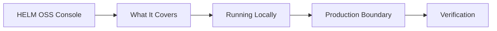

# HELM OSS Console

## Audience

## Outcome

After this page you should know what this surface is for, which source files own the behavior, which public route or adjacent page to use next, and which validation command to run before changing the claim.

## Source Truth

- Public route: `helm-oss/console`
- Source document: `helm-oss/docs/CONSOLE.md`
- Public manifest: `helm-oss/docs/public-docs.manifest.json`
- Source inventory: `helm-oss/docs/source-inventory.manifest.json`
- Validation: `make docs-coverage`, `make docs-truth`, and `npm run coverage:inventory` from `docs-platform`

Do not expand this page with unsupported product, SDK, deployment, compliance, or integration claims unless the inventory manifest points to code, schemas, tests, examples, or an owner doc that proves the claim.

## Troubleshooting

| Symptom | First check |
| --- | --- |
| The public page and source behavior disagree | Treat the source path in `Source Truth` as canonical, then update the docs and source-inventory row in the same change. |
| A link or route is missing from the docs website | Check `docs/public-docs.manifest.json`, `llms.txt`, search, and the per-page Markdown export before changing navigation. |
| A claim is not backed by code or tests | Remove the claim or add the missing code, example, schema, or validation command before publishing. |

## Diagram

This scheme maps the main sections of HELM OSS Console in reading order.



HELM OSS ships one browser frontend: `apps/console`.

The Console is a self-hostable operator surface for the OSS kernel. It is built
with React, Vite, TypeScript, and `@mindburn/ui-core`; it does not carry a
second component system, Tailwind layer, private package, or generated marketing
surface.

## What It Covers

- Command-first governance over the local kernel.
- Live receipts from `/api/v1/receipts` and `/api/v1/receipts/tail`.
- Intent evaluation through `/api/v1/evaluate`.
- Route-backed boundary records, MCP quarantine, sandbox grants, authz
  snapshots, approvals, budgets, evidence envelopes, conformance reports,
  telemetry export configuration, and coexistence manifests.
- ProofGraph, replay, trust, audit, developer, and settings navigation surfaces.
- A read-only bootstrap contract at `/api/v1/console/bootstrap` for kernel
  version, workspace, health, counts, recent receipts, conformance, and MCP
  scope state.

The Console does not invent private state. The new operational workspaces load
from public API routes such as `/api/v1/boundary/records`,
`/api/v1/mcp/registry`, `/api/v1/sandbox/grants`,
`/api/v1/authz/snapshots`, `/api/v1/approvals`, `/api/v1/budgets`,
`/api/v1/evidence/envelopes`, `/api/v1/conformance/reports`,
`/api/v1/telemetry/otel/config`, and `/api/v1/coexistence/capabilities`.

## Running Locally

Build the design-system package and Console:

```bash
make build-console
```

Start the kernel with the Console enabled:

```bash
./bin/helm serve --policy ./release.high_risk.v3.toml --console
```

The default `helm serve` bind is `127.0.0.1:7714`. Console assets are loaded from
`apps/console/dist` by default, or from `HELM_CONSOLE_DIR` / `--console-dir` when
set.

## Production Boundary

The Console is OSS and self-hostable. It is not the managed Mindburn hosted
service. The OSS repository still excludes billing, hosted retention, proprietary
operator workflows, entitlement systems, private connector programs, and managed
multi-region operations.

`helm serve --console` serves static assets with the same security middleware as
the API. API-like paths never fall through to `index.html`, so broken contracts
remain visible during development and deployment.

## Verification

Run the Console gate:

```bash
make test-console
```

Run the broader platform gate:

```bash
make test-platform
```

<!-- docs-depth-final-pass -->

## Scope Boundary

HELM OSS does not promise the commercial Console experience. This page should describe the OSS inspection and source artifacts that the Console consumes: receipts, ProofGraph nodes, policy bundle metadata, verification output, and exported evidence. If a screen or workflow exists only in HELM commercial, link to authenticated customer documentation from the product site and keep anonymous OSS docs focused on the data contracts a developer can generate locally. The validation path is to create a receipt, inspect it through the CLI or export, and verify that the fields named here are present in the public schema.
