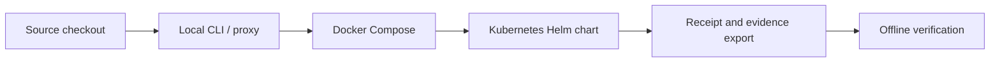

# HELM AI Kernel Deployment and Examples

This page gathers the public deployment and runnable example material that lives
outside the core docs directory.

## Audience

This page is for developers moving from a local HELM run to repeatable examples,
Docker Compose, or Kubernetes deployment.

## Outcome

You should be able to find the right example or deployment path, run it, and
know which command validates the path before relying on it.

## Deployment Path



## Deployment Targets

| Target | Source path | Public contract |
| --- | --- | --- |
| Local CLI or proxy | `core/cmd/helm-ai-kernel/`, `docs/QUICKSTART.md` | Start with `/helm-ai-kernel/developer-journey`. |
| Docker image | `Dockerfile`, `Makefile`, `docker-compose.yml` | Build and run through the retained Docker targets. |
| Docker Compose | `docker-compose.yml` | Use for local boundary testing and example orchestration. |
| Kubernetes Helm chart | `deploy/helm-chart/Chart.yaml`, `deploy/helm-chart/values.yaml`, `deploy/helm-chart/templates/` | Lint with `helm lint deploy/helm-chart` before applying. |
| Release artifacts | `.goreleaser.yml`, `.github/workflows/release.yml`, `release/` | Verify checksums, SBOM, Cosign, provenance, and reproducibility. |

## Runnable Examples

| Example | Source path | Use when |
| --- | --- | --- |
| Go client | `examples/go_client/` | You want direct Go SDK integration. |
| Java client | `examples/java_client/` | You want JVM integration. |
| Rust client | `examples/rust_client/` | You want Rust receipt or policy client behavior. |
| Python OpenAI base URL | `examples/python_openai_baseurl/` | You want an OpenAI-compatible Python client behind HELM. |
| TypeScript OpenAI base URL | `examples/ts_openai_baseurl/` | You want typed JavaScript/TypeScript proxy integration. |
| JavaScript OpenAI base URL | `examples/js_openai_baseurl/` | You want a minimal JavaScript proxy example. |
| MCP client | `examples/mcp_client/` | You want MCP invocation through HELM. |
| Receipt verification | `examples/receipt_verification/` | You want offline verification examples. |
| Starters | `examples/starters/` | You want provider starter layouts for OpenAI, Anthropic, Google, or Codex-style agents. |
| Policies | `examples/policies/` | You want CEL/Rego/Cedar policy examples. |

## Validation Commands

```bash
make build
make test
make test-all
make docker
helm lint deploy/helm-chart
make verify-fixtures
```

The developer coverage manifest records the exact validation command per
surface. If an example is not listed there, the public docs should describe it
as example-only or omit a support claim.

## Source Truth

- `deploy/README.md`
- `deploy/helm-chart/README.md`
- `examples/README.md`
- `docs/developer-coverage.manifest.json`
- `docs/DEVELOPER_JOURNEY.md`

## Troubleshooting

| Problem | First check |
| --- | --- |
| Docker build fails | Confirm the local tree builds with `make build`, then rerun the Docker target. |
| Helm chart lint fails | Check `deploy/helm-chart/values.yaml` and required Kubernetes settings. |
| Example cannot reach the proxy | Confirm `helm-ai-kernel proxy` is running and the client base URL points at the HELM boundary. |
| Receipt verification fails | Use `/helm-ai-kernel/verification` and compare against `examples/golden/`. |

<!-- docs-depth-final-pass -->

## Deployment Acceptance Checklist

Each deployment example should name the supported target, prerequisites, port exposure, persistence model, health check, and rollback signal. Docker Compose examples must identify which services are durable and which can be recreated. Kubernetes examples must identify ConfigMaps, Secrets, Services, probes, and the release artifact version. A deployment doc should not claim production readiness unless the chart or manifest is linted, the health endpoint is exercised, and receipt verification still works after restart. Include the first diagnostic to collect for failed startup: container logs, effective environment, policy bundle path, and verifier command output.
