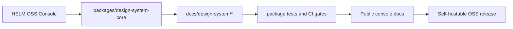

# HELM OSS Design System Surface

This page documents the public HELM OSS console and design-system surface. It
exists so the docs site covers the frontend package family instead of burying it
inside repository-only package READMEs.

## Audience

This page is for contributors extending the HELM OSS Console, maintainers
reviewing frontend package changes, and developers who need to understand which
UI assets are part of the self-hostable OSS surface.

## Outcome

You should know which packages and docs own console UI primitives, how the
design-system package is validated, and where the public console docs fit into
the larger HELM OSS developer journey.

## Surface Model



## Source Families

| Source family | Purpose | Public handling |
| --- | --- | --- |
| `apps/console/` | Browser console for receipts, policy, MCP, evidence, replay, conformance, trust, incidents, audit, developer, and settings workflows. | Covered by `/helm-oss/console`. |
| `packages/design-system-core/` | Frontend primitives, tokens, grammar highlighting, and package-level tests. | Covered by this page and package README truth checks. |
| `docs/design-system/` | Accessibility, architecture, CI gates, contrast, decisions, library adoption, primitive coverage, and theming docs. | Summarized here; detailed source remains edit-linked in repo. |
| `docs/CONSOLE.md` | Public user-facing Console docs. | Rendered directly at `/helm-oss/console`. |

## Validation

Use the package and docs gates before changing console or design-system behavior:

```bash
make test-design-system
make test-console
make docs-coverage docs-truth
```

The design system is part of the OSS self-hostable surface, but it is not a
separate product. Public docs should explain how it supports the Console and
developer experience, not position it as a standalone commercial UI kit.

## Source Truth

- `apps/console/`
- `packages/design-system-core/README.md`
- `docs/design-system/README.md`
- `docs/design-system/accessibility.md`
- `docs/design-system/architecture.md`
- `docs/design-system/ci-gates.md`
- `docs/CONSOLE.md`

## Troubleshooting

| Symptom | Check |
| --- | --- |
| Console UI copy diverges from docs | Update `docs/CONSOLE.md` and the relevant component tests together. |
| Token or contrast behavior changes | Review `docs/design-system/contrast-table.md` and package token tests. |
| A primitive lacks accessibility coverage | Add or update the design-system accessibility and primitive coverage docs before release. |
| A package change is invisible in public docs | Update this page or `/helm-oss/console`, then rerun diagram and source-coverage gates. |
