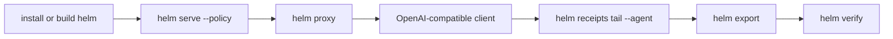

# Developer Journey

## Runtime Path



This page is the source-backed end-to-end path for a developer evaluating HELM OSS. It ties install, runtime, SDKs, policy, receipts, verification, deployment, conformance, release artifacts, and troubleshooting to live repository surfaces. If a claim here is not backed by code, examples, tests, or canonical docs, remove the claim or add the missing proof first.

## Audience

Use this page if you are integrating HELM OSS into a developer workstation, CI workflow, SDK client, local agent runtime, Docker deployment, Kubernetes Helm chart, or release verification process.

## Outcome

After this page you should be able to:

- install HELM OSS on macOS, Linux, Windows/WSL, Docker, or from source;
- start the local execution boundary with `helm serve` and the OpenAI-compatible boundary with `helm proxy`;
- run a first OpenAI-compatible request through HELM;
- trigger and inspect an allow or deny decision;
- tail receipt records and export an EvidencePack;
- run offline verification and optional online verification;
- choose a supported SDK or framework adapter path;
- run conformance and docs-truth gates;
- deploy with Docker Compose or the Kubernetes Helm chart;
- verify release artifacts, checksums, SBOM, release attestation, optional
  Cosign bundles when attached, and reproducible binaries.

## Source Truth

The developer journey is backed by:

- `Makefile`
- `Dockerfile`
- `docker-compose.yml`
- `.goreleaser.yml`
- `core/cmd/helm/*`
- `docs/reference/cli.md`
- `docs/reference/http-api.md`
- `docs/reference/execution-boundary.md`
- `core/pkg/verifier/`
- `core/pkg/conformance/`
- `api/openapi/helm.openapi.yaml`
- `sdk/go`, `sdk/python`, `sdk/ts`, `sdk/rust`, `sdk/java`
- `examples/`
- `deploy/helm-chart/`
- `scripts/check_documentation_coverage.py`
- `scripts/check_documentation_truth.py`
- `docs/developer-coverage.manifest.json`

Run these truth gates before changing public coverage claims:

```bash
make docs-coverage
make docs-truth
```

## Install Selector

:::selector os
### macOS

Use Homebrew when you want the published CLI path:

```bash
brew install mindburnlabs/tap/helm
helm --version
```

The release build target also produces `helm-darwin-amd64` and `helm-darwin-arm64` binaries:

```bash
make release-binaries-reproducible
ls bin/helm-darwin-*
```

### Linux

Use the Linux release binary when consuming a release artifact, or build from source when developing locally:

```bash
git clone https://github.com/Mindburn-Labs/helm-oss.git
cd helm-oss
make build
./bin/helm --version
```

The release build target produces `helm-linux-amd64` and `helm-linux-arm64` binaries.

### Windows / WSL

Use WSL2 or Docker for the most predictable local developer path on Windows:

```powershell
wsl --install
wsl
git clone https://github.com/Mindburn-Labs/helm-oss.git
cd helm-oss
make build
./bin/helm --version
```

The release build target also emits `helm-windows-amd64.exe`. Treat native Windows support as release-binary support unless a page explicitly says WSL or Docker.

### Docker

Use Docker when you want a clean runtime boundary without installing the toolchain locally:

```bash
docker build -t ghcr.io/mindburn-labs/helm-oss:local .
docker compose up -d
```

Use Docker Compose when validating the local proxy and receipt store together.

### Source Build

Use the source build when you are changing kernel, CLI, SDK, verifier, or conformance behavior:

```bash
git clone https://github.com/Mindburn-Labs/helm-oss.git
cd helm-oss
make build
make test
```
:::

## First Local Boundary

Start a policy-governed boundary:

```bash
./bin/helm serve --policy ./release.high_risk.v3.toml
```

Expected ready line:

```text
helm-edge-local - listening :7714 - ready
```

Then start the OpenAI-compatible proxy in another shell:

```bash
./bin/helm proxy --upstream https://api.openai.com/v1 --port 9090 --receipts-dir ./helm-receipts
```

Point OpenAI-compatible clients at:

```text
http://localhost:9090/v1
```

## First OpenAI-Compatible Call

Use Python:

```bash
cd examples/python_openai_baseurl
python -m venv .venv
. .venv/bin/activate
pip install openai
OPENAI_BASE_URL=http://localhost:9090/v1 python main.py
```

Use TypeScript:

```bash
cd examples/ts_openai_baseurl
npm install
OPENAI_BASE_URL=http://localhost:9090/v1 npm run start
```

Use JavaScript:

```bash
cd examples/js_openai_baseurl
npm install
OPENAI_BASE_URL=http://localhost:9090/v1 node main.js
```

Expected behavior:

- allowed calls return normal model output;
- denied calls return a policy denial instead of silently executing;
- receipt metadata is written to the configured receipt path;
- clients must not retry definitive policy denials as transient provider failures.

## Allow, Deny, And Receipts

HELM OSS is useful only when you can prove both outcomes:

```bash
./bin/helm receipts tail --agent agent.titan.exec --server http://127.0.0.1:7714
```

**Launch Demo Suite:** You can evaluate a complete, end-to-end set of allow/deny/escalate outcomes using the canonical launch suite in `examples/launch/`. Run `make launch-smoke` to verify policy execution, receipt proof generation, and MCP quarantine behavior locally.

Use allow and deny fixtures from `examples/policies/` when validating policy-language behavior. The policy bundle command supports CEL, Rego, and Cedar:

```bash
./bin/helm bundle build --language cel examples/policies/cel/example.cel
./bin/helm bundle build --language rego examples/policies/rego/example.rego
./bin/helm bundle build --language cedar --entities examples/policies/cedar/entities.json examples/policies/cedar/example.cedar
```

`helm bundle build` takes the policy source as the positional argument. It does not accept `--policy`; that flag belongs to `helm serve`.

## EvidencePack Export And Verification

Generate a local evidence path:

```bash
./bin/helm onboard --yes
./bin/helm demo organization --template starter --provider mock
./bin/helm export --evidence ./data/evidence --out evidence.tar --tar
```

Run offline verification first:

```bash
./bin/helm verify evidence.tar
./bin/helm verify evidence.tar --json
```

Run online verification only after offline verification passes:

```bash
./bin/helm verify evidence.tar --online
```

Online verification checks envelope/root metadata against `HELM_LEDGER_URL` or the public proof verifier. If no public anchor exists, offline verification remains the local truth and the CLI reports the anchor state.

## SDK Selector

:::selector language
### Python

Use Python for notebooks, research harnesses, smoke tests, and quick verification scripts:

```bash
cd sdk/python
python -m pip install '.[dev]'
pytest -v --tb=short
```

Public package: `helm-sdk`. Source truth: `sdk/python/pyproject.toml`, `sdk/python/helm_sdk/client.py`, and `sdk/python/tests/test_client.py`.

### TypeScript / JavaScript

Use TypeScript or JavaScript for web apps, CI scripts, and framework adapters:

```bash
cd sdk/ts
npm ci
npm test -- --run
npm run build
```

Public package: `@mindburn/helm`. Source truth: `sdk/ts/package.json`, `sdk/ts/src/client.ts`, and `sdk/ts/src/adapters/agent-frameworks.ts`.

### Go

Use Go for services that want a small dependency footprint:

```bash
cd sdk/go
go test ./...
```

Module path: `github.com/Mindburn-Labs/helm-oss/sdk/go`. Source truth: `sdk/go/go.mod` and `sdk/go/client/client.go`.

### Rust

Use Rust for strongly typed infrastructure and low-level integrations:

```bash
cd sdk/rust
cargo test
```

Crate: `helm-sdk`. Source truth: `sdk/rust/Cargo.toml`, `sdk/rust/src/client.rs`, and `sdk/rust/src/types_gen.rs`.

### Java

Use Java for JVM services and enterprise test harnesses:

```bash
cd sdk/java
mvn -q test
```

Coordinate: `com.github.Mindburn-Labs:helm-sdk`. Source truth: `sdk/java/pom.xml` and `examples/java_client/Main.java`.
:::

## Framework And Protocol Selector

:::selector framework
### OpenAI-Compatible Proxy

Use this when an existing client already supports a `base_url` or `baseURL` option. Source-backed examples live under `examples/python_openai_baseurl/`, `examples/ts_openai_baseurl/`, and `examples/js_openai_baseurl/`.

### MCP

Use MCP when the integration is tool-oriented and the client expects an MCP server, client config, or MCP bundle:

```bash
./bin/helm mcp serve
./bin/helm mcp pack --client claude-desktop --out helm.mcpb
./bin/helm mcp install --client claude-code
```

OAuth resource and scope enforcement live in `core/cmd/helm/mcp_runtime.go` and `core/cmd/helm/mcp_runtime_auth_test.go`.

### Agent Framework Helpers

The TypeScript SDK includes helper coverage for LangGraph, CrewAI, OpenAI Agents SDK, PydanticAI, and LlamaIndex. These helpers normalize framework tool-call events into HELM governance requests; they are not separate framework runtimes and they do not claim vendor certification.

Validate them with:

```bash
make test-sdk-ts
```

### Anthropic Starter

The Anthropic starter is example-only coverage under `examples/starters/anthropic/`. It gives a layout and smoke script for governed Anthropic use without claiming a full Anthropic SDK wrapper.

### Google ADK / A2A Starter

The Google ADK and A2A starter is example-only coverage under `examples/starters/google/`. It gives a layout and smoke script for governed Google ADK/A2A use without claiming full framework ownership.
:::

## Deployment Selector

:::selector deployment
### Docker Compose

Use Docker Compose for local deployment checks:

```bash
docker compose up -d
docker compose ps
```

Source truth: `docker-compose.yml` and `deploy/README.md`.

### Kubernetes Helm Chart

Use the Kubernetes Helm chart when running HELM OSS as an internal service:

```bash
helm lint deploy/helm-chart
helm install helm-oss deploy/helm-chart
```

Source truth: `deploy/helm-chart/Chart.yaml`, `deploy/helm-chart/values.yaml`, and the chart templates.

### CI

Use the Makefile targets in CI:

```bash
make build
make test
make test-all
make docs-coverage
make docs-truth
```

Source truth: `Makefile` and `.github/workflows/`.
:::

## Conformance And Release Gates

Current public release: `v0.4.0`, published on 2026-04-25 at
<https://github.com/Mindburn-Labs/helm-oss/releases/tag/v0.4.0>. Its public
assets are platform binaries for Darwin, Linux, and Windows, `SHA256SUMS.txt`,
`sbom.json`, `release-attestation.json`, `evidence-pack.tar`,
`release.high_risk.v3.toml`, `helm.mcpb`, and `helm.rb`.

Run conformance:

```bash
cd tests/conformance
go test ./...
```

Run the retained OSS release gates:

```bash
make test-all
make verify-fixtures
make release-binaries-reproducible
```

Release artifact verification is documented in `docs/PUBLISHING.md` and
`docs/VERIFICATION.md`. For `v0.4.0`, verify checksums, SBOM,
release-attestation metadata, the offline evidence pack, and reproducible
binaries. Cosign bundles and OpenVEX files are only documented as verification
paths when those files are attached to a release.

## Troubleshooting

| Symptom | Likely cause | First check |
| --- | --- | --- |
| `helm serve` starts but clients still bypass HELM | client base URL still points to upstream provider | log request host and set base URL to `http://localhost:9090/v1` |
| no receipts appear | wrong receipt server, directory, or agent id | run `helm receipts tail --agent <id> --server http://127.0.0.1:7714` |
| denied call retries forever | app treats policy denial as transient | handle HELM denials as final authorization results |
| offline verification fails | EvidencePack is incomplete or modified | rerun export and verify fixture roots with `make verify-fixtures` |
| MCP call fails with OAuth scope error | token lacks required scope or resource indicator | inspect `HELM_OAUTH_RESOURCE` and `HELM_OAUTH_SCOPES` |
| Docker build fails | local checkout or Go toolchain state is inconsistent | run `make clean` and rebuild the image |
| Helm chart deploy fails | missing values or invalid templates | run `helm lint deploy/helm-chart` before install |

Use `docs/TROUBLESHOOTING.md` for the longer runtime troubleshooting catalog.
