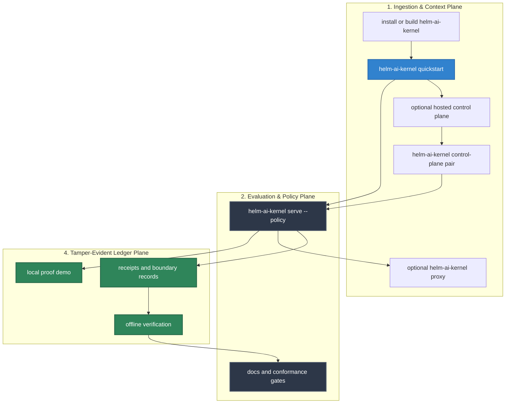

# Developer Journey

This page is the source-backed end-to-end path for evaluating HELM AI Kernel. It ties install, runtime, SDKs, policy, receipts, verification, deployment, conformance, release artifacts, and troubleshooting to live repository surfaces.

## Audience

This journey is for developers and platform teams evaluating HELM AI Kernel beyond the first quickstart. It is the source-backed path for proving local headless onboarding, optional hosted control-plane pairing, local runtime behavior, SDK calls, receipts, EvidencePack verification, conformance, deployment, and release verification.

## Outcome

After completing the path you should know which local command owns each public claim, how to route OpenAI-compatible and MCP traffic through the execution boundary, how to inspect receipts, and which validation commands keep docs aligned with code.




## Source Truth

- `Makefile`, `Dockerfile`, `docker-compose.yml`
- `core/cmd/helm-ai-kernel/*`
- `api/openapi/helm.openapi.yaml`
- `docs/reference/cli.md`
- `docs/reference/http-api.md`
- `docs/reference/execution-boundary.md`
- `sdk/go`, `sdk/python`, `sdk/ts`, `sdk/rust`, `sdk/java`
- `examples/`, `deploy/helm-chart/`, `tests/conformance/`
- `scripts/check_documentation_coverage.py`
- `scripts/check_documentation_truth.py`

## Local Headless Proof First

Start with the OSS proof path:

```bash
helm-ai-kernel quickstart
```

This starts the local Kernel and uses backend-owned onboarding APIs to create
receipts and EvidencePack refs. No hosted account is required.

Pair with a hosted control plane only when you want workspace-scoped Launchpad
or commercial workflows after the local proof. Paid capabilities remain
backend-entitlement gated.

## Install

Use one of these current paths. The published Homebrew path is the macOS path;
source builds and Docker remain the portable paths for Linux and WSL.

```bash
brew install mindburnlabs/tap/helm-ai-kernel
helm-ai-kernel --version
helm-ai-kernel quickstart
```

Use hosted pairing only after the local proof succeeds:

```bash
helm-ai-kernel login
helm-ai-kernel control-plane pair
```

```bash
git clone https://github.com/Mindburn-Labs/helm-ai-kernel.git
cd helm-ai-kernel
make build
./bin/helm-ai-kernel --version
```

```bash
docker build -t ghcr.io/mindburn-labs/helm-ai-kernel:local .
docker compose up -d
```

Docker Compose exposes the service on its compose-configured port. The local source quickstart uses `helm-ai-kernel quickstart` on `127.0.0.1:7714`.

## Local Boundary

```bash
./bin/helm-ai-kernel serve --policy ./release.high_risk.v3.toml
```

Expected ready line:

```text
helm-edge-local - listening :7714 - ready
```

Point an API client at the local kernel endpoint:

```bash
http://127.0.0.1:7714
```

## First Proof

Run, verify, and tamper-check a local receipt:

```bash
curl http://127.0.0.1:7714/api/demo/run \
  -H 'content-type: application/json' \
  -d '{"action_id":"export_customer_list","policy_id":"agent_tool_call_boundary"}'
```

```bash
curl http://127.0.0.1:7714/api/demo/verify \
  -H 'content-type: application/json' \
  -d '{"receipt":{...},"expected_receipt_hash":"<receipt_hash>"}'
```

```bash
curl http://127.0.0.1:7714/api/demo/tamper \
  -H 'content-type: application/json' \
  -d '{"receipt":{...},"expected_receipt_hash":"<receipt_hash>","mutation":"flip_verdict"}'
```

## Optional OpenAI-Compatible Proxy

Use the proxy when the application already supports an OpenAI-compatible `base_url` or `baseURL`.

```bash
python3 scripts/launch/mock-openai-upstream.py --port 19090
./bin/helm-ai-kernel proxy --upstream http://127.0.0.1:19090/v1 --port 9090 --receipts-dir ./helm-receipts
```

Configure the client base URL as:

```text
http://localhost:9090/v1
```

The example directories named `*_openai_baseurl` currently exercise HELM HTTP or SDK clients. They are not evidence that the OpenAI SDK examples are runnable unless their code imports the OpenAI SDK and reads the documented base URL variable.

## Receipts And Boundary Records

HELM AI Kernel is useful only when both allowed and denied outcomes are recorded.

```bash
./bin/helm-ai-kernel receipts tail --agent agent.demo.exec --server http://127.0.0.1:7714
curl 'http://127.0.0.1:7714/api/v1/receipts?limit=20'
./bin/helm-ai-kernel boundary records --json
```

The CLI receipt tail requires `--agent`; the HTTP list route is the unfiltered inspection path.

For workstation runs, `audit scope` turns signed `AgentRunReceipt` and `WorkstationPolicyDecisionReceipt` inputs into a B2B-ready Agent Scope Audit:

```bash
./bin/helm-ai-kernel audit scope \
  --input fixtures/workstation/reference/receipts \
  --out /tmp/helm-scope-audit \
  --evidence-pack
```

The report covers MCP tools, filesystem, network egress, memory, secrets, deploys, payments, loops, and shell only when those actions appear in HELM receipts, wrapper decisions, or imported artifacts. It is not a hosted UI or OS-wide enforcement claim.

## Policy Fixtures

**Launch Demo Suite:** You can evaluate a complete, end-to-end set of `ALLOW`,
`DENY`, and `ESCALATE` outcomes using the canonical launch suite in
`examples/launch/`. Run `make launch-smoke` to verify policy execution,
receipt proof generation, MCP quarantine behavior, and localhost-only proxy
behavior.

**SDK Examples:** Run `make sdk-examples-smoke` to build the Python and
TypeScript SDKs, start a local boundary, and validate ALLOW, DENY, MCP
fail-closed denial, signed receipt verification, sandbox preflight, and
EvidencePack verification.

Use allow and deny fixtures from `examples/policies/` when validating
policy-language behavior. The policy bundle command supports CEL, Rego, and
Cedar:

```bash
./bin/helm-ai-kernel bundle build --language cel examples/policies/cel/example.cel
./bin/helm-ai-kernel bundle build --language rego examples/policies/rego/example.rego
./bin/helm-ai-kernel bundle build --language cedar --entities examples/policies/cedar/entities.json examples/policies/cedar/example.cedar
```

`helm-ai-kernel bundle build` takes the policy source as the positional argument. It does not accept `--policy`; that flag belongs to `helm-ai-kernel serve`.

## EvidencePack Verification

Run offline verification first:

```bash
./bin/helm-ai-kernel verify evidence-pack.tar
./bin/helm-ai-kernel verify evidence-pack.tar --json
```

Run online verification only after offline verification passes:

```bash
./bin/helm-ai-kernel verify evidence-pack.tar --online
```

`--online` checks envelope or root metadata against `HELM_LEDGER_URL` or the public proof verifier. Online checks are additive and do not replace offline receipt and ProofGraph verification.

## SDKs

| Language | Public package status | Validation |
| --- | --- | --- |
| Python | `pip install helm-sdk` | `make test-sdk-py` |
| TypeScript / JavaScript | `npm install @mindburn/helm-ai-kernel` | `make test-sdk-ts` |
| Rust | `cargo add helm-sdk` | `make test-sdk-rust` |
| Go | `go get github.com/Mindburn-Labs/helm-ai-kernel/sdk/go@v0.5.18`; the Go module is released by the subdirectory tag `sdk/go/v0.5.18` | `cd sdk/go && go test ./...` |
| Java | Maven Central coordinate `io.github.mindburnlabs:helm-sdk:0.5.18` | `make test-sdk-java` |

Use [SDK Index](sdks/00_INDEX.md) before publishing SDK install instructions.

## MCP

Use MCP when the integration is tool-oriented and the client expects an MCP server, client config, or MCP bundle:

```bash
./bin/helm-ai-kernel mcp serve
./bin/helm-ai-kernel mcp pack --client claude-desktop --out helm-ai-kernel.mcpb
./bin/helm-ai-kernel mcp install --client claude-code
```

Unknown MCP servers and tools start in quarantine. They must be inspected and approved before side effects are dispatched.

## Deployment

Use Docker Compose for local deployment checks:

```bash
docker compose up -d
docker compose ps
```

Use the Kubernetes Helm chart only with a Kubernetes Helm v3 binary:

```bash
helm lint deploy/helm-chart
helm install helm-ai-kernel deploy/helm-chart
```

If the `helm` command on your machine resolves to this HELM AI Kernel binary, use `KUBE_HELM_CMD` or a pinned containerized chart runner instead.

## Release And Conformance Gates

Current source release target: `v0.5.18`: <https://github.com/Mindburn-Labs/helm-ai-kernel/releases/tag/v0.5.18>.

The release is complete only after the release page includes Darwin/Linux/Windows binaries, `SHA256SUMS.txt`, `sbom.json`, `v0.5.18.openvex.json`, `release-attestation.json`, `evidence-pack.tar`, `release.high_risk.v3.toml`, `sample-policy-material.tar`, `helm-ai-kernel-launchpad-data.tar`, `helm-ai-kernel.mcpb`, `helm-ai-kernel.rb`, `v0.5.18.json`, `version-status.json`, and matching `*.cosign.bundle` files for each primary asset. Browser UI bundles are not Kernel release assets.

Run conformance and docs gates:

```bash
cd tests/conformance && go test ./...
cd ../..
make docs-coverage
make docs-truth
```

Run release checks when release docs or packaging behavior changes:

```bash
make test
make test-platform
make test-all
make crucible
make launch-smoke
make launch-ready
make verify-fixtures
make release-assets
```

## Troubleshooting

| Symptom | Likely cause | First check |
| --- | --- | --- |
| `helm-ai-kernel serve` starts but clients still bypass HELM | client base URL still points to upstream provider | log request host and set the client base URL to HELM |
| no receipts appear | wrong server, directory, or agent id | run `helm-ai-kernel receipts tail --agent <id> --server http://127.0.0.1:7714` or query `/api/v1/receipts` |
| denied call retries forever | app treats policy denial as transient | handle `DENY` as a final authorization result |
| offline verification fails | EvidencePack is incomplete or modified | verify a complete pack and run `make verify-fixtures` |
| MCP call fails with OAuth scope error | token lacks required scope or resource indicator | inspect `HELM_OAUTH_RESOURCE` and `HELM_OAUTH_SCOPES` |
| chart deploy fails | wrong Helm binary or invalid values | use Kubernetes Helm v3 and run `helm lint deploy/helm-chart` |
