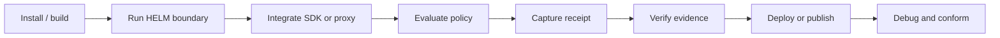

# HELM OSS Developer Surface Map

This page is the public map of HELM OSS developer surfaces. It complements the
quickstart and developer journey by showing where each source-backed capability
lives in the repository and which public docs page owns the explanation.

## Audience

This page is for developers who need the full HELM OSS surface area without
reading the repository directory by directory.

## Outcome

You should be able to pick the correct page for installation, local execution,
language SDKs, framework integration, deployment, schemas, conformance,
verification, release integrity, and troubleshooting.

## Surface Flow

## Developer Surfaces

| Need | Public page | Source truth |
| --- | --- | --- |
| Install on macOS, Linux, Windows/WSL, Docker, or source | `/helm-oss/developer-journey` | `docs/DEVELOPER_JOURNEY.md`, `docs/QUICKSTART.md`, `Makefile`, `.goreleaser.yml` |
| Run the first local boundary | `/helm-oss/developer-journey` | `core/cmd/helm/server_cmd.go`, `core/cmd/helm/proxy_cmd.go` |
| Point OpenAI-compatible clients at HELM | `/helm-oss/integrations/openai-compatible-proxy` | `docs/INTEGRATIONS/openai_baseurl.md`, `examples/python_openai_baseurl/`, `examples/ts_openai_baseurl/` |
| Use MCP | `/helm-oss/integrations/mcp` | `docs/INTEGRATIONS/mcp.md`, `examples/mcp_client/`, `mcp-bundle.json` |
| Use Python, TypeScript, JavaScript, Go, Rust, or Java | `/helm-oss/sdks` | `sdk/`, `examples/*_client/`, `examples/*openai_baseurl/` |
| Understand policy languages and bundles | `/helm-oss/reference/protocols-and-schemas`, `/helm-oss/compatibility` | `docs/architecture/policy-languages.md`, `protocols/bundles/`, `examples/policies/` |
| Validate conformance | `/helm-oss/conformance` | `docs/CONFORMANCE.md`, `protocols/conformance/v1/`, `tests/conformance/` |
| Verify receipts and evidence packs | `/helm-oss/verification`, `/helm-oss/developer-journey` | `docs/VERIFICATION.md`, `examples/receipt_verification/`, `protocols/spec/evidence-pack-v1.md` |
| Deploy with Docker or Kubernetes | `/helm-oss/deployment-and-examples` | `docker-compose.yml`, `deploy/`, `deploy/helm-chart/` |
| Verify release artifacts | `/helm-oss/security/release-security`, `/helm-oss/publishing` | `SECURITY.md`, `RELEASE.md`, `release/`, `.github/workflows/release.yml` |

## Source Truth

The coverage gate is `docs/developer-coverage.manifest.json`. The docs platform
loads public pages from `docs/public-docs.manifest.json`, then validates that
coverage-backed claims appear in public docs, search, Markdown exports,
`llms.txt`, `llms-full.txt`, and MCP responses.

## Troubleshooting

| Symptom | Use this page |
| --- | --- |
| You know the source path but not the public route | Match the source family in the table above. |
| You know the integration but not the proof command | Open `docs/developer-coverage.manifest.json` and inspect `validation_commands`. |
| A public page claims a capability but no example exists | Treat it as a docs bug unless the coverage manifest lists a live `example_paths` entry. |
