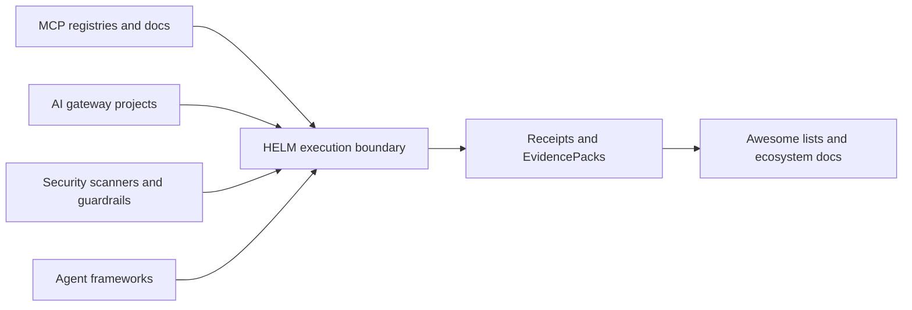

# HELM AI Kernel Ecosystem

This map helps contributors find high-value integration and upstream contribution targets.

## Integration Map

| Lane | Adjacent projects | HELM contribution angle |
| --- | --- | --- |
| MCP registries and docs | [modelcontextprotocol/registry](https://github.com/modelcontextprotocol/registry), [modelcontextprotocol/docs](https://github.com/modelcontextprotocol/docs), [modelcontextprotocol/servers](https://github.com/modelcontextprotocol/servers) | Tool metadata, schema-pin, authz, and fail-closed examples. |
| Remote tool routing infrastructure | [envoyproxy/ai-gateway](https://github.com/envoyproxy/ai-gateway), [microsoft/mcp-gateway](https://github.com/microsoft/mcp-gateway), [Portkey-AI/gateway](https://github.com/Portkey-AI/gateway), [BerriAI/litellm](https://github.com/BerriAI/litellm), [openziti/llm-gateway](https://github.com/openziti/llm-gateway) | Policy payloads, remote tool authorization, schema fidelity, and receipt-oriented audit fixtures. |
| Security scanners and guardrails | [promptfoo/promptfoo](https://github.com/promptfoo/promptfoo), [NVIDIA/garak](https://github.com/NVIDIA/garak), [NVIDIA-NeMo/Guardrails](https://github.com/NVIDIA-NeMo/Guardrails), [guardrails-ai/guardrails](https://github.com/guardrails-ai/guardrails) | Deny/escalate examples, reproducible security tests, and evidence outputs for agent tool execution. |
| Agent frameworks | [openai/openai-agents-python](https://github.com/openai/openai-agents-python), [pydantic/pydantic-ai](https://github.com/pydantic/pydantic-ai), [agno-agi/agno](https://github.com/agno-agi/agno), [crewAIInc/crewAI](https://github.com/crewAIInc/crewAI) | Minimal integration guides for routing proposed tool calls through HELM before dispatch. |
| Awesome lists | [punkpeye/awesome-mcp-servers](https://github.com/punkpeye/awesome-mcp-servers), [appcypher/awesome-mcp-servers](https://github.com/appcypher/awesome-mcp-servers), [wong2/awesome-mcp-servers](https://github.com/wong2/awesome-mcp-servers), [corca-ai/awesome-llm-security](https://github.com/corca-ai/awesome-llm-security), [ProjectRecon/awesome-ai-agents-security](https://github.com/ProjectRecon/awesome-ai-agents-security), [e2b-dev/awesome-ai-agents](https://github.com/e2b-dev/awesome-ai-agents) | Submit concise listings after the quickstart, demo asset, and contributor backlog are visible. |

## Source Truth

- [MCP integration](INTEGRATIONS/mcp.md)
- [OpenAI-compatible proxy example](EXAMPLES.md#openai-compatible-proxy)
- [Execution security model](EXECUTION_SECURITY_MODEL.md)
- [Launch proof assets](../examples/launch/README.md)
