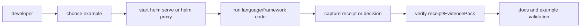

# HELM OSS Examples Matrix

This page is for developers choosing the shortest source-backed example for a language, framework, receipt, MCP, OpenTelemetry, or policy workflow. The outcome is a runnable example path, the server mode it expects, and the validation command that proves the public docs claim.

## Audience

This page is for developers who need to pick a runnable source-backed example for HELM OSS rather than infer support from a language name or integration slogan.

## Outcome

After this page you should know which example to run, which HELM server mode it expects, what output proves success, and which command validates the claim.

## Source Truth

Example source lives under [`examples`](../examples). SDK package docs live under [`sdk`](../sdk). Deployment examples are separated into [`deploy`](../deploy) and the Kubernetes chart at [`deploy/helm-chart`](../deploy/helm-chart).

## Example Flow



## Runnable Matrix

| Example | Server mode | What it proves | Source | Validation |
| --- | --- | --- | --- | --- |
| Python SDK | `helm serve --policy examples/launch/policies/agent_tool_call_boundary.toml` | ALLOW, DENY, MCP fail-closed denial, receipt verification, sandbox preflight, and evidence verification | [`examples/python_sdk`](../examples/python_sdk) | `make sdk-examples-smoke` |
| TypeScript SDK | `helm serve --policy examples/launch/policies/agent_tool_call_boundary.toml` | ALLOW, DENY, MCP fail-closed denial, receipt verification, sandbox preflight, and evidence verification | [`examples/ts_sdk`](../examples/ts_sdk) | `make sdk-examples-smoke` |
| Python OpenAI base URL | `helm proxy --port 9090` | OpenAI-compatible base URL, receipt headers, deny path | [`examples/python_openai_baseurl`](../examples/python_openai_baseurl) | `make test-sdk-py` |
| TypeScript OpenAI base URL | `helm proxy --port 9090` | JavaScript/TypeScript client base URL and receipt extraction | [`examples/ts_openai_baseurl`](../examples/ts_openai_baseurl) | `make test-sdk-ts` |
| JavaScript raw fetch | `helm proxy --port 9090` | Raw HTTP client compatibility | [`examples/js_openai_baseurl`](../examples/js_openai_baseurl) | `make docs-truth` |
| Go client | `helm serve --policy <file>` | typed client request, decision, receipt handling | [`examples/go_client`](../examples/go_client) | `go test ./sdk/go/...` |
| Rust client | `helm serve --policy <file>` | Rust client and verifier-facing types | [`examples/rust_client`](../examples/rust_client) | `make test-sdk-rust` |
| Java client | `helm serve --policy <file>` | JVM client request and error handling | [`examples/java_client`](../examples/java_client) | `make test-sdk-java` |
| MCP client | `helm mcp serve` or `/mcp` runtime | docs/tool boundary and MCP authorization path | [`examples/mcp_client`](../examples/mcp_client) | `make docs-truth` |
| Receipt verification | existing receipt/EvidencePack | offline verification path | [`examples/receipt_verification`](../examples/receipt_verification) | `make docs-truth` |
| Golden evidence | fixture evidence | stable conformance material | [`examples/golden`](../examples/golden) | `make docs-coverage` |
| OpenTelemetry GenAI | `helm proxy` with telemetry enabled | telemetry export shape | [`examples/otel-genai`](../examples/otel-genai) | `go test ./examples/otel-genai/...` |
| OpenCLAW | local example harness | compatibility with OpenCLAW-style policy material | [`examples/openclaw`](../examples/openclaw) | `make docs-truth` |
| Policy examples | `helm bundle build <source>` | CEL, Rego, Cedar bundle inputs | [`examples/policies`](../examples/policies) | `make docs-truth` |
| Starters | selected starter README | scaffolded integrations only where source exists | [`examples/starters`](../examples/starters) | `make docs-truth` |

## Common Environment

```bash
export HELM_URL=http://127.0.0.1:7714
export HELM_PROXY_BASE_URL=http://127.0.0.1:9090/v1
export OPENAI_API_KEY="${OPENAI_API_KEY:?set upstream key when proxying}"
```

Examples may also use framework-native `baseURL` or `base_url` options. Prefer the variable names used inside the example README or code; do not invent a new variable in public docs without adding it to the example.

## Expected Output

Every runnable example should produce at least one of these observable outputs:

- an HTTP response from HELM instead of the upstream provider;
- a receipt header or receipt file under the configured receipts directory;
- a deny decision and denial receipt for the blocked-path test;
- a verifier or conformance command that exits zero.

## Troubleshooting

| Symptom | Likely cause | Fix |
| --- | --- | --- |
| example reaches the upstream provider directly | base URL bypassed HELM | set the framework base URL to `http://127.0.0.1:9090/v1` or use `HELM_PROXY_BASE_URL` where the example supports it |
| receipt is missing | wrong server mode | use `helm proxy` for OpenAI-compatible examples and `helm serve` for runtime API examples |
| Java package cannot be fetched from a public registry | artifact is source-backed but not registry-backed | build from `sdk/java` locally and avoid claiming Maven Central availability |

## Not Covered

This page does not claim support for languages or frameworks that lack source, an example, or an SDK README. Planned examples must remain out of public support tables until code and validation exist.
