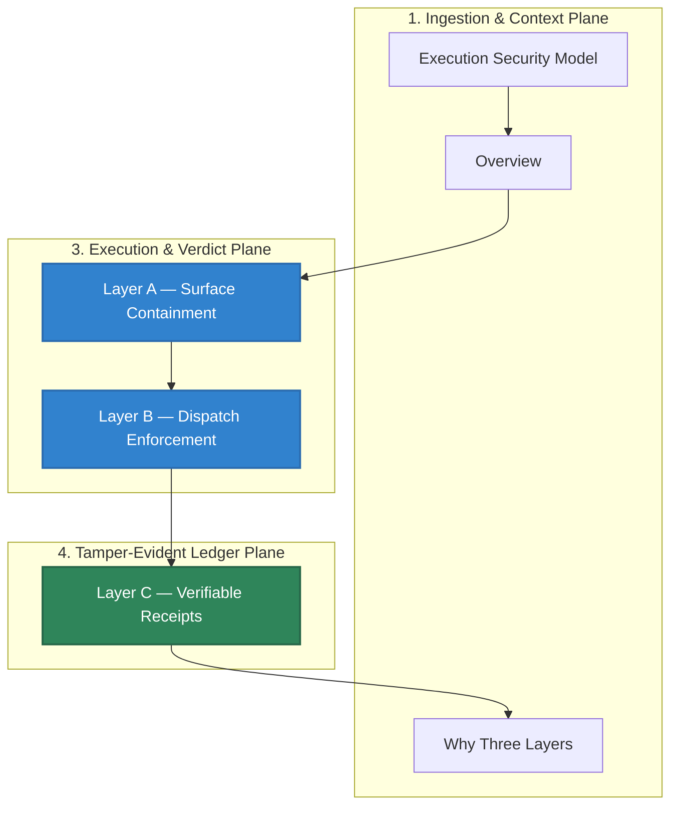

# Execution Security Model

## Audience

Security reviewers and runtime maintainers checking how HELM AI Kernel fails closed before dispatch.

## Outcome

After this page you should know what this surface is for, which source files own the behavior, which public route or adjacent page to use next, and which validation command to run before changing the claim.

## Source Truth

- Public route: `execution-security-model`
- Source document: `helm-ai-kernel/docs/EXECUTION_SECURITY_MODEL.md`
- Public manifest: `helm-ai-kernel/docs/public-docs.manifest.json`
- Source inventory: `helm-ai-kernel/docs/source-inventory.manifest.json`
- Validation: `make docs-coverage`, `make docs-truth`, and `npm run coverage:inventory` from `docs-platform`

Do not expand this page with unsupported product, SDK, deployment, compliance, or integration claims unless the inventory manifest points to code, schemas, tests, examples, or an owner doc that proves the claim.

## Troubleshooting

| Symptom | First check |
| --- | --- |
| Published output is stale or incomplete | Run `npm run helm-public:accuracy` in `docs-platform`, then check the source path and public manifest row for this page. |
| A claim needs implementation backing | Check the Source Truth files above and update the implementation, manifest, source inventory, or page in the same change. |

## Diagram

This scheme maps the main sections of Execution Security Model in reading order.




> **Canonical** · v1.0 · Normative
>
> This document defines HELM's three-layer execution security model.
> It is the canonical reference for how HELM reduces, enforces, and
> proves execution safety for AI agent tool calls.
>
> **Terminology**: follows the Unified Canonical Standard (UCS v1.3).

---

## Overview

HELM implements three independent, composable layers of execution security.
Each layer addresses a distinct class of threat and operates at a different
point in the execution lifecycle. No single layer is sufficient on its own.

## Guarantees And Non-Guarantees

HELM AI Kernel does:

- enforce deny-by-default policy at MCP and OpenAI-compatible dispatch boundaries;
- emit signed receipts for `ALLOW`, `DENY`, and `ESCALATE` decisions;
- quarantine unknown MCP servers and tools until they are inspected and approved;
- produce offline-verifiable EvidencePacks for source-backed receipt material.

HELM AI Kernel does not:

- protect against a compromised host kernel, runtime, or operator account;
- make reads safe when policy already allows the agent to read sensitive files;
- replace secret scanning, network firewalls, endpoint controls, or OS sandboxing;
- prevent prompt injection at generation time; enforcement happens at dispatch;
- capture side effects from tools that bypass the HELM proxy or MCP boundary;
- certify every MCP tool schema through static analysis;
- certify compliance with a regulatory standard by itself.

```
                ┌─────────────────────────────────────────┐
                │        Agent / Orchestrator              │
                └──────────────────┬──────────────────────┘
                                   │
          ┌────────────────────────▼────────────────────────┐
          │  Layer A — Surface Containment (design-time)    │
          │  Reduces WHAT can be called                     │
          │  capability manifests · tool bundles · profiles │
          │  connector allowlists · destination scoping     │
          └────────────────────────┬────────────────────────┘
                                   │
          ┌────────────────────────▼────────────────────────┐
          │  Layer B — Dispatch Enforcement (dispatch-time)  │
          │  Gates EACH call at PEP boundary                │
          │  schema PEP · budget locks · contract pinning   │
          │  PDP/CPI verdict · deny-by-default              │
          └────────────────────────┬────────────────────────┘
                                   │
          ┌────────────────────────▼────────────────────────┐
          │  Layer C — Verifiable Receipts (post-execution)  │
          │  Proves WHAT happened                           │
          │  Ed25519 receipts · ProofGraph DAG · replay     │
          │  EvidencePack · Merkle condensation              │
          └─────────────────────────────────────────────────┘
                                   │
                                   ▼
                            Tools / Systems
```

---

## Layer A — Surface Containment

**When**: Design-time / configuration-time.
**Purpose**: Structural attack surface reduction. Shrink what can be called
before any runtime evaluation begins.

Surface containment is a **design-time property** — it is configured before
execution, not computed per-call. It defines the **bounded execution surface**:
the maximum possible set of tools, destinations, and side-effect classes that
an agent can reach.

### Mechanisms

| Mechanism | Description |
| :--- | :--- |
| **Capability manifests** | Explicit declaration of permitted tools per agent/profile |
| **Domain-scoped tool bundles** | Tools grouped by domain with independent governance |
| **Side-effect class profiles** | Read-only, write-limited, or full profiles per tool class |
| **Connector allowlists** | Per-tenant/app/profile restrictions on which connectors are reachable |
| **Destination scoping** | Explicit target domain/URL/resource allowlists |
| **Filesystem/network deny-by-default** | WASI sandbox denies all I/O unless explicitly granted |
| **Sandbox profile requirement** | Each tool class requires a declared sandbox profile before execution |

### Architectural Property

Surface containment reduces the **blast radius** of any exploitation.
Even if dispatch enforcement (Layer B) has a bug, the bounded surface
limits what an attacker can reach. This is defense in depth by construction,
not by runtime checking.

### Implementation References

| Component | Package |
| :--- | :--- |
| Sandbox isolation | `core/pkg/runtime/sandbox/` |
| Tool catalog / MCP gateway | `core/pkg/mcp/` |
| Manifest validation | `core/pkg/manifest/` |
| Budget ceiling (P0) | `core/pkg/runtime/budget/` |

---

## Layer B — Dispatch Enforcement

**When**: Dispatch-time (per-call).
**Purpose**: Runtime per-call admissibility. Every tool call passes through a
fail-closed policy gate that evaluates **execution admissibility** — the
determination that a specific call, with specific args, at a specific time,
under a specific policy stack, is permitted.

Dispatch enforcement is a **dispatch-time property** — it is computed for
every individual call. No call reaches an executor without a signed
`DecisionRecord`.

### Mechanisms

| Mechanism | Description |
| :--- | :--- |
| **Schema PEP** | JCS canonicalization + SHA-256, fail-closed on input/output schema mismatch |
| **PDP/CPI evaluation** | Canonical Policy Index resolves P0 → P1 → P2 → verdict |
| **Budget enforcement** | ACID-locked budget gates, fail-closed on ceiling breach (`BUDGET_EXCEEDED`) |
| **Contract pinning** | Connector response schemas are pinned; any drift produces `ERR_CONNECTOR_CONTRACT_DRIFT` |
| **PRG evaluation** | Proof Requirement Graph checks cryptographic prerequisites |
| **Deny-by-default** | Unknown tools → `DENY_TOOL_NOT_FOUND`. Unknown args → `DENY`. Policy error → `FAIL_CLOSED_ERROR` |
| **Delegation session enforcement** | Session capabilities ⊆ delegator's policy; expired/invalid sessions → `DELEGATION_INVALID` |
| **Threat scan** | TCB scanner detects prompt injection / command injection signals → `THREAT_SIGNAL_DETECTED` |
| **Cryptographic Proof Safety Attestation** | Compiles and verifies agent safety assertions (AST static analysis) in a RISC Zero zkVM generating verifiable execution receipts |
| **TEE Enclave Secrets** | Silicon-sealed KMS vault wrapping (`SovereignKMSVault`) and inline token replacement proxy (`SecretProxyFilter`), preventing credentials from leaking to host memory/logs |

### Architectural Property

**Runtime execution enforcement** provides per-call guarantees:
every call is individually evaluated, every verdict is signed, every
denial is recorded. This is the choke point — the single enforcement
boundary that separates intent from effect.

### Key Term: Execution Admissibility

**Execution admissibility** is the canonical term for the PEP/CPI
determination that a specific tool call is permitted:

    Admissible iff:
      (1) tool ∈ declared surface (Layer A)
      (2) args conform to pinned schema
      (3) budget sufficient
      (4) PRG requirements satisfied
      (5) identity authorized for resource boundary
      (6) delegation session valid and in scope
      (7) no threat signals detected
      (8) all P0 ceilings respected

If any condition fails, the call is **inadmissible** and produces a
signed `DENY` verdict with a deterministic reason code.

### Implementation References

| Component | Package |
| :--- | :--- |
| Guardian (PEP) | `core/pkg/guardian/` |
| Policy contracts | `core/pkg/contracts/` |
| Gated execution | `core/pkg/executor/` |
| Canonicalization | `core/pkg/canonicalize/` |
| Approval ceremonies | `core/pkg/escalation/ceremony/` |
| Cryptographic Proof Safety Checker | `core/pkg/crypto/zk/` |
| TEE Secrets Enclave | `core/pkg/crypto/tee/` |

---

## Layer C — Verifiable Receipts

**When**: Post-execution.
**Purpose**: Post-hoc verifiability. Every execution — allowed or denied —
produces cryptographic evidence that can be independently verified without
network access.

Verifiable receipts provide **offline-verifiable proof** that the execution
boundary operated correctly.

### Mechanisms

| Mechanism | Description |
| :--- | :--- |
| **Ed25519 signed receipts** | Every verdict (ALLOW and DENY) produces a signed record |
| **ProofGraph DAG** | Append-only directed acyclic graph with Lamport causal ordering |
| **Causal hash chain** | Each receipt signs over the previous receipt's signature (`PrevHash`) |
| **EvidencePack** | Deterministic `.tar` export — same inputs produce identical output bytes |
| **Merkle condensation** | Risk-tiered checkpoints; low-risk receipts replaceable by inclusion proofs |
| **Offline replay** | Replay from genesis without network access |
| **Deny receipts** | Denied calls produce signed receipts with reason codes — not just silently dropped |

### Architectural Property

The receipts layer is **independent of enforcement**. Even if enforcement
logic changes (Layer B), the receipt chain proves what actually happened.
This separation is critical: enforcement can err, but errors are always
visible in the receipt chain.

### Implementation References

| Component | Package |
| :--- | :--- |
| Receipt enforcement | `core/pkg/receipts/` |
| ProofGraph DAG | `core/pkg/proofgraph/` |
| Cryptographic signing | `core/pkg/crypto/` |
| Evidence export/verify | `core/pkg/evidence/` |
| Replay engine | `core/pkg/replay/` |
| Trust registry | `core/pkg/trust/registry/` |

---

## Why Three Layers

A single layer is insufficient:

| Single-Layer Approach | Failure Mode |
| :--- | :--- |
| Surface containment only | Correct tools can still be called with malicious args |
| Dispatch enforcement only | Correct enforcement with too-large surface = high blast radius |
| Receipts only | You see what happened after the damage is done |

The three-layer model provides **defense in depth by construction**:

1. **Layer A** reduces the maximum possible attack surface
2. **Layer B** gates every individual call at the choke point
3. **Layer C** provides independent proof of correct operation

Each layer protects against failures in the other two.

---

## Canonical Vocabulary

| Term | Layer | Definition |
| :--- | :--- | :--- |
| **Bounded surface** | A | The maximum set of reachable tools/destinations. Design-time property |
| **Surface containment** | A | The act of constraining the bounded surface |
| **Runtime execution enforcement** | B | Per-call policy evaluation and verdict issuance |
| **Execution admissibility** | B | The determination that a specific call is permitted |
| **Verifiable receipts** | C | Cryptographic evidence of execution decisions |
| **Execution authority** | All | The composite property: containment + enforcement + proof |

---

## Conformance Mapping

| Conformance Gate | Layer |
| :--- | :--- |
| JCS Canonicalization | B |
| PEP Boundary | B |
| WASI Sandbox | A |
| Approval Ceremony | B |
| ProofGraph DAG | C |
| Trust Registry | C |
| EvidencePack | C |
| Offline Replay | C |
| Output Drift | B |
| Idempotency | B + C |
| Island Mode | A + C |
| Conformance Gates | All |

---

## Normative References

| Document | Relevance |
| :--- | :--- |
| [ARCHITECTURE.md](ARCHITECTURE.md) | System-level model, VPL, TCB |
| [core/pkg/receipts](../core/pkg/receipts/) | Execution pipeline and receipt chain implementation |
| [OWASP_MCP_THREAT_MAPPING.md](OWASP_MCP_THREAT_MAPPING.md) | Adversary classes and defenses |
| [OWASP_MCP_THREAT_MAPPING.md](OWASP_MCP_THREAT_MAPPING.md) | OWASP MCP alignment |
| [core/pkg/manifest](../core/pkg/manifest/) | Layer A configuration primitives |
| [core/pkg/trust/registry](../core/pkg/trust/registry/) | TCB boundary and trust-registry rules |
| [CONFORMANCE.md](CONFORMANCE.md) | Gate definitions, levels |

_Canonical revision: 2026-05-21 · HELM UCS v1.5_
