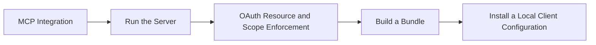

# MCP Integration

## Audience

## Outcome

After this page you should know what this surface is for, which source files own the behavior, which public route or adjacent page to use next, and which validation command to run before changing the claim.

## Source Truth

- Public route: `helm-oss/integrations/mcp`
- Source document: `helm-oss/docs/INTEGRATIONS/mcp.md`
- Public manifest: `helm-oss/docs/public-docs.manifest.json`
- Source inventory: `helm-oss/docs/source-inventory.manifest.json`
- Validation: `make docs-coverage`, `make docs-truth`, and `npm run coverage:inventory` from `docs-platform`

Do not expand this page with unsupported product, SDK, deployment, compliance, or integration claims unless the inventory manifest points to code, schemas, tests, examples, or an owner doc that proves the claim.

## Troubleshooting

| Symptom | First check |
| --- | --- |
| The public page and source behavior disagree | Treat the source path in `Source Truth` as canonical, then update the docs and source-inventory row in the same change. |
| A link or route is missing from the docs website | Check `docs/public-docs.manifest.json`, `llms.txt`, search, and the per-page Markdown export before changing navigation. |
| A claim is not backed by code or tests | Remove the claim or add the missing code, example, schema, or validation command before publishing. |

## Diagram

This scheme maps the main sections of MCP Integration in reading order.



HELM retains an MCP surface for governed tool access.

The local boundary quickstart remains the entry point:

```bash
helm serve --policy ./release.high_risk.v3.toml
```

## Run the Server

```bash
./bin/helm mcp serve
```

## OAuth Resource and Scope Enforcement

`./bin/helm mcp serve --auth oauth` supports production JWKS validation and the dev-only `HELM_OAUTH_BEARER_TOKEN` fallback. Production mode validates issuer, audience, expiration, issued-at, configured global scopes, and the MCP resource indicator before forwarding the request to the gateway.

Configure production OAuth with:

| Variable | Purpose |
| --- | --- |
| `HELM_OAUTH_JWKS_URL` | JWKS endpoint used to verify bearer-token signatures |
| `HELM_OAUTH_ISSUER` | Required `iss` claim |
| `HELM_OAUTH_AUDIENCE` | Required `aud` claim |
| `HELM_OAUTH_RESOURCE` | Required RFC 8707 resource indicator; defaults to `<base-url>/mcp` |
| `HELM_OAUTH_SCOPES` | Comma- or space-separated scopes required before gateway entry |

Tool definitions may also declare `required_scopes`. These are surfaced to MCP clients as `requiredScopes` in `tools/list` and are enforced again at execution time for both `/mcp/v1/execute` and JSON-RPC `tools/call`. A missing per-tool scope returns `MCP.OAUTH.INSUFFICIENT_SCOPE` on the REST surface or a JSON-RPC application error on the streamable MCP surface.

The resource check follows [RFC 8707](https://datatracker.ietf.org/doc/html/rfc8707): the MCP gateway treats the token audience plus `resource` / `resources` token members as accepted resource indicators and rejects tokens that are not minted for this MCP endpoint.

## Build a Bundle

```bash
./bin/helm mcp pack --client claude-desktop --out helm.mcpb
```

## Install a Local Client Configuration

```bash
./bin/helm mcp install --client claude-code
```

Use `./bin/helm mcp print-config --client <name>` for text configuration snippets where supported by the CLI.

MCP activity that emits receipts can be inspected with:

```bash
helm receipts tail --agent agent.titan.exec
```

<!-- docs-depth-final-pass -->

## MCP Integration Checklist

A complete MCP integration claim includes the transport, tool list, input schema, output schema, receipt behavior, denial behavior, and a validation command. The public example must show at least one allowed call and one policy-denied call, with the receipt or diagnostic ID a developer should capture. Keep model-provider setup separate from MCP governance: the server exposes a controlled tool boundary, while HELM owns policy evaluation, evidence capture, and verifier replay. If a tool is experimental, mark it as such and keep it out of conformance tables until it has schema and fixture coverage.
