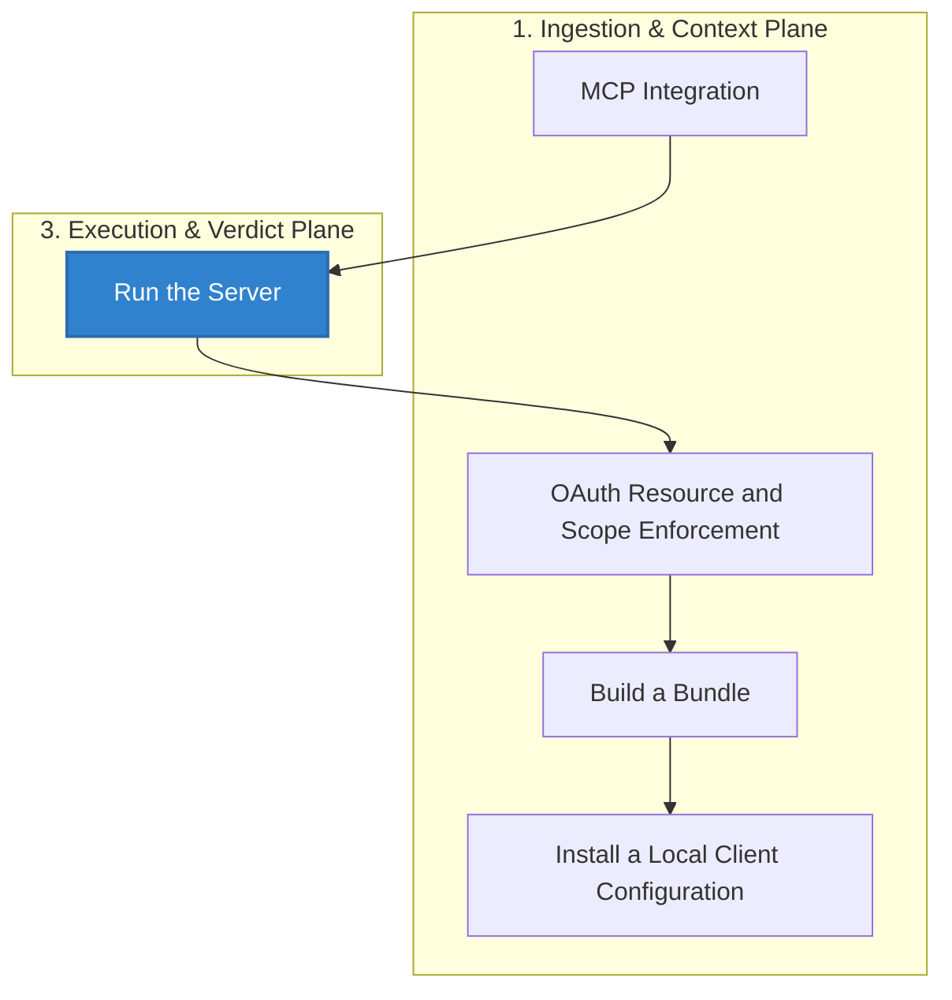

# MCP Integration

## Audience

Integration developers and operators routing MCP tool calls through the HELM AI Kernel firewall/quarantine path.

## Outcome

After this page you should know what this surface is for, which source files own the behavior, which public route or adjacent page to use next, and which validation command to run before changing the claim.

## Source Truth

- Public route: `helm-ai-kernel/integrations/mcp`
- Source document: `helm-ai-kernel/docs/INTEGRATIONS/mcp.md`
- Public manifest: `helm-ai-kernel/docs/public-docs.manifest.json`
- Source inventory: `helm-ai-kernel/docs/source-inventory.manifest.json`
- Launch demo: `scripts/launch/demo-mcp.sh`
- Shell policy fixture: `examples/launch/policies/shell_mcp_server_boundary.json`
- Validation: `make docs-coverage`, `make docs-truth`, and `npm run coverage:inventory` from `docs-platform`

Do not expand this page with unsupported product, SDK, deployment, compliance, or integration claims unless the inventory manifest points to code, schemas, tests, examples, or an owner doc that proves the claim.

## Troubleshooting

| Symptom | First check |
| --- | --- |
| Published output is stale or incomplete | Run `npm run helm-public:accuracy` in `docs-platform`, then check the source path and public manifest row for this page. |
| A claim needs implementation backing | Check the Source Truth files above and update the implementation, manifest, source inventory, or page in the same change. |

## Diagram

This scheme maps the main sections of MCP Integration in reading order.




HELM retains an MCP surface for governed tool access.

The local boundary quickstart remains the entry point:

```bash
helm-ai-kernel serve --policy ./release.high_risk.v3.toml
```

## Shell MCP Server Quickstart

This example puts HELM in front of an upstream `shell-mcp-server` for local
Claude/Cursor-style MCP usage. `shell-mcp-server` is not a HELM implementation;
it is the upstream server identity that HELM discovers, quarantines, approves,
and authorizes before each tool call.

Create a wrapper profile:

```bash
./bin/helm-ai-kernel mcp wrap \
  --server-id shell-mcp-server \
  --upstream-command "npx -y shell-mcp-server" \
  --require-pinned-schema=true \
  --json
```

Install or print client configuration:

```bash
./bin/helm-ai-kernel mcp install --client claude-code
./bin/helm-ai-kernel mcp pack --client claude-desktop --out helm-ai-kernel.mcpb
./bin/helm-ai-kernel mcp print-config --client cursor
```

The minimal shell fixture is
`examples/launch/policies/shell_mcp_server_boundary.json`. It documents the
intended quickstart policy shape:

| Command class | Verdict | Reason |
| --- | --- | --- |
| `ls` | `ALLOW` | Read-only directory listing |
| `cat <path>` | `ALLOW` | Read-only file inspection |
| `git status` | `ALLOW` | Read-only worktree status |
| `rm -rf` and equivalent recursive force delete patterns | `DENY` | Destructive deletion |
| `dd`, `mkfs`, and raw-device write patterns | `DENY` | Disk or filesystem destruction |
| `git clean -f`, `git clean -fd`, `git clean -fdx`, `git clean --force` | `DENY` | Destructive worktree cleanup |

The active policy bundle still decides enforcement. The fixture keeps docs and
review discussion concrete without creating a second policy language.

Receipt-bearing MCP decisions can be inspected with:

```bash
./bin/helm-ai-kernel receipts tail --agent mcp-demo-agent --server http://127.0.0.1:7714
```

## Run the Server

```bash
./bin/helm-ai-kernel mcp serve
```

## OAuth Resource and Scope Enforcement

`./bin/helm-ai-kernel mcp serve --auth oauth` supports production JWKS validation and the dev-only `HELM_OAUTH_BEARER_TOKEN` fallback. Production mode validates issuer, audience, expiration, issued-at, configured global scopes, and the MCP resource indicator before forwarding the request to the gateway.

Configure production OAuth with:

| Variable | Purpose |
| --- | --- |
| `HELM_OAUTH_JWKS_URL` | JWKS endpoint used to verify bearer-token signatures |
| `HELM_OAUTH_ISSUER` | Required `iss` claim |
| `HELM_OAUTH_AUDIENCE` | Required `aud` claim |
| `HELM_OAUTH_RESOURCE` | Required RFC 8707 resource indicator; defaults to `<base-url>/mcp` |
| `HELM_OAUTH_SCOPES` | Comma- or space-separated scopes required before gateway entry |

Tool definitions may also declare `required_scopes`. These are surfaced to MCP clients as `requiredScopes` in `tools/list` and are enforced again at execution time for both `/mcp/v1/execute` and JSON-RPC `tools/call`. A missing per-tool scope returns `MCP.OAUTH.INSUFFICIENT_SCOPE` on the REST surface or a JSON-RPC application error on the streamable MCP surface.

The resource check follows [RFC 8707](https://datatracker.ietf.org/doc/html/rfc8707): the MCP gateway treats the token audience plus `resource` / `resources` token members as accepted resource indicators and rejects tokens that are not minted for this MCP endpoint.

## Build a Bundle

```bash
./bin/helm-ai-kernel mcp pack --client claude-desktop --out helm-ai-kernel.mcpb
```

## Install a Local Client Configuration

```bash
./bin/helm-ai-kernel mcp install --client claude-code
```

Use `./bin/helm-ai-kernel mcp print-config --client <name>` for text configuration snippets where supported by the CLI.

## Quarantine and Schema Pins

Unknown MCP servers are quarantined by default. A call is dispatchable only
after server discovery, metadata/schema inspection, risk classification,
approval bound to a HELM receipt, and a matching pinned schema hash.

The maintained local demo covers this full path:

```bash
./scripts/launch/demo-mcp.sh
```

The demo asserts that unknown servers, unknown tools, and missing schema pins
return `DENY` or `ESCALATE`; they never dispatch to the fixture server.

MCP activity that emits receipts can be inspected with:

```bash
helm-ai-kernel receipts tail --agent <agent-id>
```

<!-- docs-depth-final-pass -->

## MCP Integration Checklist

A complete MCP integration claim includes the transport, tool list, input schema, output schema, receipt behavior, denial behavior, and a validation command. The public example must show at least one allowed call and one policy-denied call, with the receipt or diagnostic ID a developer should capture. Keep model-provider setup separate from MCP governance: the server exposes a controlled tool boundary, while HELM owns policy evaluation, evidence capture, and verifier replay. If a tool is experimental, mark it as such and keep it out of conformance tables until it has schema and fixture coverage.
