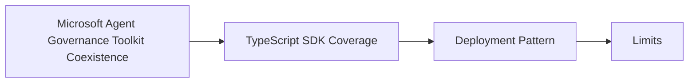

# Microsoft Agent Governance Toolkit Coexistence

## Audience

## Outcome

After this page you should know what this surface is for, which source files own the behavior, which public route or adjacent page to use next, and which validation command to run before changing the claim.

## Source Truth

- Public route: `helm-oss/integrations/microsoft-agent-governance-toolkit`
- Source document: `helm-oss/docs/INTEGRATIONS/microsoft_agent_governance_toolkit.md`
- Public manifest: `helm-oss/docs/public-docs.manifest.json`
- Source inventory: `helm-oss/docs/source-inventory.manifest.json`
- Validation: `make docs-coverage`, `make docs-truth`, and `npm run coverage:inventory` from `docs-platform`

Do not expand this page with unsupported product, SDK, deployment, compliance, or integration claims unless the inventory manifest points to code, schemas, tests, examples, or an owner doc that proves the claim.

## Troubleshooting

| Symptom | First check |
| --- | --- |
| The public page and source behavior disagree | Treat the source path in `Source Truth` as canonical, then update the docs and source-inventory row in the same change. |
| A link or route is missing from the docs website | Check `docs/public-docs.manifest.json`, `llms.txt`, search, and the per-page Markdown export before changing navigation. |
| A claim is not backed by code or tests | Remove the claim or add the missing code, example, schema, or validation command before publishing. |

## Diagram

This scheme maps the main sections of Microsoft Agent Governance Toolkit Coexistence in reading order.



Microsoft announced Agent Governance Toolkit (AGT) on 2026-04-02 as an open-source runtime governance layer for autonomous AI agents. The announcement and repository position AGT around deterministic action policy, zero-trust identity, sandboxing, SRE controls, and framework integrations across LangGraph, CrewAI, OpenAI Agents SDK, PydanticAI, LlamaIndex, and adjacent agent stacks.

HELM should not replace AGT in a customer environment that has already standardized on it. The narrow integration stance is:

- AGT can remain the framework-local governance layer.
- HELM sits below it as the non-bypassable, receipt-bearing boundary for tool execution.
- HELM evidence packs remain the audit artifact when execution must be replayed or independently verified.

## TypeScript SDK Coverage

The `@mindburn/helm` TypeScript SDK includes adapter helpers for the framework families called out in the AGT launch surface:

| Framework | Helper |
| --- | --- |
| LangGraph | `fromLangGraphToolCall` |
| CrewAI | `fromCrewAITask` |
| OpenAI Agents SDK | `fromOpenAIAgentsToolCall` |
| PydanticAI | `fromPydanticAIToolCall` |
| LlamaIndex | `fromLlamaIndexToolCall` |

Each helper normalizes a native tool-call event into an OpenAI-compatible HELM request and submits it through `chatCompletionsWithReceipt`. The framework adapter does not execute the tool. It prepares the intent for HELM policy, then returns the kernel-issued governance metadata from `X-Helm-*` headers.

```ts
import { HelmClient, createAgentFrameworkAdapter, fromLangGraphToolCall } from "@mindburn/helm";

const helm = new HelmClient({ baseUrl: "http://localhost:8080" });
const adapter = createAgentFrameworkAdapter(helm, {
  model: "helm-governance",
  metadata: { boundary: "agt-coexistence" },
});

const governed = await adapter.submit(
  fromLangGraphToolCall({
    id: "call-lg-1",
    name: "warehouse.query",
    args: { table: "orders", limit: 10 },
  }),
);

console.log(governed.governance.receiptId);
```

## Deployment Pattern

Run the framework agent exactly where it already runs. Configure AGT or framework-local middleware first. Before any side-effecting tool executes, normalize that tool event with the HELM SDK helper and submit it to the HELM boundary. Execute the original tool only when the HELM response path returns a permitted result and a receipt is present.

For OpenAI-compatible stacks, prefer routing through the HELM proxy base URL when possible. For native framework hooks, use the adapter helpers so the same action metadata reaches HELM even when the framework does not speak OpenAI's request shape directly.

## Limits

This is compatibility coverage, not Microsoft certification. The helpers do not import AGT packages, do not modify AGT policies, and do not validate AGT evidence files. They give HELM a typed bridge for the same framework families so AGT and HELM can coexist without duplicating framework-specific glue in every customer project.

Primary sources verified on 2026-04-30:

- Microsoft Open Source Blog: <https://opensource.microsoft.com/blog/2026/04/02/introducing-the-agent-governance-toolkit-open-source-runtime-security-for-ai-agents/>
- Microsoft AGT repository: <https://github.com/microsoft/agent-governance-toolkit>
- Microsoft AGT releases: <https://github.com/microsoft/agent-governance-toolkit/releases>
