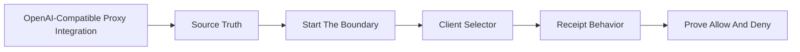

# OpenAI-Compatible Proxy Integration

## Audience

## Outcome

After this page you should know what this surface is for, which source files own the behavior, which public route or adjacent page to use next, and which validation command to run before changing the claim.

## Troubleshooting

| Symptom | First check |
| --- | --- |
| The public page and source behavior disagree | Treat the source path in `Source Truth` as canonical, then update the docs and source-inventory row in the same change. |
| A link or route is missing from the docs website | Check `docs/public-docs.manifest.json`, `llms.txt`, search, and the per-page Markdown export before changing navigation. |
| A claim is not backed by code or tests | Remove the claim or add the missing code, example, schema, or validation command before publishing. |

## Diagram

This scheme maps the main sections of OpenAI-Compatible Proxy Integration in reading order.



The OpenAI-compatible proxy is the retained OSS path for applications that already use OpenAI-style clients. It keeps the client library stable and moves the execution boundary to HELM.

## Source Truth

This page is backed by:

- `core/cmd/helm/proxy_cmd.go`
- `core/cmd/helm/server_cmd.go`
- `sdk/python/README.md`
- `sdk/ts/README.md`
- `examples/python_openai_baseurl/`
- `examples/ts_openai_baseurl/`
- `examples/js_openai_baseurl/`
- `docs/developer-coverage.manifest.json`

## Start The Boundary

Start the policy boundary:

```bash
./bin/helm serve --policy ./release.high_risk.v3.toml
```

Start the proxy:

```bash
./bin/helm proxy \
  --upstream https://api.openai.com/v1 \
  --port 9090 \
  --receipts-dir ./helm-receipts
```

Then update client base URL to:

```text
http://localhost:9090/v1
```

Do not point applications at `port 3000/v1` unless your local command actually bound that port. The proxy default in the CLI is `9090`.

## Client Selector

:::selector language
### Python

```python
from openai import OpenAI

client = OpenAI(base_url="http://localhost:9090/v1")
response = client.chat.completions.create(
    model="gpt-4",
    messages=[{"role": "user", "content": "Return the policy status."}],
)
print(response.choices[0].message.content)
```

Runnable source-backed path:

```bash
cd examples/python_openai_baseurl
OPENAI_BASE_URL=http://localhost:9090/v1 python main.py
```

### TypeScript

```ts
import OpenAI from "openai";

const openai = new OpenAI({
  baseURL: "http://localhost:9090/v1",
});

const response = await openai.chat.completions.create({
  model: "gpt-4",
  messages: [{ role: "user", content: "Return the policy status." }],
});
console.log(response.choices[0]?.message?.content);
```

Runnable source-backed path:

```bash
cd examples/ts_openai_baseurl
OPENAI_BASE_URL=http://localhost:9090/v1 npm run start
```

### JavaScript

```js
import OpenAI from "openai";

const openai = new OpenAI({
  baseURL: "http://localhost:9090/v1",
});

const response = await openai.chat.completions.create({
  model: "gpt-4",
  messages: [{ role: "user", content: "Return the policy status." }],
});
console.log(response.choices[0]?.message?.content);
```

Runnable source-backed path:

```bash
cd examples/js_openai_baseurl
OPENAI_BASE_URL=http://localhost:9090/v1 node main.js
```
:::

## Receipt Behavior

Allowed responses should be tied to a HELM decision and receipt path. In local development, tail receipts with:

```bash
./bin/helm receipts tail --server http://127.0.0.1:7714
```

Expected metadata:

| Metadata | Meaning |
| --- | --- |
| `X-Helm-Decision-ID` | decision identifier emitted by the HELM boundary when available |
| `X-Helm-Receipt-ID` | receipt identifier for the governed request |
| `X-Helm-Reason-Code` | allow or deny reason code |
| `X-Helm-Output-Hash` | hash of the governed output |
| `X-Helm-Status` | governance status for the proxied response |
| `X-Helm-Correlation-ID` | trace and receipt correlation value when present |

Some OpenAI-compatible clients hide raw response headers. In that case, use receipt tailing or the typed HELM SDK path to inspect metadata.

## Prove Allow And Deny

Use the integration only when you can prove both outcomes:

- an allowed request returns normal model output and receipt metadata;
- a disallowed tool or effect returns a denial reason instead of silently executing;
- no request reaches the upstream provider directly unless it crossed the HELM proxy.

Run the SDK and proxy tests before publishing a new example:

```bash
make test-sdk-py
make test-sdk-ts
make test
```

## Failure Modes

| Symptom | Cause | Fix |
| --- | --- | --- |
| no receipts appear | the app still calls the upstream provider directly | log the request host and set the client base URL to HELM |
| denied request retries forever | client treats 403 as transient | do not retry definitive policy denials |
| upstream auth fails | provider key is missing from the configured boundary | configure provider auth according to your deployment model |
| receipt tail is empty | wrong agent filter or receipt server | remove the filter and verify the receipt server address |
| client cannot see `X-Helm-*` headers | client library hides raw headers | inspect the local receipt stream or use an SDK method that exposes governance metadata |
| examples use the wrong port | proxy was started on a non-default port | align `--port`, `OPENAI_BASE_URL`, and client `baseURL` |

## Source-Backed Claim Policy

Retained examples live under `examples/python_openai_baseurl/`, `examples/js_openai_baseurl/`, and `examples/ts_openai_baseurl/`. Add a runnable example and validation command before claiming a new OpenAI-compatible client or framework variant.
