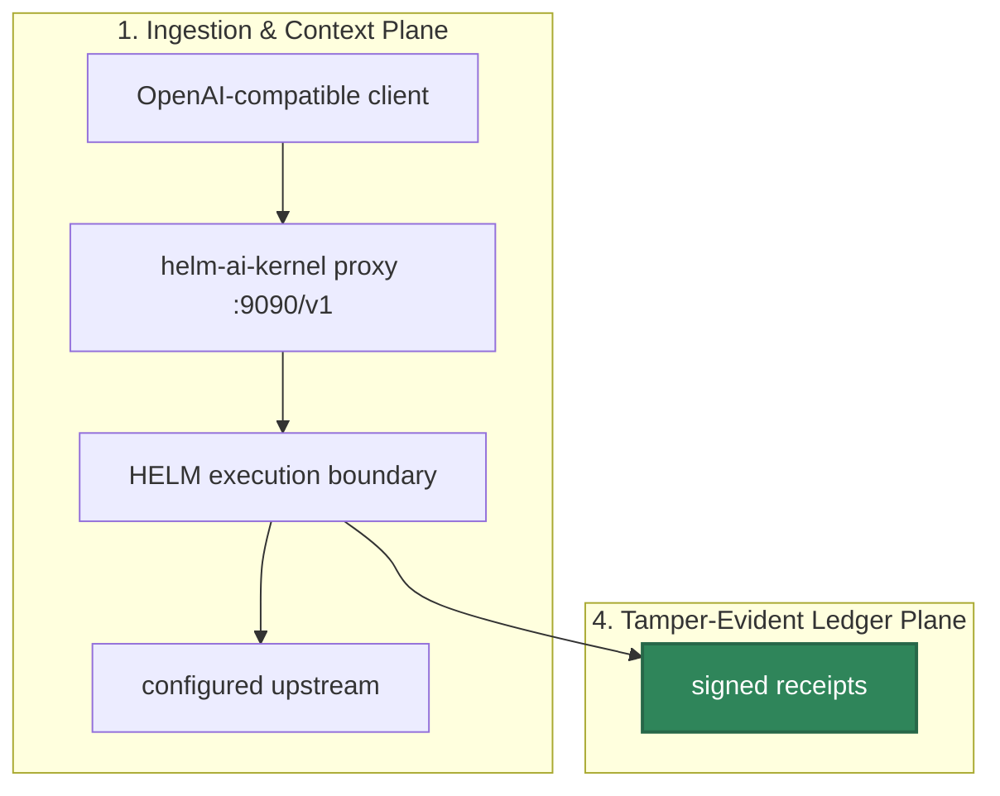

# OpenAI-Compatible Proxy Integration

## Audience

Developers who already use OpenAI-shaped clients and want requests to cross the HELM AI Kernel execution boundary before they reach an upstream provider.

## Outcome

After this integration you should have a local OpenAI-compatible base URL at `http://127.0.0.1:9090/v1`, a HELM AI Kernel boundary on `127.0.0.1:7714`, and a receipt inspection path that proves the application did not bypass HELM.




## Source Truth

- CLI proxy implementation: [`core/cmd/helm-ai-kernel/proxy_cmd.go`](../../core/cmd/helm-ai-kernel/proxy_cmd.go)
- Local boundary command: [`core/cmd/helm-ai-kernel/server_cmd.go`](../../core/cmd/helm-ai-kernel/server_cmd.go), [`core/cmd/helm-ai-kernel/serve_policy.go`](../../core/cmd/helm-ai-kernel/serve_policy.go)
- Receipt routes: [`core/cmd/helm-ai-kernel/receipt_routes.go`](../../core/cmd/helm-ai-kernel/receipt_routes.go)
- Local proxy demo: [`scripts/launch/demo-openai-proxy.sh`](../../scripts/launch/demo-openai-proxy.sh), [`scripts/launch/mock-openai-upstream.py`](../../scripts/launch/mock-openai-upstream.py)
- Source-backed examples: [`examples/python_openai_baseurl/`](../../examples/python_openai_baseurl/), [`examples/ts_openai_baseurl/`](../../examples/ts_openai_baseurl/), [`examples/js_openai_baseurl/`](../../examples/js_openai_baseurl/)

The proxy is an OpenAI-compatible request boundary. It is not hosted operations and it does not certify provider SDK behavior.

The current naming is deliberate: this integration is the OpenAI-compatible
proxy, not a Vercel-specific adapter. Existing framework or provider examples
should describe the base URL contract they exercise and keep provider-specific
claims in source-backed example pages. Do not reintroduce deleted Vercel example
paths or document a framework SDK as supported unless the retained example
imports that SDK and is covered by a validation command.

The proxy path has one job: preserve an OpenAI-shaped client interface while
moving authorization and receipt emission into HELM. A successful upstream
response is not enough evidence. The operator should be able to show that the
request host was HELM, that the boundary emitted a decision, and that receipt
inspection works for the same request.

## Start The Boundary

```bash
make build
./bin/helm-ai-kernel serve --policy ./release.high_risk.v3.toml
```

`helm-ai-kernel serve --policy` binds the local policy boundary to `http://127.0.0.1:7714` by default.

Start a mock upstream and the OpenAI-compatible proxy:

```bash
python3 scripts/launch/mock-openai-upstream.py --port 19090
./bin/helm-ai-kernel proxy \
  --upstream http://127.0.0.1:19090/v1 \
  --port 9090 \
  --receipts-dir ./helm-receipts
```

Applications that use OpenAI-shaped HTTP clients should point their base URL at:

```text
http://127.0.0.1:9090/v1
```

Do not document `3000` as a default. Use it only when the local command explicitly binds that port.

## Agent Runtime Endpoint Examples

The integration point is the OpenAI-compatible endpoint, not a framework-specific
adapter. Configure the client or framework to use HELM as the base URL.

Environment-only setup:

```bash
export OPENAI_BASE_URL=http://127.0.0.1:9090/v1
export OPENAI_API_KEY=local-dev-key
```

OpenAI Agents SDK setup:

```python
from openai import AsyncOpenAI
from agents import Agent, Runner, set_default_openai_api, set_default_openai_client

set_default_openai_client(
    AsyncOpenAI(base_url="http://127.0.0.1:9090/v1", api_key="local-dev-key"),
    use_for_tracing=False,
)
set_default_openai_api("chat_completions")

agent = Agent(name="governed", instructions="Route tool effects through HELM.")
result = await Runner.run(agent, "summarize the current task")
```

LangGraph or LangChain setup through `langchain-openai`:

```python
from langchain_openai import ChatOpenAI

llm = ChatOpenAI(
    model="helm-local-mock",
    base_url="http://127.0.0.1:9090/v1",
    api_key="local-dev-key",
)
```

Custom runtime setup:

```bash
curl -sS http://127.0.0.1:9090/v1/chat/completions \
  -H 'content-type: application/json' \
  -H 'authorization: Bearer local-dev-key' \
  -d '{"model":"helm-local-mock","messages":[{"role":"user","content":"hello through HELM"}]}'
```

## Python Example

```bash
cd examples/python_openai_baseurl
HELM_URL=http://127.0.0.1:7714 PYTHONPATH=../../sdk/python python main.py
```

## TypeScript Example

```bash
cd examples/ts_openai_baseurl
HELM_URL=http://127.0.0.1:7714 npx tsx main.ts
```

## JavaScript Fetch Example

```bash
cd examples/js_openai_baseurl
HELM_URL=http://127.0.0.1:7714 node main.js
```

## Receipt Behavior

Allowed and denied requests should produce HELM receipts. The CLI receipt tail requires an agent filter:

```bash
./bin/helm-ai-kernel receipts tail --agent <agent-id> --server http://127.0.0.1:7714
```

The HTTP route `GET /api/v1/receipts/tail` can be used directly when an unfiltered stream is appropriate.

| Metadata | Meaning |
| --- | --- |
| `X-Helm-Decision-ID` | Decision identifier emitted by the HELM boundary |
| `X-Helm-Receipt-ID` | Receipt identifier for the governed request |
| `X-Helm-Reason-Code` | ALLOW, DENY, or ESCALATE reason context |
| `X-Helm-Output-Hash` | Hash of the governed output |
| `X-Helm-Status` | Governance status for the proxied response |
| `X-Helm-Correlation-ID` | Trace and receipt correlation value |

Some OpenAI-compatible clients hide raw response headers. In that case, inspect the receipt stream or use a HELM SDK path that exposes receipt metadata.

### Risky Tool-Call Denial

The local mock upstream has a deny fixture: request model
`helm-local-tool-fixture` and it returns an OpenAI-shaped assistant message
containing `tool_calls`. The proxy must stop that response before the caller can
execute the tool.

```bash
curl -sS -D headers.txt -o denied.json -w '%{http_code}\n' \
  http://127.0.0.1:9090/v1/chat/completions \
  -H 'content-type: application/json' \
  -H 'authorization: Bearer local-dev-key' \
  -d '{"model":"helm-local-tool-fixture","messages":[{"role":"user","content":"call a denied tool"}]}'
```

Expected result:

- HTTP status is `403`.
- `X-Helm-Status` is `DENIED`.
- `X-Helm-Receipt-ID` is present.
- `denied.json` contains a HELM error body and no executable `tool_calls`.
- The latest proxy receipt has `status: "DENIED"` and `tool_calls_intercepted: 1`.

Run the maintained proof:

```bash
./scripts/launch/demo-openai-proxy.sh
```

The receipt can later be included in an EvidencePack. The EvidencePack verifier
then checks the indexed receipt bytes, root hashes, and seal instead of trusting
the proxy process that produced the denial.

## Verification

Before publishing a new proxy example, prove both outcomes:

- an allowed request returns upstream-shaped output and a HELM receipt;
- a denied or escalated request does not silently dispatch;
- the application does not call the upstream provider directly.

```bash
make test-sdk-py
make test-sdk-ts
cd core && go test ./cmd/helm-ai-kernel -run 'Test.*Route|Test.*OpenAPI|Test.*Receipt' -count=1
```

## Troubleshooting

| Symptom | Cause | Fix |
| --- | --- | --- |
| no receipts appear | the app still calls the upstream provider directly | log the request host and set the client base URL to HELM |
| denied request retries forever | client treats a policy denial as transient | do not retry definitive DENY decisions |
| upstream auth fails | provider credentials are not configured for the selected upstream | configure provider auth in the upstream environment |
| receipt tail exits with usage | missing CLI agent filter | pass `--agent <agent-id>` or use the HTTP route directly |
| examples use the wrong port | local command used a non-default port | align `--port`, `HELM_URL`, and client `baseURL` |

When troubleshooting, prove the request host first. A successful model response is not proof that the request crossed HELM unless the receipt route or SDK response metadata shows a HELM decision.
