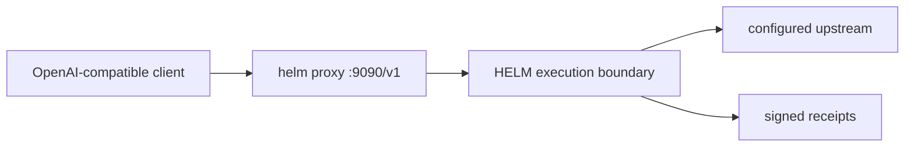

# OpenAI-Compatible Proxy Integration

## Audience

Developers who already use OpenAI-shaped clients and want requests to cross the HELM OSS execution boundary before they reach an upstream provider.



## Source Truth

- CLI proxy implementation: [`core/cmd/helm/proxy_cmd.go`](../../core/cmd/helm/proxy_cmd.go)
- Local boundary command: [`core/cmd/helm/server_cmd.go`](../../core/cmd/helm/server_cmd.go), [`core/cmd/helm/serve_policy.go`](../../core/cmd/helm/serve_policy.go)
- Receipt routes: [`core/cmd/helm/receipt_routes.go`](../../core/cmd/helm/receipt_routes.go)
- Source-backed examples: [`examples/python_openai_baseurl/`](../../examples/python_openai_baseurl/), [`examples/ts_openai_baseurl/`](../../examples/ts_openai_baseurl/), [`examples/js_openai_baseurl/`](../../examples/js_openai_baseurl/)

The proxy is an OpenAI-compatible request boundary. It is not hosted operations and it does not certify provider SDK behavior.

## Start The Boundary

```bash
make build
./bin/helm serve --policy ./release.high_risk.v3.toml
```

`helm serve --policy` binds the local policy boundary to `http://127.0.0.1:7714` by default.

Start a mock upstream and the OpenAI-compatible proxy:

```bash
python3 scripts/launch/mock-openai-upstream.py --port 19090
./bin/helm proxy \
  --upstream http://127.0.0.1:19090/v1 \
  --port 9090 \
  --receipts-dir ./helm-receipts
```

Applications that use OpenAI-shaped HTTP clients should point their base URL at:

```text
http://127.0.0.1:9090/v1
```

Do not document `3000` as a default. Use it only when the local command explicitly binds that port.

## Python Example

```bash
cd examples/python_openai_baseurl
HELM_URL=http://127.0.0.1:7714 PYTHONPATH=../../sdk/python python main.py
```

## TypeScript Example

```bash
cd examples/ts_openai_baseurl
HELM_URL=http://127.0.0.1:7714 npx tsx main.ts
```

## JavaScript Fetch Example

```bash
cd examples/js_openai_baseurl
HELM_URL=http://127.0.0.1:7714 node main.js
```

## Receipt Behavior

Allowed and denied requests should produce HELM receipts. The CLI receipt tail requires an agent filter:

```bash
./bin/helm receipts tail --agent <agent-id> --server http://127.0.0.1:7714
```

The HTTP route `GET /api/v1/receipts/tail` can be used directly when an unfiltered stream is appropriate.

| Metadata | Meaning |
| --- | --- |
| `X-Helm-Decision-ID` | Decision identifier emitted by the HELM boundary |
| `X-Helm-Receipt-ID` | Receipt identifier for the governed request |
| `X-Helm-Reason-Code` | ALLOW, DENY, or ESCALATE reason context |
| `X-Helm-Output-Hash` | Hash of the governed output |
| `X-Helm-Status` | Governance status for the proxied response |
| `X-Helm-Correlation-ID` | Trace and receipt correlation value |

Some OpenAI-compatible clients hide raw response headers. In that case, inspect the receipt stream or use a HELM SDK path that exposes receipt metadata.

## Verification

Before publishing a new proxy example, prove both outcomes:

- an allowed request returns upstream-shaped output and a HELM receipt;
- a denied or escalated request does not silently dispatch;
- the application does not call the upstream provider directly.

```bash
make test-sdk-py
make test-sdk-ts
cd core && go test ./cmd/helm -run 'Test.*Route|Test.*OpenAPI|Test.*Receipt' -count=1
```

## Failure Modes

| Symptom | Cause | Fix |
| --- | --- | --- |
| no receipts appear | the app still calls the upstream provider directly | log the request host and set the client base URL to HELM |
| denied request retries forever | client treats a policy denial as transient | do not retry definitive DENY decisions |
| upstream auth fails | provider credentials are not configured for the selected upstream | configure provider auth in the upstream environment |
| receipt tail exits with usage | missing CLI agent filter | pass `--agent <agent-id>` or use the HTTP route directly |
| examples use the wrong port | local command used a non-default port | align `--port`, `HELM_URL`, and client `baseURL` |
