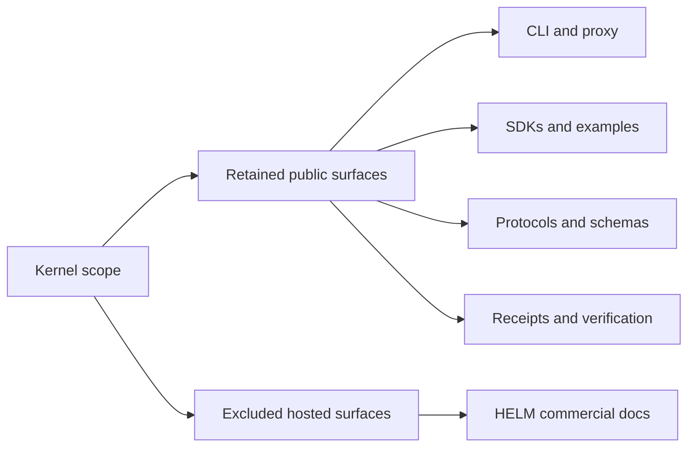

# HELM AI Kernel Scope

## Audience

Maintainers, adopters, and downstream packagers deciding what is in HELM AI Kernel and what is outside this repository.

## Outcome

After this page you should know what this surface is for, which source files own the behavior, which public route or adjacent page to use next, and which validation command to run before changing the claim.

## Source Truth

- Public route: `helm-ai-kernel/helm-ai-kernel-scope`
- Source document: `helm-ai-kernel/docs/KERNEL_SCOPE.md`
- Public manifest: `helm-ai-kernel/docs/public-docs.manifest.json`
- Source inventory: `helm-ai-kernel/docs/source-inventory.manifest.json`
- Validation: `make docs-coverage`, `make docs-truth`, and `npm run coverage:inventory` from `docs-platform`

Do not expand this page with unsupported product, SDK, deployment, compliance, or integration claims unless the inventory manifest points to code, schemas, tests, examples, or an owner doc that proves the claim.

## Troubleshooting

| Symptom | First check |
| --- | --- |
| The public page and source behavior disagree | Treat the source path in `Source Truth` as canonical, then update the docs and source-inventory row in the same change. |
| A link or route is missing from the docs website | Check `docs/public-docs.manifest.json`, `llms.txt`, search, and the per-page Markdown export before changing navigation. |
| A claim is not backed by code or tests | Remove the claim or add the missing code, example, schema, or validation command before publishing. |

> **Canonical architecture**: see [ARCHITECTURE.md](ARCHITECTURE.md) for the
> normative trust boundary model and TCB definition. For the canonical
> 8-package TCB inventory, see [ARCHITECTURE.md](ARCHITECTURE.md).

HELM AI Kernel is the **open execution kernel and self-hostable Console** of the HELM stack.

It exists to keep the deterministic boundary small, portable, and independently trustworthy. Downstream HELM layers must extend this kernel through public contracts, not replace it.

## Kernel TCB (Trusted Computing Base)

The canonical TCB is bounded to **8 packages** — the minimal trusted core.
See [ARCHITECTURE.md](ARCHITECTURE.md) for the authoritative package list,
expansion criteria, and CI enforcement details.

## Active OSS Packages

The following packages are part of the OSS kernel, including both TCB and
non-TCB supporting infrastructure:

### TCB Packages

| Package            | Purpose                                                       | Status    |
| ------------------ | ------------------------------------------------------------- | --------- |
| `contracts/`       | Canonical data structures (Decision, Effect, Receipt, Intent) | ✅ Active |
| `crypto/`          | Ed25519 signing, JCS canonicalization                         | ✅ Active |
| `guardian/`        | Policy Enforcement Point (PEP), PRG enforcement               | ✅ Active |
| `executor/`        | SafeExecutor with receipt generation                          | ✅ Active |
| `proofgraph/`      | Cryptographic ProofGraph DAG                                  | ✅ Active |
| `trust/registry/`  | Event-sourced trust registry                                  | ✅ Active |
| `runtime/sandbox/` | WASI sandbox (wazero, deny-by-default)                        | ✅ Active |
| `receipts/`        | Receipt policy enforcement (fail-closed)                      | ✅ Active |

### Supporting Infrastructure (Non-TCB)

| Package                | Purpose                                    | Status    |
| ---------------------- | ------------------------------------------ | --------- |
| `canonicalize/`        | RFC 8785 JCS implementation                | ✅ Active |
| `manifest/`            | Tool args/output validation (PEP boundary) | ✅ Active |
| `agent/adapter.go`     | KernelBridge choke point                   | ✅ Active |
| `runtime/budget/`      | Compute budget enforcement                 | ✅ Active |
| `escalation/ceremony/` | RFC-005 Approval Ceremony                  | ✅ Active |
| `genesis/ceremony/`    | VGL six-phase Genesis ceremony state machine | ✅ Active |
| `evidence/`            | Evidence pack export/verify                | ✅ Active |
| `replay/`              | Replay engine for verification             | ✅ Active |
| `mcp/`                 | Tool catalog + MCP gateway                 | ✅ Active |
| `kernel/`              | Rate limiting, backpressure                | ✅ Active |
| `a2a/`                 | Agent-to-Agent trust protocol              | ✅ Active |
| `otel/`                | OpenTelemetry governance telemetry         | ✅ Active |
| `identity/did/`        | W3C DID-based agent identity               | ✅ Active |
| `policy/reconcile/`    | Runtime policy source reconciliation and snapshot swap | ✅ Active |

### Frontier / Spec-Only Surfaces

The following names appear in strategy, standard, or roadmap material but are not active source paths in this OSS repository as of the v1.3 convergence pass. They MUST NOT be documented as shipped packages until source, tests, and conformance vectors exist under the matching path:

- `crypto/hybrid/`
- `crypto/zkproof/`
- `memory/`
- `threatscan/ensemble/`
- `evidencepack/summary/`
- `skillfortify/`
- `provenance/`
- `budget/cost/`
- `delegation/aip/`
- `replay/comparison/`
- `a2a/federation/`
- `mcptox/`
- `effects/reversibility/`
- `observability/slo_engine/`
- `otel/cloudevents/`
- `connectors/ddipe/`

### Deployment Infrastructure

| Package                         | Purpose                                  | Status    |
| ------------------------------- | ---------------------------------------- | --------- |
| `deploy/helm-chart/`            | Kubernetes Helm chart, optional HelmPolicyBundle CRD template | ✅ Active |
| `protocols/spec/`               | RFC-style protocol specification         | ✅ Active |
| `protocols/conformance/v1/owasp/` | Machine-readable OWASP threat vectors  | ✅ Active |

### Product Surfaces

The OSS boundary ships exactly one browser UI: `apps/console`, the HELM AI Kernel Console. It is a self-hostable operator surface over the local kernel and uses `@mindburn/ui-core` for all product UI primitives and styling. The repository does not ship a second browser UI, a static report viewer, a Node CLI wrapper, a Next starter, or generated HTML report surface.

`@mindburn/ui-core` remains a reusable React/token package. The Console consumes it through public package entrypoints so package integrity, app fidelity, and OSS boundary truth are tested together.

## Removed from TCB (Enterprise)

The following packages were removed to minimize the attack surface:

| Package                    | Reason                        |
| -------------------------- | ----------------------------- |
| `access/`                  | Enterprise access control     |
| `ingestion/`               | Brain subsystem data pipeline |
| `verification/refinement/` | Enterprise verification       |
| `cockpit/`                 | Product console               |
| `ops/`                     | Operations tooling            |
| `multiregion/`             | Multi-region orchestration    |
| `hierarchy/`               | Enterprise hierarchy          |
| `heuristic/`               | Heuristic analysis            |
| `perimeter/`               | Network perimeter             |

## First-Class Execution Surfaces

### MCP Interceptor

The MCP gateway (`core/pkg/mcp/`) is a **first-class governed surface**,
not an adapter. It provides:

- Tool discovery with governance metadata (`/mcp/v1/capabilities`)
- Governed tool execution with signed receipts (`/mcp/v1/execute`)
- Schema validation against pinned tool contracts
- Full ProofGraph integration — MCP calls produce the same receipt chain
  as OpenAI proxy calls

### OpenAI-Compatible Proxy

The governed proxy (`/v1/chat/completions`) intercepts OpenAI-compatible
tool calls and routes them through the PEP boundary.

### Bounded-Surface Primitives

The OSS kernel includes configurable surface containment primitives
(see [EXECUTION_SECURITY_MODEL.md](EXECUTION_SECURITY_MODEL.md)):

- Domain-scoped tool bundles
- Explicit capability manifests
- Read-only / write-limited / side-effect-class profiles
- Connector allowlists
- Destination scoping
- Filesystem/network deny-by-default (WASI)
- Sandbox profile requirement per tool class

## Boundary Truth

OSS includes:

- **Surface containment** — capability manifests, tool bundles, sandbox profiles
- **Dispatch enforcement** — fail-closed PEP, policy evaluation, budget gates
- **Verifiable receipts** — signed receipts, ProofGraph, replay
- **MCP interceptor** — first-class governed MCP surface
- **OpenAI proxy** — governed proxy for OpenAI-compatible SDKs
- **HELM AI Kernel Console** — one self-hostable browser UI for command, receipts, policy, MCP, evidence, replay, ProofGraph, conformance, trust, incidents, audit, developer, and settings workflows
- Adapters and integration surfaces

OSS does not include:

- Hosted Mindburn operations
- Enterprise identity and admin beyond the OSS runtime contract
- Legal hold, long-term hosted retention, or regulator-facing workflows
- Organization-scale rollout, staging, or shadow enforcement on live production traffic
- Managed federation or hosted trust registries
- Private entitlement, seat management, usage metering, or account-management systems
- Non-OSS connector certification programs

The invariant is simple: OSS must stay fully useful on its own as a developer-first execution kernel and self-hostable Console: Go CLI, HTTP/API contracts, SDKs, evidence export, offline verification, replay, conformance, Console assets, and release artifacts. Hosted or organization-specific operations live outside this repository and integrate through those public contracts.

## Diagram

