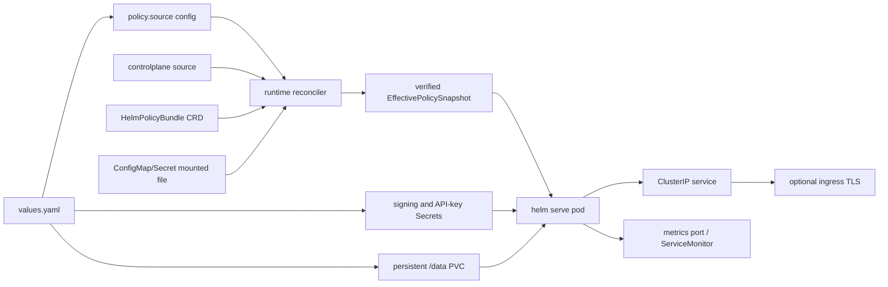

# Kubernetes Deployment

This page is for operators deploying the HELM OSS runtime with the repository-owned Kubernetes Helm chart. The outcome is a chart render, a production-safe value set, and a smoke path for health, receipts, and evidence persistence.

## Audience

Use this page if you operate Kubernetes and need to run HELM OSS as a self-hosted execution boundary with durable receipts, signing keys, and optional ingress.

## Outcome

After this page you should be able to lint the chart, render manifests, provide production signing and API-key material, install the chart, and smoke health plus receipt persistence.

## Source Truth

The chart source is [`deploy/helm-chart`](../deploy/helm-chart). Runtime container wiring is in [`deploy/helm-chart/templates/deployment.yaml`](../deploy/helm-chart/templates/deployment.yaml), values are in [`deploy/helm-chart/values.yaml`](../deploy/helm-chart/values.yaml), and chart-level production notes live in [`deploy/helm-chart/README.md`](../deploy/helm-chart/README.md).

## Deployment Topology



## Validate The Chart

```bash
make helm-chart-smoke
helm lint deploy/helm-chart
helm template helm-oss deploy/helm-chart
```

Expected output: lint succeeds, `helm template` emits Deployment, Service, ConfigMap, Secret, PVC, and optional ServiceMonitor manifests, and `make helm-chart-smoke` completes without rendering a production chart that lacks signing or API key material.

## Policy Authority Boundary

The chart does not make Kubernetes objects the HELM execution authority. It
deploys the runtime and configures a `policy.source` backend. The runtime
reconciler owns policy truth: it reads the active head, loads the canonical
bundle, verifies the expected hash and signature/provenance, compiles a
snapshot, validates it, then atomically swaps the per-scope
`EffectivePolicySnapshot`.

`POST /internal/policy/reconcile` is a wake-up hint protected by service auth.
It does not accept policy bytes and does not directly install policy. Lost
hints are recovered by `helm.policy.source.pollInterval`.

## Production Install Skeleton

```bash
helm install helm-oss deploy/helm-chart \
  --set helm.production=true \
  --set helm.signing.key=<64-char-ed25519-seed-hex> \
  --set helm.auth.adminAPIKey=<admin-api-key> \
  --set helm.auth.serviceAPIKey=<service-api-key> \
  --set persistence.enabled=true
```

For production, prefer existing Kubernetes Secrets over inline values:

```bash
kubectl create secret generic helm-signing \
  --from-literal=signing-key=<64-char-ed25519-seed-hex>

kubectl create secret generic helm-auth \
  --from-literal=HELM_ADMIN_API_KEY=<admin-api-key> \
  --from-literal=HELM_SERVICE_API_KEY=<service-api-key>

kubectl create secret generic helm-policy-trust \
  --from-literal=HELM_POLICY_TRUST_PUBLIC_KEY=<64-char-ed25519-public-key-hex>

helm upgrade --install helm-oss deploy/helm-chart \
  --set helm.production=true \
  --set helm.policy.source.kind=controlplane \
  --set helm.policy.source.controlplane.url=https://helm-controlplane.example.internal \
  --set helm.policy.signature.required=true \
  --set helm.policy.signature.existingSecret=helm-policy-trust \
  --set helm.signing.existingSecret=helm-signing \
  --set helm.auth.existingSecret=helm-auth
```

## Values That Control Runtime Behavior

| Value | Default | Source-backed behavior |
| --- | --- | --- |
| `image.repository` | `ghcr.io/mindburn-labs/helm-oss` | Container image used by the Deployment. |
| `image.tag` | chart `appVersion` | Defaults to `0.5.0` from `Chart.yaml`. |
| `helm.bindAddr` | `0.0.0.0` | Required because the pod must bind beyond loopback. |
| `service.port` | `8080` | Runtime HTTP port passed to `helm serve --port`. |
| `service.healthPort` | `8081` | Health probe port via `HELM_HEALTH_PORT`. |
| `service.metricsPort` | `9090` | Metrics container port when metrics are enabled. |
| `helm.production` | `false` | Production rendering refuses missing signing/auth material. |
| `helm.dataDir` | `/data` | Mounted from the chart PVC or `emptyDir`. |
| `helm.proxy.enabled` | `true` | Sets `HELM_ENABLE_OPENAI_PROXY=1` and `HELM_UPSTREAM_URL`. |
| `helm.policy.source.kind` | `mountedFile` | `controlplane`, `crd`, or `mountedFile`; production should use `controlplane`, or `crd` in builds that include a CRD source client. |
| `helm.policy.source.pollInterval` | `10s` | Runtime polling interval; correctness does not depend on delivery hints. |
| `helm.policy.signature.required` | `false` | When true, unsigned policy heads are rejected before compilation. Production control-plane renders require this. |
| `helm.policy.signature.publicKey` | empty | 64-char hex Ed25519 public key for canonical policy bundle verification. |
| `helm.policy.signature.existingSecret` | empty | Existing secret containing `HELM_POLICY_TRUST_PUBLIC_KEY`. |
| `helm.policy.reloadHints.httpWakeEndpoint` | `/internal/policy/reconcile` | Service-auth wake-only route for reconciler hints. |
| `helm.policy.reloadHints.configReloaderSidecar.enabled` | `false` | Optional mounted-file hint sidecar, disabled by default. |
| `helm.storage.type` | `sqlite` | Uses local SQLite unless Postgres is configured. |
| `persistence.enabled` | `true` | Creates or reuses a PVC for receipts, state, and artifacts. |
| `ingress.enabled` | `false` | Optional ingress; provide TLS and ingress class explicitly. |

## Smoke Checks

```bash
kubectl rollout status deploy/helm-oss-helm-firewall
kubectl port-forward svc/helm-oss-helm-firewall 8080:8080
curl -fsS http://127.0.0.1:8080/health
```

Then run a governed request through the public API or OpenAI-compatible proxy and verify that receipts persist after pod restart when `persistence.enabled=true`.

## Troubleshooting

| Symptom | Likely cause | Fix |
| --- | --- | --- |
| pod starts but readiness fails | health port or initial snapshot failure | inspect `HELM_HEALTH_PORT`, policy source env, mounted-file bytes, and pod logs |
| `/internal/policy/reconcile` returns unauthorized | missing service API key | set `helm.auth.serviceAPIKey` or `helm.auth.existingSecret` |
| policy ConfigMap changed but decisions did not | ConfigMap delivery is only a source backend | verify the bundle hash/signature and reconciler status; enable sidecar only as a wake hint |
| policy reconcile fails with signature error | missing trust public key, missing signature, or invalid bundle signature | set `helm.policy.signature.existingSecret` or `publicKey`, and verify the active source signs canonical bundle bytes |
| production render fails | missing signing key or API key material | set `helm.signing.existingSecret` and `helm.auth.existingSecret`, or provide explicit values |
| receipts disappear after restart | persistence disabled or PVC not bound | set `persistence.enabled=true` and verify PVC status |
| ingress works but upstream calls bypass HELM | client points at upstream provider | point clients at the service or ingress URL for HELM, not the provider URL |

## Not Covered

This page documents the repository-owned OSS chart only. Managed enterprise deployment, tenant migrations, SSO, SIEM, and retention controls belong to the HELM Enterprise docs.
