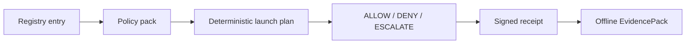

# HELM Launchpad

Status: OpenClaw, Hermes, OpenCode, and Kilo Code are `oss_supported` for
`local-container` after signed artifact, SBOM, vulnerability scan, live
conformance, teardown, receipt, and offline EvidencePack verification in
workflow `26179980172`. Codex, Claude Code, Cursor, and Junie remain external
BYO adapters.

LaunchKit is the product entrypoint for one-command app bootstrap. It uses the
existing Launchpad registry/runtime/receipt implementation as the compatibility
foundation, then exposes the Tier-1 operator command:

```bash
helm up openclaw
helm up hermes --target cloud:aws --verify-only
```

Launchpad remains the OSS local-container implementation layer. LaunchKit starts
verified AI apps through a fail-closed execution firewall, preserves the MCP
interceptor posture, records signed receipts, emits EvidencePacks that verify
offline, and opens the Console at the receipt-backed run URL.

## Audience

Operators and maintainers validating the release-backed Launchpad path in HELM
AI Kernel.

## Outcome

You can identify the supported app matrix, the exact verifier commands, the
GHCR digests promoted by CI, and the clean-install gate that must pass before
public GA claims are broadened.

## Source Truth

- CLI entrypoint: `core/cmd/helm-ai-kernel/launch_cmd.go`
- Runtime package: `core/pkg/launchpad/`
- App and substrate registry: `registry/launchpad/`
- Policy packs: `policies/launchpad/`
- Contract schemas: `schemas/launchpad/`
- Release report: `docs/launchpad/final_report.json`
- Clean-install GA gate: `docs/launchpad/CLEAN_INSTALL_GA.md`
- v1.0 redacted evidence report: `docs/launchpad/v1_report.json`

## Current CLI

```bash
helm up openclaw
helm up hermes --target local
helm up openclaw --demo
helm up hermes --verify-only
helm up hermes --target cloud:aws --yes
helm up openclaw --resume <run_id>
helm-ai-kernel launch matrix --json
helm-ai-kernel launch apps --json
helm-ai-kernel launch substrates --json
helm-ai-kernel launch secrets set model_gateway --provider openrouter --value-env OPENROUTER_API_KEY
helm-ai-kernel launch secrets status
helm-ai-kernel launch plan openclaw local-container --json
helm-ai-kernel launch openclaw local-container --headless --output json
helm-ai-kernel launch hermes local-container --headless --output json
helm-ai-kernel launch opencode local-container --headless --output json
helm-ai-kernel launch kilocode local-container --headless --output json
helm-ai-kernel launch openclaw digitalocean --live-cloud-beta --approval <approval_id> --cost-ceiling-usd <n> --headless --output json
helm-ai-kernel launch hermes hetzner --live-cloud-beta --approval <approval_id> --cost-ceiling-usd <n> --headless --output json
helm-ai-kernel launch status <launch_id> --json
helm-ai-kernel launch logs <launch_id>
helm-ai-kernel launch repair <launch_id>
helm-ai-kernel launch delete <launch_id> --cascade
helm-ai-kernel launch evidence <launch_id> --export --json
helm-ai-kernel launch evidence <launch_id> --output <dir>
helm-ai-kernel evidence inspect <pack>
helm-ai-kernel evidence diff <pack-a> <pack-b>
helm-ai-kernel verify --bundle <pack>
```

`helm-ai-kernel` remains the backwards-compatible binary and command namespace.
Release builds also ship `helm` as the primary product command.

## App Classification

| App | Availability | Evidence |
| --- | --- | --- |
| OpenClaw | `oss_supported` | `ghcr.io/mindburn-labs/helm-launchpad/openclaw@sha256:789c7eb17ad74e0c40da4372a8397cc46c64cdb4b50901ed6ad4f7d18dad5501`; workflow `26179980172`; live conformance, teardown, receipts, and offline EvidencePack verification passed |
| Hermes | `oss_supported` | `ghcr.io/mindburn-labs/helm-launchpad/hermes@sha256:11bb3893d8466b9abe2cea7f65c734647d86177908b38ea55edceb056944ee7f`; workflow `26179980172`; live conformance, teardown, receipts, and offline EvidencePack verification passed |
| OpenCode | `oss_supported` | `ghcr.io/mindburn-labs/helm-launchpad/opencode@sha256:c31aaef9b739f9ed870edd5c66f34f9a79efcfab132aaa2395f890f7bf5fb20f`; workflow `26179980172`; live conformance, teardown, receipts, and offline EvidencePack verification passed |
| Kilo Code | `oss_supported` | `ghcr.io/mindburn-labs/helm-launchpad/kilocode@sha256:68a428e13c1b8cc1cb0338eb56c0e79610a609adc91a60b99b8f9a226c1621ba`; workflow `26179980172`; live conformance, teardown, receipts, and offline EvidencePack verification passed |
| Codex / Claude Code / Cursor / Junie | `external_proprietary_adapter` | BYO/external adapters only; HELM governs execution and does not redistribute them |

## Safety Model

- Runtime verdicts are only `ALLOW`, `DENY`, or `ESCALATE`.
- `oss_supported` requires license, immutable signed OCI artifact, policy pack,
  sandbox, healthcheck, e2e, signed MCP manifest refs, teardown, signed
  receipts, a hash-chained EvidencePack graph, and offline-verifiable proof.
- Local default substrate is `local-container`.
- Registry substrate metadata now declares isolation strength, network
  enforcement, secret mode, receipt support, teardown proof, and lifecycle
  support. Substrates without receipts or teardown proof cannot graduate beyond
  experimental.
- OpenRouter egress uses launch-scoped proxy receipts; non-OpenRouter allowlists
  are rejected.
- Current local-container model access uses a logical `model_gateway` secret
  binding that projects the provider env var only inside the launch process.
  Proxy-only secretless model access remains the stricter target and is not yet
  a public GA claim.
- Supported apps route MCP through HELM-owned signed manifest refs. Unknown
  servers/tools quarantine, schema pins are required, and side-effect tools
  require approval receipts.
- DigitalOcean and Hetzner cloud substrates remain opt-in beta and dry-run by
  default. CLI live paths require `--live-cloud-beta`, an approval receipt, a
  cost ceiling, provider readiness, and idempotency reconciliation before any
  public claim can move beyond beta.
- Host `curl | bash`, mutable live git update, and package-manager mutation
  inside the current worktree are denied by installer tests.



## Evidence Inspection

Every generated Launchpad EvidencePack includes `04_EXPORTS/launchpad_evidence_graph.json`.
The graph hash-chains receipts for plan/verdict, sandbox preflight, MCP
quarantine, model gateway grant, install, start, healthcheck, teardown, and
failure paths when present.

```bash
helm-ai-kernel evidence inspect <pack>
helm-ai-kernel evidence inspect <pack> --json
helm-ai-kernel evidence diff <pack-a> <pack-b>
helm-ai-kernel verify --bundle <pack>
```

## Clean Install Gate

Clean-install validation is intentionally separate from the build machine:

```bash
brew update
brew install mindburnlabs/tap/helm-ai-kernel
helm-ai-kernel launch matrix --json
helm-ai-kernel launch openclaw local-container --headless --output json
helm-ai-kernel launch hermes local-container --headless --output json
helm-ai-kernel launch opencode local-container --headless --output json
helm-ai-kernel launch kilocode local-container --headless --output json
helm-ai-kernel launch delete <launch_id> --cascade
helm-ai-kernel verify --bundle <pack>
```

The reusable gate is `scripts/launch/clean_install_gate.sh`. It writes only
redacted JSON evidence to `docs/launchpad/clean_install_report.json`; raw logs,
provider keys, key fragments, and host identifiers are not committed.

`--include-candidates` remains accepted for backward compatibility, but
OpenCode and Kilo Code are part of the supported clean-install app set after
workflow `26179980172`.

For current source-backed details, use the Launchpad specs and conformance docs:
`docs/launchpad/APP_SPEC.md`, `docs/launchpad/SUBSTRATE_SPEC.md`,
`docs/launchpad/POLICY_PACKS.md`, `docs/launchpad/SECURITY_REVIEW.md`,
`docs/launchpad/CONFORMANCE.md`, and `docs/launchpad/CLEAN_INSTALL_GA.md`.

## Troubleshooting

| Symptom | First check |
| --- | --- |
| Published output is stale or incomplete | Run `npm run helm-public:accuracy` in `docs-platform`, then check the source path and public manifest row for this page. |
| A launch reaches `REPAIR_REQUIRED` | Check `helm-ai-kernel launch logs <launch_id>` and `helm-ai-kernel launch evidence <launch_id> --export --json`; logs redact scoped provider keys. |
| A claim needs implementation backing | Check the Source Truth files above and update the implementation, manifest, source inventory, or page in the same change. |
