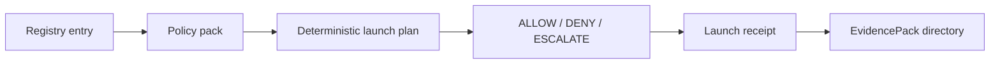

# HELM Launchpad

Status: partial implementation, fail-closed by default.

Launchpad is the OSS app launcher surface for HELM AI Kernel. The current implementation provides registry loading, policy validation, deterministic plan compilation, guarded CLI flows, session records, receipts, and EvidencePack directory generation for escalated plans. It does not yet perform live Docker, cloud, or app install side effects.

## Source Truth

- CLI entrypoint: `core/cmd/helm-ai-kernel/launch_cmd.go`
- Runtime package: `core/pkg/launchpad/`
- App and substrate registry: `registry/launchpad/`
- Policy packs: `policies/launchpad/`
- Contract schemas: `schemas/launchpad/`
- Conformance status: `docs/launchpad/CONFORMANCE.md`

## Current CLI

```sh
helm-ai-kernel launch matrix --json
helm-ai-kernel launch apps --json
helm-ai-kernel launch substrates --json
helm-ai-kernel launch plan openclaw local-container --json
helm-ai-kernel launch openclaw local-container --headless --output json
helm-ai-kernel launch status <launch_id> --json
helm-ai-kernel launch logs <launch_id>
helm-ai-kernel launch repair <launch_id>
helm-ai-kernel launch delete <launch_id> --cascade
```

## Safety Model

- Runtime verdicts are only `ALLOW`, `DENY`, or `ESCALATE`.
- `oss_supported` is blocked unless license, artifact, policy, sandbox, healthcheck, e2e, teardown, receipts, and EvidencePack conformance pass.
- External proprietary tools are BYO adapters only.
- Local default substrate is `local-container`.
- Cloud substrates are dry-run/stub until operator approval and idempotency reconciliation exist.
- No host `curl | bash`, mutable live git update, or package-manager mutation inside the current worktree is allowed.



## Current App Classification

- `openclaw`, `hermes`, `opencode`, `kilocode`: `oss_candidate`.
- `codex`, `claude-code.external`, `cursor.external`, `junie.external`: `external_proprietary_adapter`.

See `docs/launchpad/FINAL_IMPLEMENTATION_REPORT.md` for the exact implementation status.
