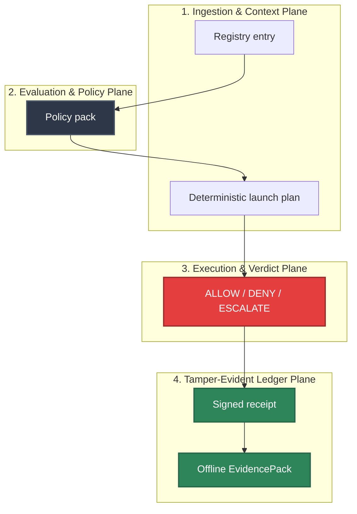

# HELM Launchpad

Run real AI apps through HELM's execution boundary. Register at
<https://console.helm.mindburn.org>, install the CLI, and pair your workstation
before launching. Receipts and evidence appear in the Console dashboard.

Supported local-container apps:

| App | Command | Proof |
| --- | --- | --- |
| OpenClaw | `helm up openclaw` | receipts + EvidencePack |
| Hermes | `helm up hermes --target local` | receipts + EvidencePack |
| OpenCode | `helm-ai-kernel launch opencode local-container --headless --output json` | receipts + EvidencePack |
| Kilo Code | `helm-ai-kernel launch kilocode local-container --headless --output json` | receipts + EvidencePack |

## What happens during launch

1. Resolve app registry entry.
2. Validate policy pack.
3. Verify signed artifact digest.
4. Prepare sandbox and scoped filesystem.
5. Apply network deny-by-default policy.
6. Set model gateway secret only inside launch scope.
7. Run healthcheck.
8. Emit launch/install/healthcheck receipts.
9. Export EvidencePack.
10. Teardown and emit teardown receipt.
11. Verify offline.

## Source Truth

- CLI entrypoint: `core/cmd/helm-ai-kernel/launch_cmd.go`
- Runtime package: `core/pkg/launchpad/`
- App and substrate registry: `registry/launchpad/`
- Policy packs: `policies/launchpad/`
- Contract schemas: `schemas/launchpad/`
- Universal importer: `core/pkg/launchpad/importer`
- Universal importer docs: `docs/launchpad/UNIVERSAL_IMPORTER.md`
- UX architecture: `docs/launchpad/UX_ARCHITECTURE.md`
- Hosted account/entitlement target contract:
  `docs/launchpad/MINDBURN_ACCOUNT_ENTITLEMENTS_SPEC.md`
- Release report: `docs/launchpad/final_report.json`
- Clean-install GA gate: `docs/launchpad/CLEAN_INSTALL_GA.md`
- v1.0 redacted evidence report: `docs/launchpad/v1_report.json`

## Current CLI

```bash
helm up openclaw
helm up hermes --target local
helm up openclaw --demo
helm up hermes --verify-only
helm up hermes --target cloud:aws --yes
helm up openclaw --resume <run_id>
helm-ai-kernel launch matrix --json
helm-ai-kernel launch apps --json
helm-ai-kernel launch substrates --json
helm-ai-kernel launch secrets set model_gateway --provider openrouter --value-env OPENROUTER_API_KEY
helm-ai-kernel launch secrets status
helm-ai-kernel launch plan openclaw local-container --json
helm-ai-kernel launch openclaw local-container --headless --output json
helm-ai-kernel launch hermes local-container --headless --output json
helm-ai-kernel launch opencode local-container --headless --output json
helm-ai-kernel launch kilocode local-container --headless --output json
helm-ai-kernel launch openclaw digitalocean --live-cloud-beta --approval <approval_id> --cost-ceiling-usd <n> --headless --output json
helm-ai-kernel launch hermes hetzner --live-cloud-beta --approval <approval_id> --cost-ceiling-usd <n> --headless --output json
helm-ai-kernel launch status <launch_id> --json
helm-ai-kernel launch logs <launch_id>
helm-ai-kernel launch repair <launch_id>
helm-ai-kernel launch delete <launch_id> --cascade
helm-ai-kernel launch evidence <launch_id> --export --json
helm-ai-kernel launch evidence <launch_id> --output <dir>
helm-ai-kernel evidence inspect <pack>
helm-ai-kernel evidence diff <pack-a> <pack-b>
helm-ai-kernel verify --bundle <pack>
```

`helm-ai-kernel` remains the backwards-compatible binary and command namespace.
Release builds also ship `helm` as the primary product command.

## Account and Entitlement Boundary

The Kernel repo exposes headless Launchpad APIs. Free, Individual, and
Enterprise hosted account entitlements are target architecture, not production
Kernel behavior in this repo. External clients must not infer account tier or
invent entitlement state; they may only render explicit backend fields or
clearly labeled test fixtures. The hosted integration contract lives in
`docs/launchpad/MINDBURN_ACCOUNT_ENTITLEMENTS_SPEC.md`.

## Universal Importer

Launchpad now has an additive repo-to-runtime importer for GitHub URLs and
local paths. It generates SourceSnapshot, CapabilityGraph, LaunchRecipe,
TargetPlan, untrusted AppSpec candidates, preflight checks, and import evidence
ledger records.

```text
POST /api/v1/launchpad/imports
GET  /api/v1/launchpad/imports
GET  /api/v1/launchpad/imports/{id}
POST /api/v1/launchpad/imports/{id}/preflight
POST /api/v1/launchpad/imports/{id}/promote
POST /api/v1/launchpad/imports/{id}/launch
POST /api/v1/launchpad/imports/{id}/teardown
```

Current boundary: the importer inspects and plans; it does not execute unknown
repository code. Generated AppSpecs remain `oss_candidate`,
`generated_untrusted`, and `trusted=false` until sandbox build, SBOM,
vulnerability scan, license review, smoke test, teardown, and evidence refs are
complete. `launch` blocks before LaunchKit execution for unpromoted imports.

See `docs/launchpad/UNIVERSAL_IMPORTER.md` for adapter and promotion details.

## App Classification

| App | Availability | Evidence |
| --- | --- | --- |
| OpenClaw | `oss_supported` | `ghcr.io/mindburn-labs/helm-launchpad/openclaw@sha256:4da80a1e48b5603fd203b7d2b98539a01f796142b0ed9315e5ed86b25bf5d995`; workflow `26198407296`; live conformance, teardown, receipts, and offline EvidencePack verification passed |
| Hermes | `oss_supported` | `ghcr.io/mindburn-labs/helm-launchpad/hermes@sha256:4ec024dd8d0191fc887f04dc92c959fc865808d1526f782b5093f395fdd41652`; workflow `26198407296`; live conformance, teardown, receipts, and offline EvidencePack verification passed |
| OpenCode | `oss_supported` | `ghcr.io/mindburn-labs/helm-launchpad/opencode@sha256:cdbeb88cfbd698809e673339d525083cdf1cdb3e91529e01c6834cd90b778550`; workflow `26198407296`; live conformance, teardown, receipts, and offline EvidencePack verification passed |
| Kilo Code | `oss_supported` | `ghcr.io/mindburn-labs/helm-launchpad/kilocode@sha256:7b03834725235714ea8e698d38d89ce9b8bd81230b7e784016cb20a2c3c93ca6`; workflow `26198407296`; live conformance, teardown, receipts, and offline EvidencePack verification passed |
| Codex / Claude Code / Cursor / Junie | `external_proprietary_adapter` | BYO/external adapters only; HELM governs execution and does not redistribute them |

## Safety Model

- Runtime verdicts are only `ALLOW`, `DENY`, or `ESCALATE`.
- `oss_supported` requires license, immutable signed OCI artifact, policy pack,
  sandbox, healthcheck, e2e, signed MCP manifest refs, teardown, signed
  receipts, a hash-chained EvidencePack graph, and offline-verifiable proof.
- Local default substrate is `local-container`.
- Registry substrate metadata now declares isolation strength, network
  enforcement, secret mode, receipt support, teardown proof, and lifecycle
  support. Substrates without receipts or teardown proof cannot graduate beyond
  experimental.
- OpenRouter egress uses launch-scoped proxy receipts; non-OpenRouter allowlists
  are rejected.
- Current local-container model access uses a logical `model_gateway` secret
  binding that projects the provider env var only inside the launch process.
  Proxy-only secretless model access remains the stricter target and is not yet
  a public GA claim.
- Supported apps route MCP through HELM-owned signed manifest refs. Unknown
  servers/tools quarantine, schema pins are required, and side-effect tools
  require approval receipts.
- DigitalOcean and Hetzner cloud substrates remain opt-in beta and dry-run by
  default. CLI live paths require `--live-cloud-beta`, an approval receipt, a
  cost ceiling, provider readiness, and idempotency reconciliation before any
  public claim can move beyond beta.
- Host `curl | bash`, mutable live git update, and package-manager mutation
  inside the current worktree are denied by installer tests.




## Evidence Inspection

Every generated Launchpad EvidencePack includes `04_EXPORTS/launchpad_evidence_graph.json`.
The graph hash-chains receipts for plan/verdict, sandbox preflight, MCP
quarantine, model gateway grant, install, start, healthcheck, teardown, and
failure paths when present.

```bash
helm-ai-kernel evidence inspect <pack>
helm-ai-kernel evidence inspect <pack> --json
helm-ai-kernel evidence diff <pack-a> <pack-b>
helm-ai-kernel verify --bundle <pack>
```

## Clean Install Gate

Clean-install validation is intentionally separate from the build machine:

```bash
brew update
brew install mindburnlabs/tap/helm-ai-kernel
helm-ai-kernel launch matrix --json
helm-ai-kernel launch openclaw local-container --headless --output json
helm-ai-kernel launch hermes local-container --headless --output json
helm-ai-kernel launch opencode local-container --headless --output json
helm-ai-kernel launch kilocode local-container --headless --output json
helm-ai-kernel launch delete <launch_id> --cascade
helm-ai-kernel verify --bundle <pack>
```

The reusable gate is `scripts/launch/clean_install_gate.sh`. It writes only
redacted JSON evidence to `docs/launchpad/clean_install_report.json`; raw logs,
provider keys, key fragments, and host identifiers are not committed.

`--include-candidates` remains accepted for backward compatibility, but
OpenCode and Kilo Code are part of the supported clean-install app set after
workflow `26198407296`.

For current source-backed details, use the Launchpad specs and conformance docs:
`docs/launchpad/APP_SPEC.md`, `docs/launchpad/SUBSTRATE_SPEC.md`,
`docs/launchpad/POLICY_PACKS.md`, `docs/launchpad/SECURITY_REVIEW.md`,
`docs/launchpad/CONFORMANCE.md`, and `docs/launchpad/CLEAN_INSTALL_GA.md`.

## Troubleshooting

| Symptom | First check |
| --- | --- |
| Published output is stale or incomplete | Run `npm run helm-public:accuracy` in `docs-platform`, then check the source path and public manifest row for this page. |
| A launch reaches `REPAIR_REQUIRED` | Check `helm-ai-kernel launch logs <launch_id>` and `helm-ai-kernel launch evidence <launch_id> --export --json`; logs redact scoped provider keys. |
| A claim needs implementation backing | Check the Source Truth files above and update the implementation, manifest, source inventory, or page in the same change. |
