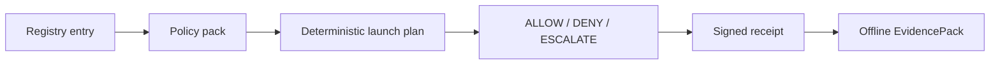

# HELM Launchpad

Status: OpenClaw and Hermes local-container support is release-backed in
`v0.5.4`; v1.0 hardening adds logical secret binding, four-app promotion
workflow coverage, and opt-in cloud beta gates. OpenCode and Kilo Code still
remain candidates until their signed evidence exists.

LaunchKit is the product entrypoint for one-command app bootstrap. It uses the
existing Launchpad registry/runtime/receipt implementation as the compatibility
foundation, then exposes the Tier-1 operator command:

```bash
helm up openclaw
helm up hermes --target cloud:aws --verify-only
```

Launchpad remains the OSS local-container implementation layer. LaunchKit starts
verified AI apps through a fail-closed execution firewall, preserves the MCP
interceptor posture, records signed receipts, emits EvidencePacks that verify
offline, and opens the Console at the receipt-backed run URL.

## Audience

Operators and maintainers validating the release-backed Launchpad path in HELM
AI Kernel.

## Outcome

You can identify the supported app matrix, the exact verifier commands, the
GHCR digests promoted by CI, and the clean-install gate that must pass before
public GA claims are broadened.

## Source Truth

- CLI entrypoint: `core/cmd/helm-ai-kernel/launch_cmd.go`
- Runtime package: `core/pkg/launchpad/`
- App and substrate registry: `registry/launchpad/`
- Policy packs: `policies/launchpad/`
- Contract schemas: `schemas/launchpad/`
- Release report: `docs/launchpad/final_report.json`
- Clean-install GA gate: `docs/launchpad/CLEAN_INSTALL_GA.md`
- v1.0 redacted evidence report: `docs/launchpad/v1_report.json`

## Current CLI

```bash
helm up openclaw
helm up hermes --target local
helm up openclaw --demo
helm up hermes --verify-only
helm up hermes --target cloud:aws --yes
helm up openclaw --resume <run_id>
helm-ai-kernel launch matrix --json
helm-ai-kernel launch apps --json
helm-ai-kernel launch substrates --json
helm-ai-kernel launch secrets set model_gateway --provider openrouter --value-env OPENROUTER_API_KEY
helm-ai-kernel launch secrets status
helm-ai-kernel launch plan openclaw local-container --json
helm-ai-kernel launch openclaw local-container --headless --output json
helm-ai-kernel launch hermes local-container --headless --output json
helm-ai-kernel launch opencode local-container --headless --output json
helm-ai-kernel launch kilocode local-container --headless --output json
helm-ai-kernel launch openclaw digitalocean --live-cloud-beta --approval <approval_id> --cost-ceiling-usd <n> --headless --output json
helm-ai-kernel launch hermes hetzner --live-cloud-beta --approval <approval_id> --cost-ceiling-usd <n> --headless --output json
helm-ai-kernel launch status <launch_id> --json
helm-ai-kernel launch logs <launch_id>
helm-ai-kernel launch repair <launch_id>
helm-ai-kernel launch delete <launch_id> --cascade
helm-ai-kernel launch evidence <launch_id> --export --json
helm-ai-kernel launch evidence <launch_id> --output <dir>
helm-ai-kernel verify --bundle <pack>
```

`helm-ai-kernel` remains the backwards-compatible binary and command namespace.
Release builds also ship `helm` as the primary product command.

## App Classification

| App | Availability | Evidence |
| --- | --- | --- |
| OpenClaw | `oss_supported` | `ghcr.io/mindburn-labs/helm-launchpad/openclaw@sha256:808d750ed3ce3e29ed45d68c00c9c77ff50990204b3fe563b9f45d00f1beb88e`; workflow `26110916296`; directory and tar EvidencePack verification passed |
| Hermes | `oss_supported` | `ghcr.io/mindburn-labs/helm-launchpad/hermes@sha256:b970c2308182384377670704f6769e200eef89e18cc1a1102de9cba0d2437527`; workflow `26110916296`; directory and tar EvidencePack verification passed |
| OpenCode | `oss_candidate` | Four-app artifact workflow recipe and promotion eligibility are implemented; not `oss_supported` until signed artifact, live e2e, teardown, receipt, and offline EvidencePack evidence is produced |
| Kilo Code | `oss_candidate` | Four-app artifact workflow recipe and promotion eligibility are implemented; not `oss_supported` until signed artifact, live e2e, teardown, receipt, and offline EvidencePack evidence is produced |
| Codex / Claude Code / Cursor / Junie | `external_proprietary_adapter` | BYO/external adapters only; HELM governs execution and does not redistribute them |

## Safety Model

- Runtime verdicts are only `ALLOW`, `DENY`, or `ESCALATE`.
- `oss_supported` requires license, immutable signed OCI artifact, policy pack,
  sandbox, healthcheck, e2e, teardown, signed receipts, and offline-verifiable
  EvidencePack proof.
- Local default substrate is `local-container`.
- OpenRouter egress uses launch-scoped proxy receipts; non-OpenRouter allowlists
  are rejected.
- DigitalOcean and Hetzner cloud substrates remain opt-in beta and dry-run by
  default. CLI live paths require `--live-cloud-beta`, an approval receipt, a
  cost ceiling, provider readiness, and idempotency reconciliation before any
  public claim can move beyond beta.
- Host `curl | bash`, mutable live git update, and package-manager mutation
  inside the current worktree are denied by installer tests.



## Clean Install Gate

Clean-install validation is intentionally separate from the build machine:

```bash
brew update
brew install mindburnlabs/tap/helm-ai-kernel
helm-ai-kernel launch matrix --json
helm-ai-kernel launch openclaw local-container --headless --output json
helm-ai-kernel launch hermes local-container --headless --output json
helm-ai-kernel launch opencode local-container --headless --output json
helm-ai-kernel launch kilocode local-container --headless --output json
helm-ai-kernel launch delete <launch_id> --cascade
helm-ai-kernel verify --bundle <pack>
```

The reusable gate is `scripts/launch/clean_install_gate.sh`. It writes only
redacted JSON evidence to `docs/launchpad/clean_install_report.json`; raw logs,
provider keys, key fragments, and host identifiers are not committed.

The v1.0 clean-install gate intentionally includes OpenCode and Kilo Code. It
will fail until those apps are promoted from complete signed evidence, which
keeps public claims tied to release truth instead of roadmap intent.

For current source-backed details, use the Launchpad specs and conformance docs:
`docs/launchpad/APP_SPEC.md`, `docs/launchpad/SUBSTRATE_SPEC.md`,
`docs/launchpad/POLICY_PACKS.md`, `docs/launchpad/SECURITY_REVIEW.md`,
`docs/launchpad/CONFORMANCE.md`, and `docs/launchpad/CLEAN_INSTALL_GA.md`.

## Troubleshooting

| Symptom | First check |
| --- | --- |
| Published output is stale or incomplete | Run `npm run helm-public:accuracy` in `docs-platform`, then check the source path and public manifest row for this page. |
| A launch reaches `REPAIR_REQUIRED` | Check `helm-ai-kernel launch logs <launch_id>` and `helm-ai-kernel launch evidence <launch_id> --export --json`; logs redact scoped provider keys. |
| A claim needs implementation backing | Check the Source Truth files above and update the implementation, manifest, source inventory, or page in the same change. |
