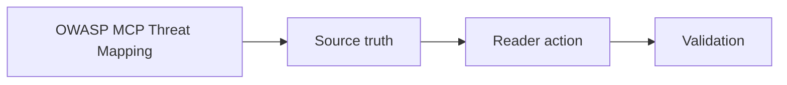

# OWASP MCP Threat Mapping

## Audience

## Outcome

After this page you should know what this surface is for, which source files own the behavior, which public route or adjacent page to use next, and which validation command to run before changing the claim.

## Source Truth

- Public route: `helm-oss/owasp-mcp-threat-mapping`
- Source document: `helm-oss/docs/OWASP_MCP_THREAT_MAPPING.md`
- Public manifest: `helm-oss/docs/public-docs.manifest.json`
- Source inventory: `helm-oss/docs/source-inventory.manifest.json`
- Validation: `make docs-coverage`, `make docs-truth`, and `npm run coverage:inventory` from `docs-platform`

Do not expand this page with unsupported product, SDK, deployment, compliance, or integration claims unless the inventory manifest points to code, schemas, tests, examples, or an owner doc that proves the claim.

## Troubleshooting

| Symptom | First check |
| --- | --- |
| The public page and source behavior disagree | Treat the source path in `Source Truth` as canonical, then update the docs and source-inventory row in the same change. |
| A link or route is missing from the docs website | Check `docs/public-docs.manifest.json`, `llms.txt`, search, and the per-page Markdown export before changing navigation. |
| A claim is not backed by code or tests | Remove the claim or add the missing code, example, schema, or validation command before publishing. |

## Diagram

This scheme maps the main sections of OWASP MCP Threat Mapping in reading order.

This page maps retained HELM OSS control points to OWASP-style MCP and agent-tooling threat areas. It is a public engineering map, not a certification statement.

| Risk Area | Primary HELM Control Points | Evidence To Review |
| --- | --- | --- |
| unauthorized tool use | policy evaluation, manifest/schema validation, fail-closed execution boundary | policy bundle, denial reason code, receipt |
| connector contract drift | schema handling, typed contracts, conformance checks | generated schema, connector conformance output |
| outbound data movement | egress rules, boundary packages, approval gates | policy bundle and proof graph |
| prompt-injection tool misuse | untrusted context handling, tool allowlists, effect levels | denied examples and threat-model tests |
| auditability gaps | signed receipts, proof graph, exported evidence bundles | receipt timeline and verifier output |
| replay and dispute handling | offline verification, causal hashes, evidence pack export | verifier command and evidence archive |

For a deeper agentic threat inventory, use [security/owasp-agentic-top10-coverage.md](security/owasp-agentic-top10-coverage.md). For product-level trust language, use the HELM trust docs on `helm.docs.mindburn.org`.
