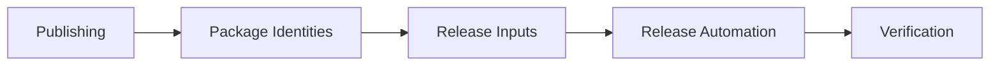

# Publishing

## Audience

## Outcome

After this page you should know what this surface is for, which source files own the behavior, which public route or adjacent page to use next, and which validation command to run before changing the claim.

## Source Truth

- Public route: `helm-oss/publishing`
- Source document: `helm-oss/docs/PUBLISHING.md`
- Public manifest: `helm-oss/docs/public-docs.manifest.json`
- Source inventory: `helm-oss/docs/source-inventory.manifest.json`
- Validation: `make docs-coverage`, `make docs-truth`, and `npm run coverage:inventory` from `docs-platform`

Do not expand this page with unsupported product, SDK, deployment, compliance, or integration claims unless the inventory manifest points to code, schemas, tests, examples, or an owner doc that proves the claim.

## Troubleshooting

| Symptom | First check |
| --- | --- |
| The public page and source behavior disagree | Treat the source path in `Source Truth` as canonical, then update the docs and source-inventory row in the same change. |
| A link or route is missing from the docs website | Check `docs/public-docs.manifest.json`, `llms.txt`, search, and the per-page Markdown export before changing navigation. |
| A claim is not backed by code or tests | Remove the claim or add the missing code, example, schema, or validation command before publishing. |

## Diagram

This scheme maps the main sections of Publishing in reading order.



The repository retains packaging metadata for the kernel binaries, container image, and the public SDKs.

## Package Identities

| Surface | Package Identity |
| --- | --- |
| CLI/Homebrew | `mindburnlabs/tap/helm` backed by `mindburnlabs/homebrew-tap` |
| TypeScript SDK | `@mindburn/helm` |
| Python SDK | `helm-sdk` |
| Rust SDK | `helm-sdk` |
| Java SDK | Maven workflow: `com.github.Mindburn-Labs:helm-sdk`; JitPack release availability is tracked in `docs/OSS_READINESS_AUDIT.md` |
| Go SDK | `github.com/Mindburn-Labs/helm-oss/sdk/go@main`; tagged module version alignment is tracked in `docs/OSS_READINESS_AUDIT.md` |

## Release Inputs

Before tagging a release:

1. update `VERSION`
2. update `CHANGELOG.md`
3. run `make build`, `make test`, `make test-console`,
   `make test-platform`, `make test-all`, `make crucible`, and
   `make launch-smoke`
4. run `make release-assets`
5. verify that SDK package versions match `VERSION`
6. verify `helm verify evidence-pack.tar`; run
   `helm verify evidence-pack.tar --online` only when the public proof endpoint
   and credentials for that release are available
7. run `make release-binaries-reproducible` when validating that release binaries are reproducible from the checked-in source and pinned build metadata

## Release Automation

The retained workflow set under `.github/workflows/` covers:

- main CI
- GitHub Release creation for tagged versions
- Homebrew formula generation for `mindburnlabs/homebrew-tap`
- GHCR image publication for `latest`, version tag, and slim tag
- manual publication workflows for npm, PyPI, crates.io, and Maven-compatible distribution

Current public GitHub release: `v0.4.0`, published on 2026-04-25 at
<https://github.com/Mindburn-Labs/helm-oss/releases/tag/v0.4.0>.

There is no public GitHub Release object for `v0.4.1`; use `v0.4.0` as the
actual release baseline when auditing deltas.

Its attached assets are:

- `helm-darwin-amd64`
- `helm-darwin-arm64`
- `helm-linux-amd64`
- `helm-linux-arm64`
- `helm-windows-amd64.exe`
- `SHA256SUMS.txt`
- `sbom.json`
- `release-attestation.json`
- `evidence-pack.tar`
- `release.high_risk.v3.toml`
- `helm.mcpb`
- `helm.rb`

Target `v0.5.0` assets additionally include `v0.5.0.openvex.json`,
`sample-policy-material.tar`, and `*.cosign.bundle` files for every primary
asset, including `SHA256SUMS.txt`. `sample-policy-material.tar` must include
the sample policy and its referenced EU AI Act high-risk reference pack.

The retained SDK package manifests are versioned with `VERSION`, but npm,
PyPI, crates.io, and Maven publication require the corresponding registry
secrets. If `NPM_TOKEN`, `PYPI_TOKEN`, `CRATES_TOKEN`, or Maven credentials are
absent, that registry channel is not published for the release and must not be
documented as published.

Do not document an asset as published unless it appears on the GitHub release
or is produced by a retained workflow and attached to that release.

If a package or channel is not represented in the retained workflow set, it should not be described as a supported public publication channel in repository documentation.

## Verification

Every public release must include enough material to verify what was downloaded.
For `v0.4.0`, use `SHA256SUMS.txt`, `sbom.json`,
`release-attestation.json`, the platform binary assets, and the offline
`evidence-pack.tar`.

Cosign bundle verification applies only when `*.cosign.bundle` files are
attached to the release.

Verify a downloaded binary blob:

```bash
cosign verify-blob \
  --bundle helm-linux-amd64.cosign.bundle \
  --certificate-identity-regexp "https://github.com/Mindburn-Labs/helm-oss" \
  --certificate-oidc-issuer https://token.actions.githubusercontent.com \
  helm-linux-amd64
```

Verify a published container image when a container image has been published
for the release:

```bash
cosign verify \
  --certificate-identity-regexp "Mindburn-Labs/helm-oss" \
  --certificate-oidc-issuer https://token.actions.githubusercontent.com \
  ghcr.io/mindburn-labs/helm-oss:<version>
```

The same recipe is documented in `docs/VERIFICATION.md`. The local helper
`scripts/release/verify_cosign.sh` is called via `make verify-cosign`, but it
requires matching `*.cosign.bundle` files in the downloaded release directory.
