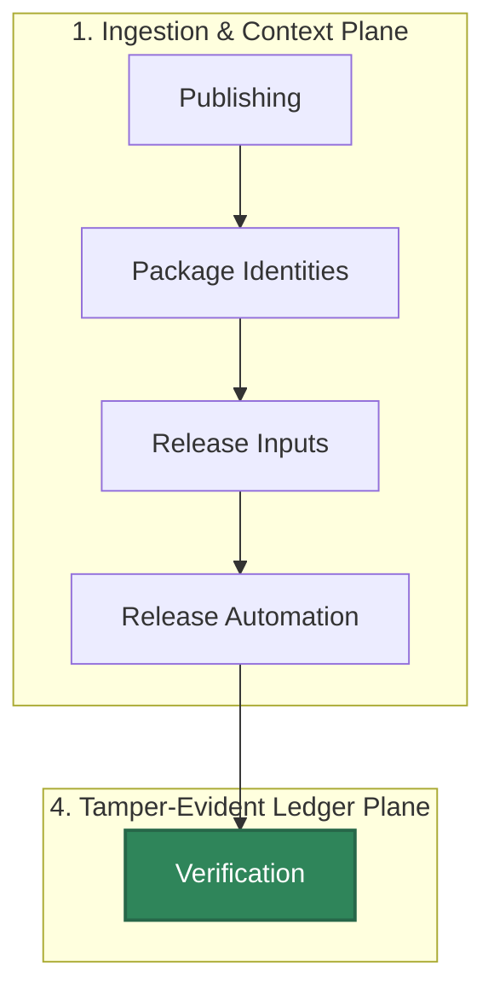

# Publishing

<!-- quantum_posture: this page references release signatures and bundles but does not implement cryptographic controls. -->

Publishing defines the current source-backed release and package artifact contract for HELM AI Kernel.

## Audience

This page is for maintainers preparing a release and consumers checking whether a binary, SDK package, container image, or evidence bundle is actually part of the current HELM AI Kernel release surface.

## Outcome

You should know which package identities are source-backed, which registry claims require separate proof, and which checks must pass before a release artifact is documented as published.

## Source Truth

- Public route: `publishing`
- Source document: `helm-ai-kernel/docs/PUBLISHING.md`
- Public manifest: `helm-ai-kernel/docs/public-docs.manifest.json`
- Source inventory: `helm-ai-kernel/docs/source-inventory.manifest.json`
- Validation: `make docs-coverage`, `make docs-truth`, and `npm run coverage:inventory` from `docs-platform`

Do not expand this page with unsupported product, SDK, deployment, compliance, or integration claims unless the inventory manifest points to code, schemas, tests, examples, or an owner doc that proves the claim.

## Troubleshooting

| Symptom | First check |
| --- | --- |
| Published output is stale or incomplete | Run `npm run helm-public:accuracy` in `docs-platform`, then check the source path and public manifest row for this page. |
| A claim needs implementation backing | Check the Source Truth files above and update the implementation, manifest, source inventory, or page in the same change. |

## Diagram

This scheme maps the main sections of Publishing in reading order.




The repository retains packaging metadata for the kernel binaries, container image, and the public SDKs.

## Package Identities

| Surface | Package Identity |
| --- | --- |
| CLI/Homebrew | GitHub Release binaries, attached `helm-ai-kernel.rb`, and `mindburnlabs/tap/helm-ai-kernel` |
| TypeScript SDK | `@mindburn/helm-ai-kernel` |
| Python SDK | `helm-sdk` |
| Rust SDK | `helm-sdk` |
| Java SDK | Maven Central coordinate `io.github.mindburnlabs:helm-sdk:0.5.19` |
| Go SDK | `github.com/Mindburn-Labs/helm-ai-kernel/sdk/go@v0.5.19`; publish with the subdirectory tag `sdk/go/v0.5.19` |

## Release Inputs

Before tagging a release:

1. run `python3 scripts/release/prepare_version.py <version>` and review the
   coordinated bump across `VERSION`, chart metadata, SDK manifests, OpenAPI
   metadata, generated SDK headers, and release docs
2. update `CHANGELOG.md`
3. run `make version-drift`
4. run `make build`, `make test`, `make test-platform`, `make test-all`,
   `make crucible`, and
   `make launch-smoke`
5. run `make sdk-openapi-check` and `make sdk-examples-smoke`
6. run `make release-assets`
7. verify `helm-ai-kernel verify evidence-pack.tar`; run
   `helm-ai-kernel verify evidence-pack.tar --online` only when the public proof endpoint
   and credentials for that release are available
8. run `make release-binaries-reproducible` when validating that release binaries are reproducible from the checked-in source and pinned build metadata

Tag-triggered release workflows fail if the tag `v<version>` does not match
the checked-in `VERSION` file. The chart and SDK package manifests are not
patched in CI; source-controlled release metadata is the authority.

## Release Automation

The retained workflow set under `.github/workflows/` covers:

- main CI
- GitHub Release creation for tagged versions
- Homebrew formula generation for `mindburnlabs/homebrew-tap`
- GHCR image publication for `latest`, version tag, and slim tag
- tag-triggered npm, PyPI, crates.io, and Maven-compatible SDK publication
- daily published registry drift monitoring through `make version-drift-published`

Release target: `v0.5.19`. The release is complete only after the tagged
workflow publishes every lockstep channel, attaches `version-status.json` to
the GitHub Release, and `make version-drift-published` passes for that version:
<https://github.com/Mindburn-Labs/helm-ai-kernel/releases/tag/v0.5.19>.

There is no public GitHub Release object for `v0.4.1`; use `v0.4.0` as the
actual release baseline when auditing the `v0.5.0` delta.

The release workflow attaches these assets:

- `helm-ai-kernel-darwin-amd64`
- `helm-ai-kernel-darwin-arm64`
- `helm-ai-kernel-linux-amd64`
- `helm-ai-kernel-linux-arm64`
- `helm-ai-kernel-windows-amd64.exe`
- `SHA256SUMS.txt`
- `sbom.json`
- `v0.5.19.openvex.json`
- `release-attestation.json`
- `evidence-pack.tar`
- `release.high_risk.v3.toml`
- `sample-policy-material.tar`
- `helm-ai-kernel-launchpad-data.tar`
- `helm-ai-kernel.mcpb`
- `helm-ai-kernel.rb`
- `v0.5.19.json`
- matching `*.cosign.bundle` files for every primary asset

`sample-policy-material.tar` includes the sample policy and its referenced EU
AI Act high-risk reference pack. Browser UI bundles are not Kernel release
assets and are not installed by the Homebrew formula.
The retained release workflow attaches a `helm-ai-kernel.rb` formula asset for version `0.5.19`
and publishes the same version to `mindburnlabs/homebrew-tap`;
`version-status.json` must include a passing `homebrew-tap` surface before
documenting `brew install mindburnlabs/tap/helm-ai-kernel` as current.

SDK package manifests and registry versions must remain lockstep with the
GitHub release tag. npm, PyPI, crates.io, Maven, and Homebrew publication
require the corresponding registry secrets. If `NPM_TOKEN`, `PYPI_TOKEN`,
`CRATES_TOKEN`, `HOMEBREW_TAP_TOKEN`, or Maven credentials are absent, the
release workflow must fail instead of documenting a partial release as
complete.

Do not document an asset as published unless it appears on the GitHub release
or is produced by a retained workflow and attached to that release.

If a package or channel is not represented in the retained workflow set, it should not be described as a supported public publication channel in repository documentation.

`make release-assets` stages only verifiable release material. On tag builds it
requires `release/vex/v<version>.openvex.json`, exports the audit EvidencePack,
runs `helm-ai-kernel verify` against the staged `evidence-pack.tar`, and then
writes the final `SHA256SUMS.txt`.

## Verification

Every public release must include enough material to verify what was downloaded.
For the current release target, use `SHA256SUMS.txt`, `sbom.json`,
`v0.5.19.openvex.json`, `release-attestation.json`, the platform binary assets,
attached `*.cosign.bundle` files, and the offline `evidence-pack.tar`.

Verify a downloaded binary blob:

```bash
cosign verify-blob \
  --bundle helm-ai-kernel-linux-amd64.cosign.bundle \
  --certificate-identity-regexp "https://github.com/Mindburn-Labs/helm-ai-kernel" \
  --certificate-oidc-issuer https://token.actions.githubusercontent.com \
  helm-ai-kernel-linux-amd64
```

Verify a published container image when a container image has been published
for the release:

```bash
cosign verify \
  --certificate-identity-regexp "Mindburn-Labs/helm-ai-kernel" \
  --certificate-oidc-issuer https://token.actions.githubusercontent.com \
  ghcr.io/mindburn-labs/helm-ai-kernel:<version>
```

The same recipe is documented in `docs/VERIFICATION.md`. The local helper
`scripts/release/verify_cosign.sh` is called via `make verify-cosign`, but it
requires matching `*.cosign.bundle` files in the downloaded release directory.
A zero-bundle run is not signature evidence.
