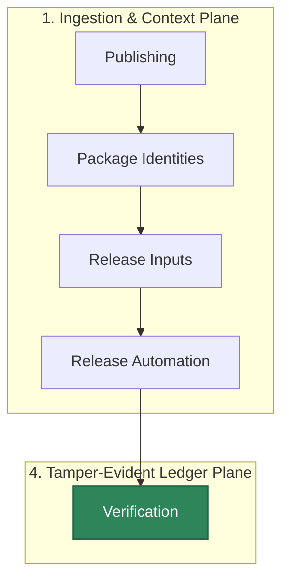

# Publishing

<!-- quantum_posture: this page references release signatures and bundles but does not implement cryptographic controls. -->

Publishing defines the current source-backed release and package artifact contract for HELM AI Kernel.

## Audience

This page is for maintainers preparing a release and consumers checking whether a binary, SDK package, container image, or evidence bundle is actually part of the current HELM AI Kernel release surface.

## Outcome

You should know which package identities are source-backed, which registry claims require separate proof, and which checks must pass before a release artifact is documented as published.

## Source Truth

- Public route: `publishing`
- Source document: `helm-ai-kernel/docs/PUBLISHING.md`
- Public manifest: `helm-ai-kernel/docs/public-docs.manifest.json`
- Source inventory: `helm-ai-kernel/docs/source-inventory.manifest.json`
- Validation: `make docs-coverage`, `make docs-truth`, and `npm run coverage:inventory` from `docs-platform`

Do not expand this page with unsupported product, SDK, deployment, compliance, or integration claims unless the inventory manifest points to code, schemas, tests, examples, or an owner doc that proves the claim.

## Troubleshooting

| Symptom | First check |
| --- | --- |
| Published output is stale or incomplete | Run `npm run helm-public:accuracy` in `docs-platform`, then check the source path and public manifest row for this page. |
| A claim needs implementation backing | Check the Source Truth files above and update the implementation, manifest, source inventory, or page in the same change. |

## Diagram

This scheme maps the main sections of Publishing in reading order.


```mermaid
flowchart TD
    subgraph Ingestion["1. Ingestion & Context Plane"]
        Page["Publishing"]
        A["Package Identities"]
        B["Release Inputs"]
        C["Release Automation"]
    end

    subgraph Ledger["4. Tamper-Evident Ledger Plane"]
        D["Verification"]
    end

    %% Operational Flow Edges
    Page --> A
    A --> B
    B --> C
    C --> D

    %% Premium Styling Rules
    style D fill:#2f855a,stroke:#276749,stroke-width:2px,color:#fff
```


The repository retains packaging metadata for the kernel binaries, container image, and the public SDKs.

## Package Identities

| Surface | Package Identity |
| --- | --- |
| CLI/Homebrew | GitHub Release binaries, attached `helm-ai-kernel.rb`, and `mindburn-labs/tap/helm-ai-kernel` |
| TypeScript SDK | `@mindburn/helm-ai-kernel` |
| Python SDK | `helm-sdk` |
| Rust SDK | `helm-sdk` |
| Java SDK | Maven Central coordinate `io.github.mindburnlabs:helm-sdk:0.9.0` |
| Go SDK | `github.com/Mindburn-Labs/helm-ai-kernel/sdk/go@v0.9.0`; publish with the subdirectory tag `sdk/go/v0.9.0` |

## Rehearse Before Tagging

`make release-rehearsal` (`scripts/release/rehearse.py`) answers, before a
tag exists, whether the next release would pass `release.yml`. It picks the
version the tag would carry: `VERSION` when it is ahead of the latest `v*`
tag, otherwise the smallest bump the contract gates accept (a break needs a
major bump, or a minor bump while the version is `0.y.z`). It then checks the
contract gates against the last tag, the `contracts-catalog` spec blob, the
Console sidecar pin row and its annotated `helm-console-sidecar-v<version>`
tag, version lockstep, the npm, PyPI and crates.io packages, the production
chart render and its key pairs, the deployment environments, and every
repository secret and variable `release.yml` reads.

Each row is `PASS`, `FAIL`, `ACTION-NEEDED` (a per-release step, printed with
its remedy) or `UNKNOWN` (not readable here, never a pass). Trusted-publisher
settings are always `UNKNOWN`, because no registry exposes them; the row names
the exact settings each registry must hold. The command exits non-zero only on
a `FAIL`, a defect that blocks any version; `REHEARSAL_ARGS=--strict` fails on
`ACTION-NEEDED` too. `.github/workflows/release-rehearsal.yml` runs it on
`main` every day and on demand, and writes the table to the run summary.

## Release Inputs

Before tagging a release:

1. run `make release-rehearsal`: fix every `FAIL` row first; its
   `ACTION-NEEDED` rows name which of the steps below this release needs, so
   re-run it after step 3 until none is left
2. run `make prepare-version VERSION=<version>` and review the coordinated
   bump across `VERSION`, chart metadata, SDK manifests, OpenAPI metadata,
   generated SDK headers, and release docs
3. synchronize `api/openapi/helm.openapi.yaml` into
   `Mindburn-Labs/contracts-catalog` and merge the catalog change to `main`
4. update `CHANGELOG.md`
5. run `make docs-coverage docs-truth`
6. run `make quality-merge`
7. run `make quality-release`
8. run `make release-readiness`
9. run `make release-assets`
10. after publication, run or confirm `make version-drift-published`

Tag-triggered release workflows fail if the tag `v<version>` does not match
the checked-in `VERSION` file, the tag's peeled commit is not reachable from
current `origin/main` (equal to it or one of its ancestors), or the catalog
OpenAPI differs from the tagged Kernel OpenAPI. The
preflight reads catalog `main` with `DOWNSTREAM_FANOUT_TOKEN`; it never opens
or merges a downstream catalog PR. The chart and SDK package manifests are not
patched in CI; source-controlled release metadata is the authority.

## Release Automation

The retained workflow set under `.github/workflows/` covers:

- main CI
- GitHub Release creation for tagged versions
- Homebrew formula generation for `Mindburn-Labs/homebrew-tap`
- GHCR image publication for `latest`, version tag, and slim tag
- Go SDK subdirectory tag publication for `sdk/go/v0.9.0`
- tag-triggered npm, PyPI, crates.io, and Maven-compatible SDK publication
- daily published registry drift monitoring through `make version-drift-published`
- a daily release rehearsal of `main` through `make release-rehearsal`

Release target: `v0.9.0`. The release is complete only after the tagged
workflow publishes every lockstep channel, attaches `version-status.json` to
the GitHub Release, and `make version-drift-published` passes for that version:
<https://github.com/Mindburn-Labs/helm-ai-kernel/releases/tag/v0.9.0>.

There is no public GitHub Release object for `v0.4.1`; use `v0.4.0` as the
actual release baseline when auditing the `v0.5.0` delta.

The release workflow attaches these assets:

- `helm-ai-kernel-darwin-amd64`
- `helm-ai-kernel-darwin-arm64`
- `helm-ai-kernel-linux-amd64`
- `helm-ai-kernel-linux-arm64`
- `helm-ai-kernel-windows-amd64.exe`
- `SHA256SUMS.txt`
- `sbom.json`
- `v0.9.0.openvex.json`
- `release-attestation.json`
- `evidence-pack.tar`
- `release.high_risk.v3.toml`
- `sample-policy-material.tar`
- `helm-ai-kernel-launchpad-data.tar`
- `helm-ai-kernel.mcpb`
- `helm-console-local-sidecar-*`
- `helm-ai-kernel-*-console.tar.gz`
- `CONSOLE-SHA256SUMS.txt`
- `helm-ai-kernel.rb`
- `v0.9.0.json`
- matching `*.cosign.bundle` files for every primary asset

`sample-policy-material.tar` includes the sample policy and its referenced EU
AI Act high-risk reference pack. The local Console sidecars and standalone
browser UI layouts are Kernel release assets; the Homebrew formula does not
install them.
The retained release workflow attaches a `helm-ai-kernel.rb` formula asset for version `0.9.0`
and publishes the same version to `Mindburn-Labs/homebrew-tap`;
`version-status.json` must include a passing `homebrew-tap` surface before
documenting `brew install mindburn-labs/tap/helm-ai-kernel` as current.

SDK package manifests and registry versions must remain lockstep with the
GitHub release tag. npm, PyPI, and crates.io publish through OIDC trusted
publishing from `release.yml`, with no stored registry token; Maven Central and
Homebrew publication use the `MAVEN_*` and `HOMEBREW_TAP_TOKEN` secrets. If a
registry rejects the workflow identity or a secret is absent, the release
workflow must fail instead of documenting a partial release as complete. A
failed channel is repaired by re-running the failed jobs of the same tag run;
channels that already carry the version are skipped.

Do not document an asset as published unless it appears on the GitHub release
or is produced by a retained workflow and attached to that release.

If a package or channel is not represented in the retained workflow set, it should not be described as a supported public publication channel in repository documentation.

`make release-assets` stages only verifiable release material. On tag builds it
requires `release/vex/v<version>.openvex.json`, exports the audit EvidencePack,
runs `helm-ai-kernel verify` against the staged `evidence-pack.tar`, and then
writes the final `SHA256SUMS.txt`.

## Verification

Every public release must include enough material to verify what was downloaded.
For the current release target, use `SHA256SUMS.txt`, `sbom.json`,
`v0.9.0.openvex.json`, `release-attestation.json`, the platform binary assets,
attached `*.cosign.bundle` files, and the offline `evidence-pack.tar`.

Every release signature is made by the tag release workflow, so its signing
identity names the exact tag:
`https://github.com/Mindburn-Labs/helm-ai-kernel/.github/workflows/release.yml@refs/tags/<tag>`.
Pass that exact string with `--certificate-identity`. Do not use
`--certificate-identity-regexp`: an unanchored pattern also accepts signatures
from other workflows, branches and repositories. Dev-grade `dev-sha-<sha>`
images are signed by `dev-image.yml` and do not verify with these commands.

Verify a downloaded binary blob. Set `HELM_TAG` to the exact tag of the release
you downloaded:

```bash
HELM_TAG=vX.Y.Z  # the exact release tag
cosign verify-blob \
  --bundle helm-ai-kernel-linux-amd64.cosign.bundle \
  --certificate-identity "https://github.com/Mindburn-Labs/helm-ai-kernel/.github/workflows/release.yml@refs/tags/${HELM_TAG}" \
  --certificate-oidc-issuer https://token.actions.githubusercontent.com \
  helm-ai-kernel-linux-amd64
```

Verify a published container image when a container image has been published
for the release:

```bash
HELM_TAG=vX.Y.Z  # the exact release tag
cosign verify \
  --certificate-identity "https://github.com/Mindburn-Labs/helm-ai-kernel/.github/workflows/release.yml@refs/tags/${HELM_TAG}" \
  --certificate-oidc-issuer https://token.actions.githubusercontent.com \
  "ghcr.io/mindburn-labs/helm-ai-kernel:${HELM_TAG}"
```

The local helper `scripts/release/verify_cosign.sh` is called via
`make verify-cosign`; set `KERNEL_RELEASE_TAG=<tag>` to pin the same exact
identity. It fails when the directory holds no `*.cosign.bundle` files, because
a zero-bundle run is not signature evidence. `install.sh` verifies the signature
on `SHA256SUMS.txt` with the same exact identity before it trusts the checksum.
