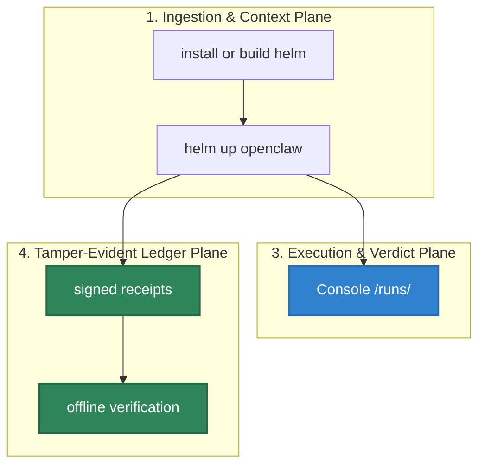

# Quickstart

This is the shortest current HELM AI Kernel path: build or install the CLI, run
a LaunchKit app through `helm up`, inspect the receipt-backed Console run, and
verify the exported EvidencePack offline. The lower-level boundary demo remains
available for integration testing.

## Audience

This quickstart is for developers, security reviewers, and integration owners who need the shortest local proof that HELM AI Kernel can sit between an agent-facing request and infrastructure side effects.

## Outcome

By the end you should have a LaunchKit run URL under `/runs/<run_id>`, a demo or
live receipt chain, an offline verification command, and the narrow docs and
route tests that prove this page still matches the CLI.




## Source Truth

- `core/cmd/helm-ai-kernel/server_cmd.go`
- `core/cmd/helm-ai-kernel/demo_routes.go`
- `core/cmd/helm-ai-kernel/proxy_cmd.go`
- `core/cmd/helm-ai-kernel/receipts_cmd.go`
- `core/cmd/helm-ai-kernel/verify_cmd.go`
- `api/openapi/helm.openapi.yaml`
- `release.high_risk.v3.toml`

The quickstart deliberately uses the local OSS runtime rather than hosted
services. `helm-ai-kernel serve` owns the boundary, demo routes create and verify a
receipt, and the OpenAPI file is the route contract. If an example requires a
credential, customer tenant, or managed control plane, it does not belong in the
first-run OSS path. Keep this page focused on proving the boundary can allow,
deny, record, and verify a local action.

## 1. Install Or Build

Use Homebrew for the published macOS CLI:

```bash
brew install mindburnlabs/tap/helm-ai-kernel
helm-ai-kernel --version
```

Use a source build when editing this repository:

```bash
git clone https://github.com/Mindburn-Labs/helm-ai-kernel.git
cd helm-ai-kernel
make build
./bin/helm-ai-kernel --version
./bin/helm --version
```

Use Docker when you want a clean local runtime:

```bash
docker build -t ghcr.io/mindburn-labs/helm-ai-kernel:local .
docker compose up -d
```

## 2. Launch A Supported App

For the instant no-secret path, run demo mode:

```bash
./bin/helm up openclaw --demo --no-open
```

For live mode, bind a scoped model secret first:

```bash
export OPENROUTER_API_KEY='<key>'
./bin/helm secret set model_gateway --provider openrouter --value-env OPENROUTER_API_KEY
./bin/helm up openclaw --live
```

The command prints a Console URL like:

```text
http://127.0.0.1:7714/runs/<run_id>
```

It also prints an offline verifier command:

```bash
helm evidence verify <evidence-pack> --offline
```

Use `--verify-only` to compile and verify gates without starting runtime:

```bash
./bin/helm up hermes --verify-only
```

## 3. Optional: Start A Local Boundary

```bash
./bin/helm-ai-kernel serve --policy ./release.high_risk.v3.toml
```

Expected ready line:

```text
helm-edge-local - listening :7714 - ready
```

If you installed with Homebrew, replace `./bin/helm-ai-kernel` with `helm-ai-kernel`.

Run the basic boundary checks in another shell:

```bash
./bin/helm-ai-kernel boundary status --json
./bin/helm-ai-kernel conform negative --json
./bin/helm-ai-kernel mcp authorize-call --server-id new-server --tool-name file.delete --json
./bin/helm-ai-kernel sandbox preflight --runtime wazero --json
```

The MCP authorization example should fail closed until the server identity, tool schema, scopes, and policy state are approved.

## 4. Run The Built-In Proof Demo

The local demo routes are implemented in the CLI server and exercise receipt verification without requiring a hosted service.

```bash
curl http://127.0.0.1:7714/api/demo/run \
  -H 'content-type: application/json' \
  -d '{"action_id":"export_customer_list","policy_id":"agent_tool_call_boundary"}'
```

Copy the returned `receipt` and `proof_refs.receipt_hash`, then verify it:

```bash
curl http://127.0.0.1:7714/api/demo/verify \
  -H 'content-type: application/json' \
  -d '{"receipt":{...},"expected_receipt_hash":"<receipt_hash>"}'
```

Tamper checks must fail:

```bash
curl http://127.0.0.1:7714/api/demo/tamper \
  -H 'content-type: application/json' \
  -d '{"receipt":{...},"expected_receipt_hash":"<receipt_hash>","mutation":"flip_verdict"}'
```

## 5. Optional OpenAI-Compatible Proxy

Start the proxy only when an existing client can set an OpenAI-style base URL:

```bash
python3 scripts/launch/mock-openai-upstream.py --port 19090
```

Then start the proxy against that local upstream:

```bash
./bin/helm-ai-kernel proxy \
  --upstream http://127.0.0.1:19090/v1 \
  --port 9090 \
  --receipts-dir ./helm-receipts
```

Point the client at:

```text
http://localhost:9090/v1
```

The retained source examples under `examples/*_openai_baseurl/` are HELM HTTP/SDK examples, not verified OpenAI SDK examples. Use [OpenAI-Compatible Proxy Integration](INTEGRATIONS/openai_baseurl.md) for the proxy contract.

## 6. Inspect Receipts

The CLI receipt tail requires an agent id:

```bash
./bin/helm-ai-kernel receipts tail --agent agent.demo.exec --server http://127.0.0.1:7714
```

For an unfiltered local list, use the HTTP API:

```bash
curl 'http://127.0.0.1:7714/api/v1/receipts?limit=20'
```

## 7. Verify Evidence

`helm-ai-kernel verify` is offline-first and succeeds only when the EvidencePack contains the required roots, proof material, and receipts.

```bash
./bin/helm-ai-kernel verify evidence-pack.tar
./bin/helm-ai-kernel verify evidence-pack.tar --json
```

Use the `v0.5.7` release `evidence-pack.tar` after `version-status.json` confirms all lockstep channels, or use an operator-generated pack known to contain ProofGraph and receipt material. Do not treat the local onboarding demo export as verified unless it includes those records.

## 8. Validate The Checkout

```bash
make docs-coverage
make docs-truth
cd core && go test ./cmd/helm-ai-kernel -run 'Test.*Route|Test.*OpenAPI|Test.*Receipt' -count=1
```

Run broader targets when you changed their surface:

```bash
make test-console
make test-design-system
make verify-fixtures
```

## Troubleshooting

| Symptom | Cause | Fix |
| --- | --- | --- |
| client call reaches the upstream provider directly | base URL still points to the provider | set the client base URL to HELM and log the request host |
| `helm-ai-kernel receipts tail` exits with usage | missing required agent filter | pass `--agent <id>` or use `GET /api/v1/receipts` for an unfiltered list |
| denied request retries forever | client treats policy denial as transient | handle `DENY` as a final authorization result |
| `helm-ai-kernel verify` fails | EvidencePack is incomplete or modified | use a complete pack and run `make verify-fixtures` |
| Docker path fails | local image or compose state is stale | rebuild the image and restart `docker compose` |

If a command differs from this page, inspect the matching source path in `Source Truth` before changing docs. Update the CLI source, OpenAPI route, and documentation together only when the source proves the behavior changed.
