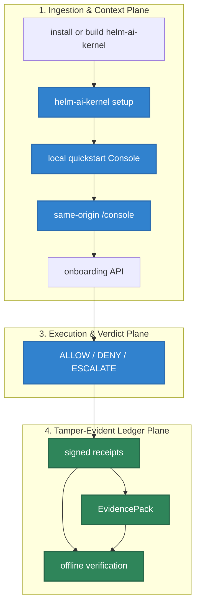

# Quickstart

This is the shortest current HELM AI Kernel OSS proof path: install or build
the CLI, run `helm-ai-kernel setup claude-code --yes` or
`helm-ai-kernel setup codex --yes`, keep the terminal open, and watch HELM
protect a local coding agent with a signed denial and the same-origin Console.
No account, hosted service, live model key, production credential, Docker
daemon, or private endpoint is required for the local proof.

## Audience

This quickstart is for developers, security reviewers, and integration owners who need the shortest local proof that HELM AI Kernel can sit between an agent-facing request and infrastructure side effects.

## Outcome

By the end you should have a local Claude Code or Codex MCP entry, a PreToolUse
hook, draft policy artifacts under `~/.helm-ai-kernel`, a local Kernel on
`127.0.0.1:7714`, a Console served from the same origin at `/console`, a signed
`DENY` receipt for a blocked tool call, and offline-verifiable proof artifacts.
Hosted console pairing, paid plans, and Enterprise automation remain next-step
paths after the local proof succeeds.




## Source Truth

- `core/cmd/helm-ai-kernel/setup_cmd.go`
- `core/cmd/helm-ai-kernel/hook_cmd.go`
- `core/cmd/helm-ai-kernel/quickstart_cmd.go`
- `core/cmd/helm-ai-kernel/local_first_run_routes.go`
- `core/cmd/helm-ai-kernel/server_cmd.go`
- `core/cmd/helm-ai-kernel/console_routes.go`
- `core/cmd/helm-ai-kernel/proxy_cmd.go`
- `core/cmd/helm-ai-kernel/receipts_cmd.go`
- `core/cmd/helm-ai-kernel/verify_cmd.go`
- `api/openapi/helm.openapi.yaml`
- `release.high_risk.v3.toml`
- `scripts/release/stage_console_bundle.sh`
- `release/console-bundle.lock.example.json`
- `scripts/launch/demo-mcp.sh`
- `scripts/launch/demo-openai-proxy.sh`
- `examples/launch/policies/shell_mcp_server_boundary.json`

The setup path uses the local CLI, client MCP config, client hook config, and
same-origin Console as the primary OSS proof path. `helm-ai-kernel setup`
prepares local state, registers the stdio MCP server, installs a PreToolUse
hook where supported, drafts policy artifacts without approval, starts the
Kernel, serves the verified Console bundle from `/console`, and exposes
backend-owned onboarding APIs. The hook writes DENY receipts for blocked local
tool calls; the Kernel creates the Console proof receipts and EvidencePack refs.

## 0. Build Or Install

Use a source build when editing this repository or proving the current checkout:

```bash
git clone https://github.com/Mindburn-Labs/helm-ai-kernel.git
cd helm-ai-kernel
make build
./bin/helm-ai-kernel --version
./bin/helm --version
```

Install the published macOS CLI when evaluating the current release:

```bash
brew install mindburnlabs/tap/helm-ai-kernel
helm-ai-kernel --version
```

Use Docker when you want a clean local runtime:

```bash
docker build -t ghcr.io/mindburn-labs/helm-ai-kernel:local .
docker compose up -d
```

## 1. Protect Claude Code Or Codex

Use the one-command front door for a fresh local proof:

```bash
helm-ai-kernel setup claude-code --yes
```

For Codex:

```bash
helm-ai-kernel setup codex --yes
```

The command defaults to `--scope user` and data under `~/.helm-ai-kernel`.
Project scope is explicit:

```bash
helm-ai-kernel setup codex --scope project --yes
```

Inspect or undo the local integration:

```bash
helm-ai-kernel setup status claude-code
helm-ai-kernel setup remove claude-code --yes
```

Use `--dry-run --json` to inspect the exact binary path, client config path,
hook config path, data dir, Kernel URL, Console URL, scan grade, draft policy
path, and uninstall command before writing anything:

```bash
helm-ai-kernel setup codex --dry-run --json
```

Setup never approves detected tools. It writes draft policy and quarantine
artifacts only; approvals remain explicit.

When a PreToolUse hook denies a high-risk call, verify the signed decision
receipt offline:

```bash
helm-ai-kernel workstation verify-decision --receipt ~/.helm-ai-kernel/receipts/hooks/<decision>.json
```

## 2. Run Local Console-First Quickstart Directly

Use this lower-level command when you only want the local Kernel and Console,
without modifying Claude Code or Codex config:

```bash
helm-ai-kernel quickstart
```

The command defaults to `127.0.0.1:7714`, creates local data under `data/`, and
opens a one-time bootstrap URL. The Homebrew release installs the signed
Console web bundle under `share/helm-ai-kernel/console`; source and direct
binary users can provide the same production bundle with `--console-assets`.
Use `--no-open` for terminal-only validation:

```bash
helm-ai-kernel quickstart --no-open --json
```

Useful flags:

| Flag | Purpose |
| --- | --- |
| `--addr 127.0.0.1` | Loopback bind address. Non-loopback binds are rejected. |
| `--port 7714` | Local Kernel port. |
| `--data-dir <dir>` | SQLite, keys, policy, receipts, and EvidencePack location. |
| `--reset` | Remove the quickstart data directory before initialization. |
| `--console-assets <build/web>` | Serve a verified production Console bundle at `/console`. |
| `--profile claude|codex|mcp|openai-compatible` | Label the onboarding path. |
| `--dry-run --json` | Prepare and print machine-readable startup state without serving. |

The browser URL carries a one-time bootstrap token. It can only be exchanged
from loopback, expires quickly, and only returns a local bearer token. Calls to
the onboarding APIs still require `X-Helm-Tenant-ID` and
`X-Helm-Principal-ID`.

The local Console walks through:

| Step | Backend proof |
| --- | --- |
| Kernel health | local Kernel reachable |
| Policy loaded | starter policy path active |
| Signed allow | signed `ALLOW` receipt |
| Signed deny | signed `DENY` receipt |
| MCP quarantine | signed `ESCALATE` receipt for untrusted MCP |
| Tamper check | receipt tampering rejected |
| Export | onboarding EvidencePack metadata written under the data dir |

## 3. Manual Boundary Path

```bash
./bin/helm-ai-kernel serve --policy ./release.high_risk.v3.toml
```

Expected ready line:

```text
helm-edge-local - listening :7714 - ready
```

If you installed with Homebrew, replace `./bin/helm-ai-kernel` with
`helm-ai-kernel`.

Run the basic boundary checks in another shell:

```bash
./bin/helm-ai-kernel boundary status --json
./bin/helm-ai-kernel conform negative --json
./bin/helm-ai-kernel mcp authorize-call --server-id new-server --tool-name file.delete --json
./bin/helm-ai-kernel sandbox preflight --runtime wazero --json
```

The MCP authorization example should fail closed until the server identity,
tool schema, scopes, and policy state are approved.

## 3. Run Local Proof Demos

Run the maintained MCP and receipt proof scripts:

```bash
./scripts/launch/demo-mcp.sh
./scripts/launch/demo-proof.sh
```

Expected proof outcomes:

| Check | Expected result |
| --- | --- |
| Unknown MCP server or tool | `DENY` or `ESCALATE` before fixture dispatch |
| Missing schema pin | Fail-closed authorization decision |
| Dangerous shell fixture | Signed `DENY` receipt |
| Receipt verification | Original receipt verifies |
| Tamper check | Flipped verdict fails verification |

Use the receipt stream while the boundary is running:

```bash
./bin/helm-ai-kernel receipts tail --agent agent.demo.exec --server http://127.0.0.1:7714
```

For an unfiltered local list, use:

```bash
curl 'http://127.0.0.1:7714/api/v1/receipts?limit=20'
```

## 4. Hosted Console And LaunchKit Path

Create an account at <https://console.helm.mindburn.org> only when you want the
hosted dashboard for runs, receipts, and evidence after the local OSS proof.
This quickstart does not claim hosted Enterprise production or commercial
entitlement enforcement; paid capabilities remain backend-enforced.

Install, log in, and pair your workstation:

```bash
brew install mindburnlabs/tap/helm-ai-kernel
helm-ai-kernel --version
helm-ai-kernel login
helm-ai-kernel console pair
```

For the instant demo path (no model key required), run demo mode:

```bash
./bin/helm up openclaw --demo --no-open
```

For live mode, bind a scoped model secret first:

```bash
export OPENROUTER_API_KEY='<key>'
./bin/helm secret set model_gateway --provider openrouter --value-env OPENROUTER_API_KEY
./bin/helm up openclaw --live
```

The command prints a Console URL like:

```text
http://127.0.0.1:7714/runs/<run_id>
```

It also prints an offline verifier command:

```bash
helm evidence verify <evidence-pack> --offline
```

Use `--verify-only` to compile and verify gates without starting runtime:

```bash
./bin/helm up hermes --verify-only
```

## 5. Shell + MCP Quickstart

Use `helm-ai-kernel setup claude-code --yes` or
`helm-ai-kernel setup codex --yes` first when the target is Claude Code or
Codex. Use this lower-level path when Claude Desktop, Cursor, or another
MCP-capable client needs shell access through an upstream `shell-mcp-server`.
The upstream server remains third-party; HELM sits in front of it as the MCP
execution boundary.

Generate a wrapper profile for the upstream stdio server:

```bash
./bin/helm-ai-kernel mcp wrap \
  --server-id shell-mcp-server \
  --upstream-command "npx -y shell-mcp-server" \
  --require-pinned-schema=true \
  --json
```

Install or print a local client configuration:

```bash
./bin/helm-ai-kernel mcp install --client claude-code
./bin/helm-ai-kernel mcp pack --client claude-desktop --out helm-ai-kernel.mcpb
./bin/helm-ai-kernel mcp print-config --client cursor
```

The minimal shell policy fixture is
`examples/launch/policies/shell_mcp_server_boundary.json`. It allows read-only
`ls`, `cat <path>`, `pwd`, and `git status`; it blocks destructive shell patterns
including `rm -rf`, `dd`, `mkfs`, destructive `git clean` forms, and equivalent
raw disk or worktree deletion attempts.

Before a real tool dispatch, the HELM path must produce an MCP authorization
decision and a receipt. Inspect it with:

```bash
./bin/helm-ai-kernel receipts tail --agent mcp-demo-agent --server http://127.0.0.1:7714
```

Run the maintained local proof:

```bash
./scripts/launch/demo-mcp.sh
```

The demo proves unknown servers, unknown tools, and missing schema pins return
`DENY` or `ESCALATE` before fixture dispatch.

## 6. Run The Built-In Proof Demo

The local demo routes are implemented in the CLI server and exercise receipt verification without requiring a hosted service.

```bash
curl http://127.0.0.1:7714/api/demo/run \
  -H 'content-type: application/json' \
  -d '{"action_id":"export_customer_list","policy_id":"agent_tool_call_boundary"}'
```

Copy the returned `receipt` and `proof_refs.receipt_hash`, then verify it:

```bash
curl http://127.0.0.1:7714/api/demo/verify \
  -H 'content-type: application/json' \
  -d '{"receipt":{...},"expected_receipt_hash":"<receipt_hash>"}'
```

Tamper checks must fail:

```bash
curl http://127.0.0.1:7714/api/demo/tamper \
  -H 'content-type: application/json' \
  -d '{"receipt":{...},"expected_receipt_hash":"<receipt_hash>","mutation":"flip_verdict"}'
```

## 6. OpenAI-Compatible Proxy Quickstart

Start the proxy when an existing client can set an OpenAI-style base URL:

```bash
python3 scripts/launch/mock-openai-upstream.py --port 19090
```

Then start the proxy against that local upstream:

```bash
./bin/helm-ai-kernel proxy \
  --upstream http://127.0.0.1:19090/v1 \
  --port 9090 \
  --receipts-dir ./helm-receipts
```

Point the client at:

```text
http://localhost:9090/v1
```

Frameworks use the same switch: configure the OpenAI-compatible endpoint to
`http://127.0.0.1:9090/v1` instead of calling OpenAI directly.

```bash
export OPENAI_BASE_URL=http://127.0.0.1:9090/v1
export OPENAI_API_KEY=local-dev-key
```

Agents SDK can use a default OpenAI client pointed at HELM:

```python
from openai import AsyncOpenAI
from agents import Agent, Runner, set_default_openai_api, set_default_openai_client

set_default_openai_client(
    AsyncOpenAI(base_url="http://127.0.0.1:9090/v1", api_key="local-dev-key"),
    use_for_tracing=False,
)
set_default_openai_api("chat_completions")

agent = Agent(name="quickstart", instructions="Use governed tool calls only.")
result = await Runner.run(agent, "hello through HELM")
```

LangGraph/LangChain apps can point `ChatOpenAI` at the same endpoint:

```python
from langchain_openai import ChatOpenAI

llm = ChatOpenAI(
    model="helm-local-mock",
    base_url="http://127.0.0.1:9090/v1",
    api_key="local-dev-key",
)
```

A custom runtime can call the proxy directly:

```bash
curl -sS http://127.0.0.1:9090/v1/chat/completions \
  -H 'content-type: application/json' \
  -H 'authorization: Bearer local-dev-key' \
  -d '{"model":"helm-local-mock","messages":[{"role":"user","content":"hello"}]}'
```

Risky upstream tool calls are denied by the proxy before the caller can execute
them. The maintained demo sends a local fixture that returns an OpenAI-shaped
`tool_calls` response; HELM returns `403`, sets `X-Helm-Status: DENIED`, removes
executable `tool_calls` from the response body, and persists a denied receipt
that can be exported into an EvidencePack.

```bash
./scripts/launch/demo-openai-proxy.sh
```

The retained source examples under `examples/*_openai_baseurl/` are HELM HTTP/SDK examples. Use [OpenAI-Compatible Proxy Integration](INTEGRATIONS/openai_baseurl.md) for the proxy contract.

## 7. Inspect Receipts

The CLI receipt tail requires an agent id:

```bash
./bin/helm-ai-kernel receipts tail --agent agent.demo.exec --server http://127.0.0.1:7714
```

For an unfiltered local list, use the HTTP API:

```bash
curl 'http://127.0.0.1:7714/api/v1/receipts?limit=20'
```

## 8. Verify Evidence

`helm-ai-kernel verify` is offline-first and succeeds only when the EvidencePack contains the required roots, proof material, and receipts.

```bash
./bin/helm-ai-kernel verify evidence-pack.tar
./bin/helm-ai-kernel verify evidence-pack.tar --json
```

Use the `v0.5.18` release `evidence-pack.tar` after `version-status.json` confirms all lockstep channels, or use an operator-generated pack known to contain ProofGraph and receipt material. Do not treat the local onboarding demo export as verified unless it includes those records.

## 9. Validate The Checkout

```bash
make docs-coverage
make docs-truth
cd core && go test ./cmd/helm-ai-kernel -run 'Test.*Route|Test.*OpenAPI|Test.*Receipt' -count=1
```

Run broader targets when you changed their surface:

```bash
make test-platform
make sdk-openapi-check
make verify-fixtures
```

## Troubleshooting

| Symptom | Cause | Fix |
| --- | --- | --- |
| client call reaches the upstream provider directly | base URL still points to the provider | set the client base URL to HELM and log the request host |
| `helm-ai-kernel receipts tail` exits with usage | missing required agent filter | pass `--agent <id>` or use `GET /api/v1/receipts` for an unfiltered list |
| denied request retries forever | client treats policy denial as transient | handle `DENY` as a final authorization result |
| `helm-ai-kernel verify` fails | EvidencePack is incomplete or modified | use a complete pack and run `make verify-fixtures` |
| Docker path fails | local image or compose state is stale | rebuild the image and restart `docker compose` |

If a command differs from this page, inspect the matching source path in `Source Truth` before changing docs. Update the CLI source, OpenAPI route, and documentation together only when the source proves the behavior changed.
