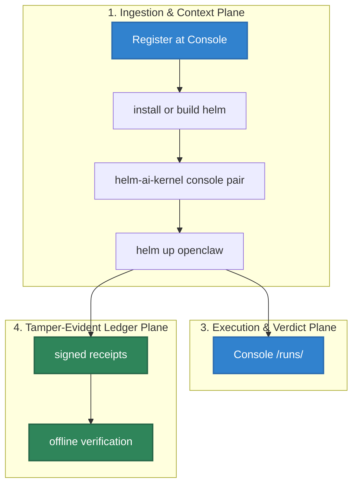

# Quickstart

This is the shortest current HELM AI Kernel path: register at the Console,
install the CLI, pair your workstation, run a LaunchKit app through `helm up`,
and inspect the receipt-backed Console run. The lower-level boundary demo
remains available for local integration testing.

## Audience

This quickstart is for developers, security reviewers, and integration owners who need the shortest local proof that HELM AI Kernel can sit between an agent-facing request and infrastructure side effects.

## Outcome

By the end you should have a Console account, a paired local workstation, a
LaunchKit run URL under `/runs/<run_id>`, a receipt chain visible in the
Console dashboard, an offline verification command, and the narrow docs and
route tests that prove this page still matches the CLI.




## Source Truth

- `core/cmd/helm-ai-kernel/server_cmd.go`
- `core/cmd/helm-ai-kernel/demo_routes.go`
- `core/cmd/helm-ai-kernel/proxy_cmd.go`
- `core/cmd/helm-ai-kernel/receipts_cmd.go`
- `core/cmd/helm-ai-kernel/verify_cmd.go`
- `api/openapi/helm.openapi.yaml`
- `release.high_risk.v3.toml`
- `scripts/launch/demo-mcp.sh`
- `scripts/launch/demo-openai-proxy.sh`
- `examples/launch/policies/shell_mcp_server_boundary.json`

The quickstart uses Console registration as the primary adoption path. Console
provides the dashboard for receipts, evidence, and run history. The local CLI
remains the secondary path for offline proof verification and integration
testing. `helm-ai-kernel serve` owns the boundary, demo routes create and
verify a receipt, and the OpenAPI file is the route contract.

## 0. Register At Console

Create your account at <https://console.helm.mindburn.org>. The Console is the
primary surface for managing runs, inspecting receipts, and reviewing evidence.

## 1. Install And Pair

Install the CLI via Homebrew, log in, and pair your workstation with the Console:

```bash
brew install mindburnlabs/tap/helm-ai-kernel
helm-ai-kernel --version
helm-ai-kernel login
helm-ai-kernel console pair
```

Use a source build when editing this repository:

```bash
git clone https://github.com/Mindburn-Labs/helm-ai-kernel.git
cd helm-ai-kernel
make build
./bin/helm-ai-kernel --version
./bin/helm --version
```

Use Docker when you want a clean local runtime:

```bash
docker build -t ghcr.io/mindburn-labs/helm-ai-kernel:local .
docker compose up -d
```

## 2. Launch A Supported App

For the instant demo path (no model key required), run demo mode:

```bash
./bin/helm up openclaw --demo --no-open
```

For live mode, bind a scoped model secret first:

```bash
export OPENROUTER_API_KEY='<key>'
./bin/helm secret set model_gateway --provider openrouter --value-env OPENROUTER_API_KEY
./bin/helm up openclaw --live
```

The command prints a Console URL like:

```text
http://127.0.0.1:7714/runs/<run_id>
```

It also prints an offline verifier command:

```bash
helm evidence verify <evidence-pack> --offline
```

Use `--verify-only` to compile and verify gates without starting runtime:

```bash
./bin/helm up hermes --verify-only
```

## 3. Optional: Start A Local Boundary

```bash
./bin/helm-ai-kernel serve --policy ./release.high_risk.v3.toml
```

Expected ready line:

```text
helm-edge-local - listening :7714 - ready
```

If you installed with Homebrew, replace `./bin/helm-ai-kernel` with `helm-ai-kernel`.

Run the basic boundary checks in another shell:

```bash
./bin/helm-ai-kernel boundary status --json
./bin/helm-ai-kernel conform negative --json
./bin/helm-ai-kernel mcp authorize-call --server-id new-server --tool-name file.delete --json
./bin/helm-ai-kernel sandbox preflight --runtime wazero --json
```

The MCP authorization example should fail closed until the server identity, tool schema, scopes, and policy state are approved.

## 4. Shell + MCP Quickstart

Use this path when Claude Code, Claude Desktop, Cursor, or another MCP-capable
client needs shell access through an upstream `shell-mcp-server`. The upstream
server remains third-party; HELM sits in front of it as the MCP execution
boundary.

Generate a wrapper profile for the upstream stdio server:

```bash
./bin/helm-ai-kernel mcp wrap \
  --server-id shell-mcp-server \
  --upstream-command "npx -y shell-mcp-server" \
  --require-pinned-schema=true \
  --json
```

Install or print a local client configuration:

```bash
./bin/helm-ai-kernel mcp install --client claude-code
./bin/helm-ai-kernel mcp pack --client claude-desktop --out helm-ai-kernel.mcpb
./bin/helm-ai-kernel mcp print-config --client cursor
```

The minimal shell policy fixture is
`examples/launch/policies/shell_mcp_server_boundary.json`. It allows read-only
`ls`, `cat <path>`, and `git status`; it blocks destructive shell patterns
including `rm -rf`, `dd`, `mkfs`, destructive `git clean` forms, and equivalent
raw disk or worktree deletion attempts.

Before a real tool dispatch, the HELM path must produce an MCP authorization
decision and a receipt. Inspect it with:

```bash
./bin/helm-ai-kernel receipts tail --agent mcp-demo-agent --server http://127.0.0.1:7714
```

Run the maintained local proof:

```bash
./scripts/launch/demo-mcp.sh
```

The demo proves unknown servers, unknown tools, and missing schema pins return
`DENY` or `ESCALATE` before fixture dispatch.

## 5. Run The Built-In Proof Demo

The local demo routes are implemented in the CLI server and exercise receipt verification without requiring a hosted service.

```bash
curl http://127.0.0.1:7714/api/demo/run \
  -H 'content-type: application/json' \
  -d '{"action_id":"export_customer_list","policy_id":"agent_tool_call_boundary"}'
```

Copy the returned `receipt` and `proof_refs.receipt_hash`, then verify it:

```bash
curl http://127.0.0.1:7714/api/demo/verify \
  -H 'content-type: application/json' \
  -d '{"receipt":{...},"expected_receipt_hash":"<receipt_hash>"}'
```

Tamper checks must fail:

```bash
curl http://127.0.0.1:7714/api/demo/tamper \
  -H 'content-type: application/json' \
  -d '{"receipt":{...},"expected_receipt_hash":"<receipt_hash>","mutation":"flip_verdict"}'
```

## 6. OpenAI-Compatible Proxy Quickstart

Start the proxy when an existing client can set an OpenAI-style base URL:

```bash
python3 scripts/launch/mock-openai-upstream.py --port 19090
```

Then start the proxy against that local upstream:

```bash
./bin/helm-ai-kernel proxy \
  --upstream http://127.0.0.1:19090/v1 \
  --port 9090 \
  --receipts-dir ./helm-receipts
```

Point the client at:

```text
http://localhost:9090/v1
```

Frameworks use the same switch: configure the OpenAI-compatible endpoint to
`http://127.0.0.1:9090/v1` instead of calling OpenAI directly.

```bash
export OPENAI_BASE_URL=http://127.0.0.1:9090/v1
export OPENAI_API_KEY=local-dev-key
```

Agents SDK can use a default OpenAI client pointed at HELM:

```python
from openai import AsyncOpenAI
from agents import Agent, Runner, set_default_openai_api, set_default_openai_client

set_default_openai_client(
    AsyncOpenAI(base_url="http://127.0.0.1:9090/v1", api_key="local-dev-key"),
    use_for_tracing=False,
)
set_default_openai_api("chat_completions")

agent = Agent(name="quickstart", instructions="Use governed tool calls only.")
result = await Runner.run(agent, "hello through HELM")
```

LangGraph/LangChain apps can point `ChatOpenAI` at the same endpoint:

```python
from langchain_openai import ChatOpenAI

llm = ChatOpenAI(
    model="helm-local-mock",
    base_url="http://127.0.0.1:9090/v1",
    api_key="local-dev-key",
)
```

A custom runtime can call the proxy directly:

```bash
curl -sS http://127.0.0.1:9090/v1/chat/completions \
  -H 'content-type: application/json' \
  -H 'authorization: Bearer local-dev-key' \
  -d '{"model":"helm-local-mock","messages":[{"role":"user","content":"hello"}]}'
```

Risky upstream tool calls are denied by the proxy before the caller can execute
them. The maintained demo sends a local fixture that returns an OpenAI-shaped
`tool_calls` response; HELM returns `403`, sets `X-Helm-Status: DENIED`, removes
executable `tool_calls` from the response body, and persists a denied receipt
that can be exported into an EvidencePack.

```bash
./scripts/launch/demo-openai-proxy.sh
```

The retained source examples under `examples/*_openai_baseurl/` are HELM HTTP/SDK examples. Use [OpenAI-Compatible Proxy Integration](INTEGRATIONS/openai_baseurl.md) for the proxy contract.

## 7. Inspect Receipts

The CLI receipt tail requires an agent id:

```bash
./bin/helm-ai-kernel receipts tail --agent agent.demo.exec --server http://127.0.0.1:7714
```

For an unfiltered local list, use the HTTP API:

```bash
curl 'http://127.0.0.1:7714/api/v1/receipts?limit=20'
```

## 8. Verify Evidence

`helm-ai-kernel verify` is offline-first and succeeds only when the EvidencePack contains the required roots, proof material, and receipts.

```bash
./bin/helm-ai-kernel verify evidence-pack.tar
./bin/helm-ai-kernel verify evidence-pack.tar --json
```

Use the `v0.5.11` release `evidence-pack.tar` after `version-status.json` confirms all lockstep channels, or use an operator-generated pack known to contain ProofGraph and receipt material. Do not treat the local onboarding demo export as verified unless it includes those records.

## 9. Validate The Checkout

```bash
make docs-coverage
make docs-truth
cd core && go test ./cmd/helm-ai-kernel -run 'Test.*Route|Test.*OpenAPI|Test.*Receipt' -count=1
```

Run broader targets when you changed their surface:

```bash
make test-platform
make sdk-openapi-check
make verify-fixtures
```

## Troubleshooting

| Symptom | Cause | Fix |
| --- | --- | --- |
| client call reaches the upstream provider directly | base URL still points to the provider | set the client base URL to HELM and log the request host |
| `helm-ai-kernel receipts tail` exits with usage | missing required agent filter | pass `--agent <id>` or use `GET /api/v1/receipts` for an unfiltered list |
| denied request retries forever | client treats policy denial as transient | handle `DENY` as a final authorization result |
| `helm-ai-kernel verify` fails | EvidencePack is incomplete or modified | use a complete pack and run `make verify-fixtures` |
| Docker path fails | local image or compose state is stale | rebuild the image and restart `docker compose` |

If a command differs from this page, inspect the matching source path in `Source Truth` before changing docs. Update the CLI source, OpenAPI route, and documentation together only when the source proves the behavior changed.
