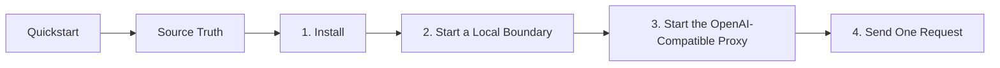

# Quickstart

## Diagram

This scheme maps the main sections of Quickstart in reading order.



This is the shortest source-backed HELM OSS path: install the CLI, start a local boundary, open the Console, proxy one OpenAI-compatible request, inspect receipts, export an EvidencePack, and verify it offline.

For the complete end-to-end path across SDKs, MCP, Docker, Kubernetes, conformance, and release verification, use [Developer Journey](DEVELOPER_JOURNEY.md).

## Source Truth

This page is backed by:

- `Makefile`
- `apps/console/`
- `core/cmd/helm/server_cmd.go`
- `core/cmd/helm/console_routes.go`
- `core/cmd/helm/proxy_cmd.go`
- `core/cmd/helm/verify_cmd.go`
- `core/cmd/helm/receipts_cmd.go`
- `examples/python_openai_baseurl/`
- `examples/ts_openai_baseurl/`
- `examples/js_openai_baseurl/`
- `examples/receipt_verification/`

## 1. Install

:::selector os
### macOS

```bash
brew install mindburnlabs/tap/helm
helm --version
```

Use Homebrew for the published macOS CLI path. Use `make build` when editing HELM OSS itself.

### Linux

```bash
git clone https://github.com/Mindburn-Labs/helm-oss.git
cd helm-oss
make build
./bin/helm --version
```

Release builds also produce Linux amd64 and arm64 binaries.

### Windows / WSL

```powershell
wsl --install
wsl
git clone https://github.com/Mindburn-Labs/helm-oss.git
cd helm-oss
make build
./bin/helm --version
```

Use WSL2 or Docker for local development on Windows. Native Windows release binaries are produced by the release build target.

### Docker

```bash
docker build -t ghcr.io/mindburn-labs/helm-oss:local .
docker compose up -d
```

Use Docker when you want a clean runtime boundary without installing the Go toolchain locally.
:::

## 2. Start a Local Boundary

```bash
./bin/helm serve --policy ./release.high_risk.v3.toml
```

Expected ready line:

```text
helm-edge-local - listening :7714 - ready
```

The sample policy uses retained reference-pack and receipt-store behavior. If you installed through Homebrew, replace `./bin/helm` with `helm`.

## 3. Start the OpenAI-Compatible Proxy

Optional Console build:

```bash
make build-console
./bin/helm serve --policy ./release.high_risk.v3.toml --console
```

Open `http://127.0.0.1:7714` to use the self-hostable HELM OSS Console.

In another shell:

```bash
./bin/helm proxy \
  --upstream https://api.openai.com/v1 \
  --port 9090 \
  --receipts-dir ./helm-receipts
```

Point existing OpenAI-compatible clients at:

```text
http://localhost:9090/v1
```

## 4. Send One Request

:::selector language
### Python

```bash
cd examples/python_openai_baseurl
python -m venv .venv
. .venv/bin/activate
pip install openai
OPENAI_BASE_URL=http://localhost:9090/v1 python main.py
```

### TypeScript

```bash
cd examples/ts_openai_baseurl
npm install
OPENAI_BASE_URL=http://localhost:9090/v1 npm run start
```

### JavaScript

```bash
cd examples/js_openai_baseurl
npm install
OPENAI_BASE_URL=http://localhost:9090/v1 node main.js
```
:::

Expected result:

- allowed request: normal model output plus HELM receipt metadata;
- denied request: policy denial with a reason code;
- no silent bypass: request logs show the local HELM proxy host.

## 5. Inspect Receipts

Tail all local receipts first:

```bash
./bin/helm receipts tail --server http://127.0.0.1:7714
```

Then filter by agent or session once you know the recorded identity:

```bash
./bin/helm receipts tail --agent agent.titan.exec --server http://127.0.0.1:7714
```

If nothing appears, remove the filter and check whether the client is still calling the upstream provider directly.

## 6. Export and Verify Evidence

Create a local demo EvidencePack:

```bash
./bin/helm onboard --yes
./bin/helm demo organization --template starter --provider mock
./bin/helm export --evidence ./data/evidence --out evidence.tar --tar
```

Verify offline:

```bash
./bin/helm verify evidence.tar
./bin/helm verify evidence.tar --json
```

Optional online verification:

```bash
./bin/helm verify evidence.tar --online
```

`--online` runs only after offline verification passes. It checks embedded envelope/root metadata against `HELM_LEDGER_URL` or the public proof verifier.

## 7. Validate the Checkout

```bash
make test
make test-console
make test-platform
make test-all
make docs-coverage
make docs-truth
```

Use these targets before editing docs that claim support for a CLI command, SDK, example, schema, deployment surface, or verification behavior.

## Common Failures

| Symptom | Cause | Fix |
| --- | --- | --- |
| client call reaches the upstream provider directly | base URL is not pointed at HELM | set `OPENAI_BASE_URL=http://localhost:9090/v1` or the matching client option |
| receipt tail is empty | wrong server or filter | remove the agent filter and check `--server` |
| denied request retries forever | client treats policy denial as transient | handle HELM denials as final authorization results |
| `helm verify` fails | EvidencePack is incomplete or modified | rerun export and `make verify-fixtures` |
| Docker path fails | local image or compose state is stale | rebuild with `docker build` and restart `docker compose` |
