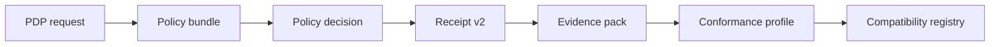

# HELM OSS Protocols and Schemas

This page is the public hub for HELM OSS protocols, JSON schemas, policy
language material, conformance fixtures, and evidence-pack formats.

## Audience

This page is for developers implementing clients, auditors checking wire
contracts, and maintainers changing protocol or schema files.

## Outcome

You should know which protocol family to use, where the normative schema lives,
and which public route explains the behavior.

## Protocol Topology

## Protocol Families

| Family | Source path | Public use |
| --- | --- | --- |
| Core protocol | `protocols/spec/PROTOCOL.md` | Conceptual contract for HELM wire behavior. |
| Evidence pack | `protocols/spec/evidence-pack-v1.md` | Offline verification and auditor evidence exchange. |
| JSON schemas | `protocols/json-schemas/SCHEMA_INDEX.md`, `protocols/json-schemas/` | Normative schema references for receipts, policy, effects, packs, telemetry, and tooling. |
| Policy schema | `protocols/policy-schema/v1/` | DSL grammar, canonicalization, reason codes, and localization keys. |
| Conformance | `protocols/conformance/v1/` | Test vectors, compatibility registry, and conformance guide. |
| Effect specs | `protocols/specs/effects/` | OpenAPI and taxonomy for effect contracts. |
| Authority court specs | `protocols/specs/authority-court/` | Authorization request and decision schema material. |
| Reference packs | `reference_packs/` | Public compliance and industry evidence pack templates. |

## Schema Domains

The JSON schema index covers access, actor context, audit, authority,
autonomy envelope, business controls, certification, CLI, compliance, core,
cybernetics, effects, identity, intent, intervention, jurisdiction, kernel,
module provenance, organization DNA, packs, policy, profiles, reason codes,
receipts, registry, safety, telemetry, tooling, truth, and verification.

Use `/openapi.yaml` for the public HTTP API where available. Use the schema
index and protocol files for non-REST interfaces such as receipts, evidence
packs, policy bundles, effects, MCP-adjacent contracts, and conformance vectors.

## Source Truth

- `protocols/json-schemas/SCHEMA_INDEX.md`
- `protocols/spec/PROTOCOL.md`
- `protocols/spec/evidence-pack-v1.md`
- `protocols/policy-schema/v1/dsl_grammar.md`
- `protocols/conformance/v1/CONFORMANCE_GUIDE.md`
- `docs/architecture/policy-languages.md`

## Troubleshooting

| Problem | Check |
| --- | --- |
| Schema validation disagrees across clients | Confirm canonical JSON handling and the exact schema version in `SCHEMA_INDEX.md`. |
| A policy bundle evaluates differently | Check policy language canonicalization and reason-code mapping. |
| A conformance implementation fails | Compare against `protocols/conformance/v1/test-vectors.json`. |
| A receipt cannot be replayed | Check the evidence-pack schema, receipt version, and referenced artifact hashes. |

<!-- docs-depth-final-pass -->

## Protocol Update Rules

Protocol documentation is current only when schemas, examples, tests, and public references agree. Any change to a JSON schema, bundle layout, receipt field, MCP message shape, or verifier payload must update the schema index, at least one valid example, one invalid example, and the compatibility note. Public docs should distinguish stable contracts from implementation details; generated files and private operator payloads can be indexed without being explained as public APIs. When drift appears, prefer generated schemas and conformance fixtures over prose, then repair the prose and rerun docs truth.

<!-- docs-depth-final-pass-extra -->
 The public protocol hub should also state which generated registries are authoritative and which compatibility windows apply to clients pinned to older receipt or bundle versions.

<!-- docs-depth-final-pass-extra-2 -->
 Include migration notes whenever a field is renamed, deprecated, or promoted to stable.
