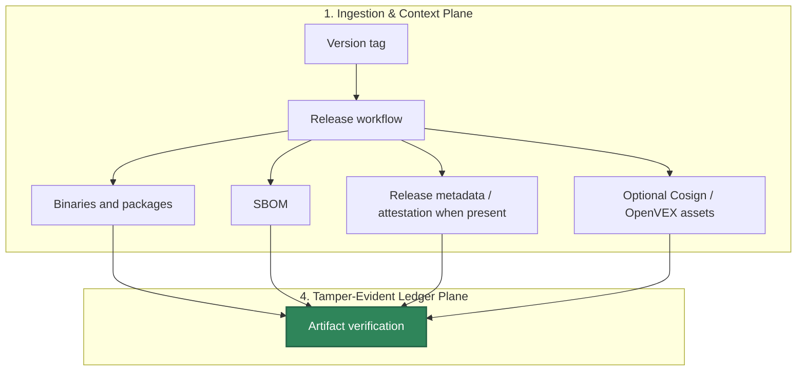

# HELM AI Kernel Release and Security Evidence

This page collects the public release, vulnerability disclosure, supply-chain,
fuzzing, OpenSSF, VEX, SBOM, Cosign, and reproducibility material for HELM AI Kernel.

## Audience

This page is for developers installing release artifacts, security reviewers,
package maintainers, and organizations validating HELM AI Kernel before adoption.

## Outcome

You should know how a release is produced, how to verify it, where to report
vulnerabilities, and which evidence files support supply-chain review.

## Release Evidence Chain




Current source release target: `v0.5.16`:
<https://github.com/Mindburn-Labs/helm-ai-kernel/releases/tag/v0.5.16>. The
release is complete only when GitHub shows Darwin/Linux/Windows binaries,
`SHA256SUMS.txt`, `sbom.json`, `v0.5.16.openvex.json`,
`release-attestation.json`, `evidence-pack.tar`, `release.high_risk.v3.toml`,
`sample-policy-material.tar`, `helm-ai-kernel-launchpad-data.tar`,
`helm-console-web-v0.5.16.tar.gz` with checksum/SBOM/provenance/lock/manifest
sidecars, `helm-ai-kernel.mcpb`, `helm-ai-kernel.rb`, `v0.5.16.json`,
`version-status.json`, and matching `*.cosign.bundle` files for each primary
asset.

## Public Release Material

| Need | Source path | Public route |
| --- | --- | --- |
| Release preparation | `RELEASE.md`, `VERSION`, `CHANGELOG.md` | `/helm-ai-kernel/publishing`, `/helm-ai-kernel/changelog` |
| Vulnerability reporting | `SECURITY.md` | This page and `/helm-ai-kernel/publishing` |
| OpenSSF mapping | `BEST_PRACTICES.md` | This page |
| SBOM and release metadata | `release/README.md`, `scripts/ci/generate_sbom.sh`, release asset `sbom.json`, release asset `release-attestation.json` | This page |
| OpenVEX policy source | `release/vex.openvex.json`, `release/vex/policies.yaml` | This page; only claim published VEX when attached to the GitHub release |
| Cosign and reproducible binaries | `.github/workflows/release.yml`, `scripts/release/`, `docs/VERIFICATION.md` | `/helm-ai-kernel/verification`, `/helm-ai-kernel/publishing`; Cosign verification requires attached `*.cosign.bundle` files |
| Fuzzing | `oss-fuzz/`, Go fuzz tests under `core/pkg/` | This page and `/helm-ai-kernel/execution-security-model` |

## Verification Commands

```bash
make release-binaries-reproducible
make release-smoke
make release-assets
make verify-cosign
make verify-fixtures
make docs-coverage docs-truth
```

Release artifacts should not be treated as trustworthy only because they are
downloaded from a release page. Verify checksums, release metadata,
receipt/evidence material, reproducible-build behavior, and signatures when
signature bundles are attached.

For tag-triggered releases, the workflow requires the tag ref to match the
checked-in `VERSION` file, requires an exact `v<version>.openvex.json`, exports
the audit EvidencePack, verifies the staged `evidence-pack.tar`, and only then
writes final checksums. A failed EvidencePack verification blocks release asset
publication.

Release EvidencePacks use the native
`07_ATTESTATIONS/evidence_pack.sig` seal. If a release is cut under the
customer or high-assurance profile, release verification must pass with
`helm-ai-kernel verify --profile customer --storage-receipt <receipt>` or the
equivalent high-assurance profile, proving the trusted external signer,
Rekor/RFC3161 anchor receipt, and active S3 Object Lock storage receipt.

For `v0.5.10`, use checksum verification, SBOM inspection, OpenVEX inspection,
release metadata inspection, offline EvidencePack verification,
reproducible-build validation, and Cosign verification against the attached
bundles.

## Historical Release Context (Signed Releases & Provenance)

Historical development releases before the `v0.5.9` release target were early
developer drafts designed to test baseline execution mechanics. Because those
iterations did not complete the current keyless Sigstore Cosign and SLSA
provenance release contract, their assets must not be treated as having
cryptographic signature bundles (`*.cosign.bundle`) or SLSA provenance
attestations unless those files are attached to the release.

Starting from a completed `v0.5.9` public release and for later tags, the
retained release pipeline must publish complete signature bundles and
attestation metadata before the release is documented as complete.

## Source Truth

- `SECURITY.md`
- `RELEASE.md`
- `BEST_PRACTICES.md`
- `release/README.md`
- `docs/PUBLISHING.md`
- `docs/VERIFICATION.md`

## Troubleshooting

| Problem | Check |
| --- | --- |
| Signature verification fails | Confirm the release actually includes `*.cosign.bundle` files, then check the expected workflow identity and Rekor entry documented in `SECURITY.md`. |
| Reproducible build hashes differ | Confirm `SOURCE_DATE_EPOCH`, `-trimpath`, and build-id settings match the release workflow. |
| VEX status is unclear | Inspect `release/vex/policies.yaml`; only rely on a release VEX file when it is attached to the GitHub release. |
| Kubernetes Helm validation runs the HELM AI Kernel CLI | Set `KUBE_HELM_CMD` to a Kubernetes Helm v3 binary or run `make helm-chart-smoke`, which uses a pinned containerized Helm runner when needed. |
| A security issue needs disclosure | Use `security@mindburn.org`; do not open a public issue. |

<!-- docs-depth-final-pass -->

## Release Verification Path

A release security page should let a developer verify an artifact without trusting prose. Include the expected version, checksum file, SBOM location, signature or provenance command, and the receipt/verifier compatibility note for that release. If a release artifact is missing, mark the verification mode as unavailable rather than implying Cosign, SBOM, or reproducible-build coverage. The minimum public acceptance path is: download release artifact, verify checksum, inspect SBOM/provenance when present, run the binary or container health check, create one receipt, and verify that receipt offline.
